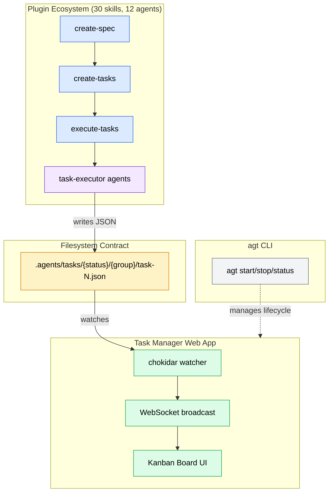

# Agent Tools

Reusable skills and agents for AI coding assistants — a harness-agnostic plugin ecosystem for codebase analysis, feature development, debugging, documentation, code review, and spec-driven development.

## Architecture

The project is a three-domain system unified by the filesystem as the sole integration contract:



Skills are organized into a 4-type taxonomy:

| Type | Count | Purpose |
|------|-------|---------|
| **Workflow** | 14 | Multi-phase orchestrations with agent coordination |
| **Dispatcher** | 3 | Thin wrappers for shared agent dispatch |
| **Reference** | 9 | Knowledge bases loaded on demand by other skills |
| **Utility** | 3 | Standalone single-purpose tools |

Agents are nested inside their owning skills. When a second skill needs the same agent, it's promoted to a dispatcher skill.

## Skills

### Core (20 skills)

**Workflows:** deep-analysis, feature-dev, bug-killer, codebase-analysis, mr-reviewer, docs-manager, release-python-package

**Dispatchers:** code-exploration, code-architecture, research

**Knowledge:** language-patterns, architecture-patterns, technical-diagrams, code-quality, project-conventions, changelog-format, glab

**Utilities:** git-commit, document-changes, project-learnings

### SDD Pipeline (8 skills)

Four-stage spec-driven development: `create-spec` → [`analyze-spec`] → `create-tasks` → `execute-tasks`

`analyze-spec` is an optional quality gate that scores specs across 4 dimensions before task decomposition.

Supported by `sdd-specs` (templates) and `sdd-tasks` (task schema) reference skills. Supplemented by `inverted-spec` — a special-use-case skill that reverse-engineers specs from existing codebases.

### Meta (2 skills)

**Workflows:** create-skill (GAS-only portable), create-skill-opencode (multi-platform: GAS/OpenCode/Codex)

## Key Design Decisions

- **Harness-agnostic:** Every skill includes a dual Execution Strategy — subagent dispatch when available, sequential inline fallback when not
- **Mostly read-only agents:** Most agents have only Read/Glob/Grep/Bash access. Two exceptions: `task-executor` (Write+Edit for code implementation) and `changelog-manager` (Edit for CHANGELOG.md updates). All other file modifications are handled by the orchestrating lead.
- **Hub-and-spoke coordination:** Workers explore independently; all coordination flows through the lead
- **File-based task management:** SDD tasks use directory position as state (`pending/` → `in-progress/` → `completed/`)

## Structure

```
plugins/
├── core/skills/       # 20 general-purpose skills
├── meta/skills/       # 2 skill-authoring skills
├── sdd/skills/        # 8 spec-driven development skills
└── manifest.json      # Skill registry
apps/
├── task-manager/      # React + Node.js web app for SDD task management
└── cli/               # agt CLI for app lifecycle management
internal/
├── reports/           # Architecture decision reports
├── docs/              # Analysis documents
└── specs/             # SDD spec inputs
scripts/
└── installers/        # Cross-platform install scripts
```

## Installation

Cross-platform installers are available in `scripts/installers/` for Bash, PowerShell, and CMD.
