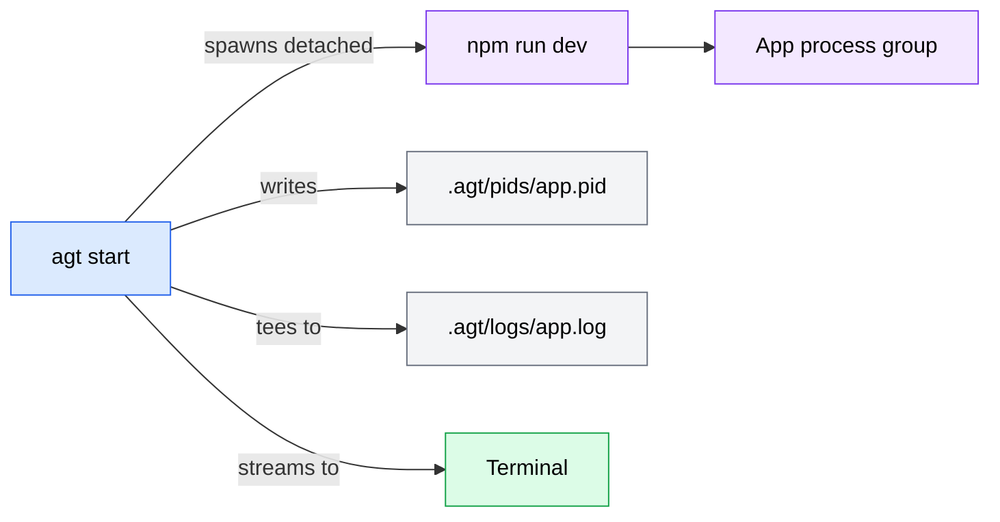

# agt CLI

TypeScript CLI tool for managing apps in the `apps/` directory. Provides lifecycle management (start, stop, kill), status monitoring, and log viewing for development servers.

## Architecture

`agt` auto-discovers apps by scanning `apps/` for subdirectories with a `package.json` containing a `dev` script. It spawns each app as a detached process group, tracks PIDs, and tees output to both the terminal and a log file.



## Tech Stack

- **Runtime**: Node.js, TypeScript 5.8
- **CLI framework**: Commander.js v13
- **Dev runner**: tsx
- **Build**: tsc

## Commands

| Command | Description |
|---------|-------------|
| `agt start <app>` | Start app in dev mode (foreground, streams output + saves to log) |
| `agt stop <app>` | Send SIGTERM to running app (5s timeout, suggests `kill` if stuck) |
| `agt kill <app>` | Send SIGKILL to running app immediately |
| `agt status [app]` | Show status of all or specific app (auto-cleans stale PIDs) |
| `agt logs <app> [-n N]` | Show last N lines of log output (default 50) |
| `agt list` | List discovered apps with running/stopped status |

## Runtime State

```
.agt/
├── pids/<app>.pid    # PID files for running apps
└── logs/<app>.log    # Log files (truncated on each start)
```

`.agt/` is gitignored at the repo root.

## Key Design Decisions

- **Process group management**: Apps are spawned with `detached: true`, giving the child its own PGID equal to its PID. Signals are sent via `process.kill(-pid, signal)` to reach the entire process group (npm -> concurrently -> tsx + vite), not just the top-level npm process. Falls back to individual PID signal if group kill fails.
- **Tee logging**: Subscribes to `data` events on child stdout/stderr, writing each chunk to both the terminal and the log file simultaneously. Log file opened with `flags: "w"` (truncated on start).
- **Stale PID detection**: `agt status` verifies process liveness via `process.kill(pid, 0)` and auto-removes PID files for dead processes.
- **Repo root detection**: Walks up from `import.meta.url` looking for a directory containing BOTH `apps/` AND `plugins/manifest.json` (dual marker prevents false positives).
- **Input validation**: App names validated against `^[a-zA-Z0-9_-]+$` to prevent path traversal.

## Project Structure

```
src/
├── index.ts              # CLI entry point (Commander setup)
├── commands/
│   ├── start.ts          # App spawning with tee logging
│   ├── stop.ts           # Graceful shutdown (SIGTERM)
│   ├── kill.ts           # Forced shutdown (SIGKILL)
│   ├── status.ts         # PID liveness checking
│   ├── logs.ts           # Log tail viewer
│   └── list.ts           # App discovery + status
└── lib/
    ├── discovery.ts      # Auto-discovery (scans apps/ for package.json)
    ├── process.ts        # Process group signal management
    ├── logger.ts         # Tee logging (terminal + file)
    ├── paths.ts          # Runtime state paths (.agt/)
    └── validate.ts       # App name validation
```

## Setup

```bash
cd apps/cli && npm install && npm run build && npm link
```

## Development

```bash
cd apps/cli && npx tsx src/index.ts <command>
```
