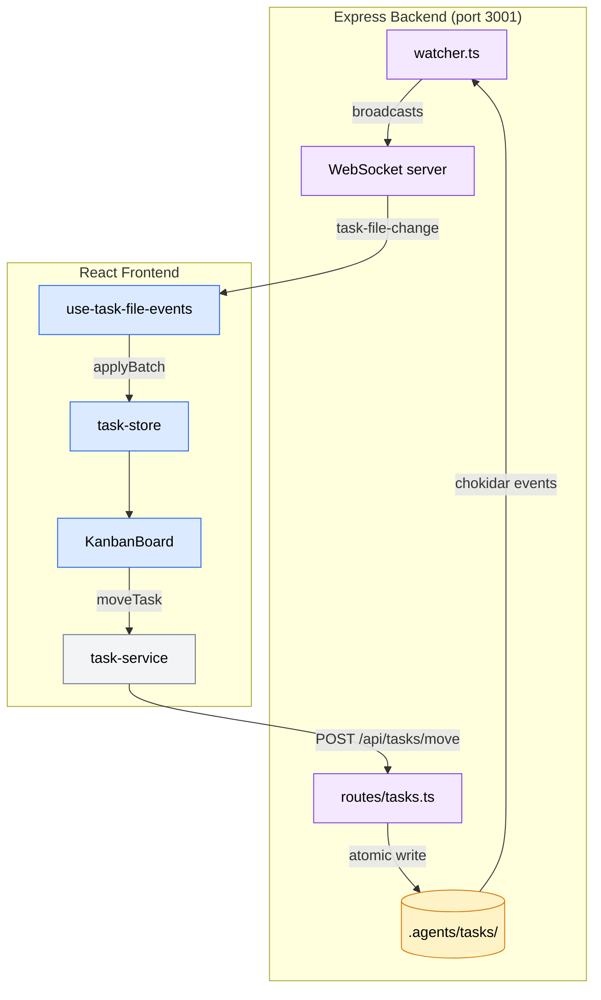

# Task Manager

Web application for visualizing and managing SDD (Spec-Driven Development) pipeline tasks. Built with React 19 + Node.js/Express 5.

## Architecture

Two-tier architecture: a Node.js/Express backend handles file I/O, file watching, and WebSocket broadcasting. A React 19 frontend handles visualization and interaction. Communication flows through REST API for CRUD operations and WebSocket for real-time push events.

The filesystem is the source of truth — tasks are JSON files in `.agents/tasks/{status}/{group}/task-N.json`. The app watches for external changes (from AI agents) and reconciles in real-time.

### Data Flow

```
Filesystem → chokidar watcher → WebSocket broadcast → Service (Zod validate) → Zustand Store → React Component
```



### Backend (Node.js/Express)

6 route modules exposing REST endpoints:

| Module | Purpose |
|--------|---------|
| `routes/tasks.ts` | Task CRUD, status transitions, mtime-based conflict detection |
| `routes/sessions.ts` | Live/archived session monitoring |
| `routes/specs.ts` | Spec reading, lifecycle tracking |
| `routes/projects.ts` | Project management |
| `routes/settings.ts` | App settings persistence |
| `routes/discovery.ts` | Project auto-discovery |

Supporting modules:
- `watcher.ts` — Dual chokidar v4 file watcher (tasks + sessions) with 100ms debounce + WebSocket broadcast
- `file-utils.ts` — Atomic writes (temp file + rename), mtime conflict checking
- `session-parser.ts` — Session file parsing

### Frontend (React + TypeScript)

| Layer | Count | Purpose |
|-------|-------|---------|
| Components | 21+ | UI rendering (KanbanBoard, TaskDetailPanel, etc.) |
| Services | 13 | HTTP + WebSocket client abstraction (`api-client.ts`) |
| Hooks | 11 | Event subscriptions, state derivation |
| Stores | 8 | Zustand v5 state management (no middleware) |
| Types | 3 | Zod schemas as source of truth |

## Tech Stack

- **Backend**: Node.js + Express 5 + WebSocket (ws) + chokidar v4
- **Frontend**: React 19, TypeScript 5.8, Zustand v5, Zod v4, dnd-kit v6, react-markdown
- **Styling**: Tailwind CSS v4
- **Tooling**: Vite 7.x, vitest, ESLint 9 (pinned, not 10), Prettier, tsx (dev runner)

## Development

```bash
npm install
npm run dev           # Start Vite + Express server (concurrently)
npm run dev:server    # Start only the Express backend
npm run dev:client    # Start only the Vite frontend
npm test              # Run vitest suite
npm run lint          # ESLint check
```

### Build

```bash
npm run build         # Build frontend + compile server TypeScript
npm run start         # Run production server (after build)
```

## Key Patterns

- **Optimistic concurrency**: `task-store.moveTaskOptimistic()` updates UI immediately, confirms or rolls back based on API response
- **Derived columns**: "blocked" and "failed" are UI-only — computed from pending tasks with unresolved dependencies or failure metadata
- **Dual validation**: Zod `.passthrough()` on frontend + imperative validation on backend for forward compatibility
- **Atomic writes**: temp file + rename prevents partial write corruption
- **Batch mutations**: `task-store.applyBatch()` applies multiple WebSocket events in a single state update
- **Service layer**: all HTTP/WS calls wrapped in typed services via `api-client.ts` — components never call `fetch()` directly
