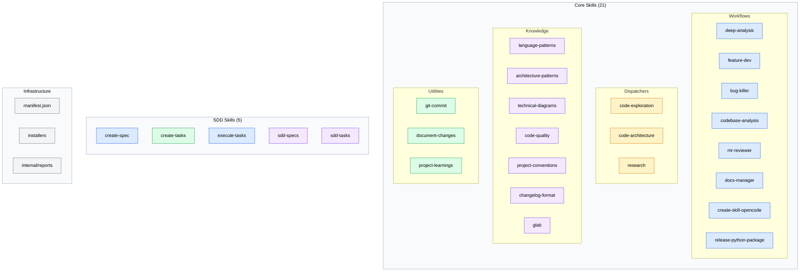
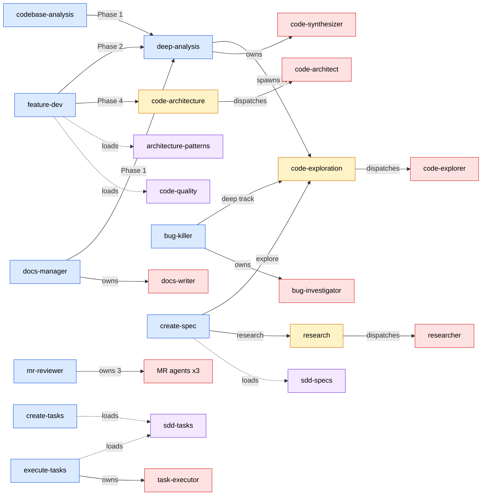
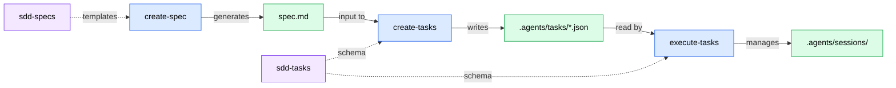

# Codebase Analysis Report

**Analysis Context**: General codebase understanding
**Codebase Path**: `/Users/sequenzia/dev/repos/agent-tools`
**Date**: 2026-03-21

## Table of Contents
- [Executive Summary](#executive-summary)
- [Architecture Overview](#architecture-overview)
- [Tech Stack](#tech-stack)
- [Critical Files](#critical-files)
- [Patterns & Conventions](#patterns--conventions)
- [Relationship Map](#relationship-map)
- [Challenges & Risks](#challenges--risks)
- [Recommendations](#recommendations)
- [Analysis Methodology](#analysis-methodology)

---

## Executive Summary

agent-tools is a **pure markdown/JSON skill and agent library** — a plugin ecosystem for AI coding assistants with 26 skills, 12 agents, and zero compiled code. The most important architectural insight is its **harness-agnostic design**: every skill includes a dual "Execution Strategy" that enables portability across Claude Code, OpenCode, Codex, and future platforms via a single mechanism (subagent dispatch when available, sequential inline fallback otherwise). The primary risk is that the `produces_for` metadata field in the SDD pipeline is generated by `create-tasks` but never consumed by `execute-tasks`, creating a dead code path in the spec-driven development workflow.

---

## Architecture Overview

The codebase follows a **layered composition model** built on three design principles:

1. **4-Type Skill Taxonomy** — Skills are classified as *workflow* (multi-phase orchestrations with agents), *utility* (standalone tools), *reference* (knowledge bases loaded on demand), or *dispatcher* (thin wrappers for shared agent dispatch). This cleanly separates orchestration, knowledge, and agent dispatch concerns.

2. **Agent Nesting with Promotion** — Agents live inside their owning skill's `agents/` directory as private components. When a second skill needs the same agent, the agent is "promoted" to a dispatcher skill, becoming the single source of truth. This creates a clear ownership model: 9 private agents embedded in workflow skills, 3 shared agents accessed through dispatchers.

3. **Hub-and-Spoke Coordination** — All 6 workflow skills that use agents follow a hub-and-spoke topology where the orchestrating lead assigns work, workers execute independently (no cross-worker communication), and results flow back to the lead or a synthesizer. This pattern scales from 3-agent parallel batches (mr-reviewer) to dynamic N-agent exploration teams (deep-analysis).

The project is in an active architecture stabilization phase with 46 commits across 16 days (March 6–21, 2026). The first week focused on building skills; the second week on refactoring for portability and organizational consistency, documented in 11 internal reports.

---

## Tech Stack

| Category | Technology | Role |
|----------|-----------|------|
| Content Format | Markdown (SKILL.md, agent .md) | All skills, agents, and references |
| Data Format | JSON (manifest.json, task files) | Skill registry, task definitions |
| Scripting | Bash / PowerShell / CMD | Cross-platform installation |
| Diagrams | Mermaid | Visual documentation (native in GitHub/GitLab) |
| Versioning | Git | Version control and architecture decision history |

This is a **content-only** repository — no programming languages, no build system, no test framework, no package manager. Skills are pure markdown instructions executed by AI agent platforms at runtime.

---

## Critical Files

| File | Purpose | Relevance |
|------|---------|-----------|
| `skills/README.md` | Authoritative architecture doc — skill taxonomy, agent table, placement rule, full directory tree | High |
| `skills/manifest.json` | JSON index of all 26 skills with type, description, and allowed_tools | High |
| `skills/core/deep-analysis/SKILL.md` | Hub-and-spoke analysis orchestrator (6 phases); composable sub-workflow used by 3 other skills | High |
| `skills/core/feature-dev/SKILL.md` | 7-phase feature development workflow; most complex skill with multi-architect + multi-reviewer dispatch | High |
| `skills/core/code-exploration/SKILL.md` | Most-consumed dispatcher (5 consumers); gateway to the code-explorer agent | High |
| `skills/sdd/execute-tasks/SKILL.md` | Wave-based autonomous task execution; entirely file-based state machine with polling completion | High |
| `skills/sdd/create-tasks/SKILL.md` | 10-phase spec decomposition; DAG inference, producer-consumer detection, idempotent merge | High |
| `skills/core/code-exploration/agents/code-explorer.md` | Most reused agent (5 consumers); focused area exploration with structured output format | High |
| `skills/sdd/sdd-tasks/SKILL.md` | Task schema reference — defines the `.agents/tasks/` file format consumed by create-tasks and execute-tasks | High |
| `skills/core/mr-reviewer/SKILL.md` | 3-agent parallel MR review; only self-contained workflow (no external skill invocations) | Medium |

### File Details

#### `skills/core/deep-analysis/SKILL.md`
- **Key role**: The orchestration centerpiece — performs rapid recon, generates dynamic focus areas, spawns N parallel explorers, then launches a synthesizer
- **Core logic**: 6-phase workflow with session checkpointing, exploration cache (24h TTL), interrupted session recovery, and configurable approval (auto-approve when skill-invoked)
- **Connections**: Invoked by feature-dev, codebase-analysis, and docs-manager; dispatches code-explorer via code-exploration skill; owns code-synthesizer agent

#### `skills/sdd/execute-tasks/SKILL.md`
- **Key role**: Autonomous task execution engine — the most architecturally sophisticated skill
- **Core logic**: Reads `.agents/tasks/` JSON files, builds topological wave plan, dispatches task-executor agents in parallel (up to max_parallel), detects completion via result file existence, manages shared execution context
- **Connections**: Loads sdd-tasks reference for schema; owns task-executor agent; creates `.agents/sessions/` for state management

#### `skills/core/code-exploration/SKILL.md`
- **Key role**: Universal exploration gateway — thin dispatcher wrapping the code-explorer agent
- **Core logic**: Accepts focus area + context, dispatches code-explorer with appropriate instructions, returns structured findings
- **Connections**: Consumed by deep-analysis, bug-killer, docs-manager, codebase-analysis, create-spec

---

## Patterns & Conventions

### Code Patterns

- **Dual Execution Strategy**: Every skill with agents includes two paths — parallel subagent dispatch when available, sequential inline execution when not. This is the single mechanism enabling cross-platform portability.
- **Hub-and-Spoke Topology**: Workers never communicate directly. All coordination flows through the orchestrating lead. Scales from fixed 3-agent batches to dynamic N-agent teams.
- **Read-Only Agents**: No agent has Write/Edit access. Agents are investigators/analyzers; the orchestrating lead performs all file modifications. This is a deliberate safety boundary.
- **Progressive Disclosure**: Core instructions in SKILL.md (target <5000 tokens), detailed content in `references/*.md` loaded on demand via Read tool.
- **File-as-State-Machine**: SDD tasks use directory position as state (`pending/` → `in-progress/` → `completed/`), with file moves serving as atomic state transitions.
- **Model Tiering**: Opus for synthesis/architecture/review (complex reasoning), Sonnet for exploration (parallel breadth), Haiku for procedural scripting.

### Naming Conventions

- **Skills**: kebab-case directories (`code-exploration`, `bug-killer`, `create-skill-opencode`)
- **Agents**: kebab-case files matching agent name (`code-explorer.md`, `bug-investigator.md`)
- **References**: kebab-case files describing content (`decomposition-patterns.md`, `entry-examples.md`)
- **Skill entry point**: Always `SKILL.md` (uppercase)
- **Frontmatter**: YAML with `name`, `description`, `metadata` (type, agents, argument-hint), `allowed-tools`

### Project Structure

- **Two-category organization**: `skills/core/` (21 general-purpose) and `skills/sdd/` (5 spec-driven development) — flattened at deployment time
- **Skill directories contain**: `SKILL.md` (required), optional `agents/` (owned agents), optional `references/` (knowledge files), optional `scripts/`
- **Internal docs**: `internal/reports/` for architecture decision reports, `internal/docs/` for analyses

---

## Relationship Map

**Skill Invocation Graph:**

**SDD Pipeline Flow:**

---

## Challenges & Risks

| Challenge | Severity | Impact |
|-----------|----------|--------|
| `produces_for` dead metadata | Medium | `create-tasks` generates `produces_for` fields for producer-consumer relationships, but `execute-tasks` never reads or uses this field. Context injection between dependent tasks doesn't happen, reducing execution quality for multi-feature specs. |
| Consumer list drift | Medium | Dispatcher frontmatter `consumers` lists are manually maintained with no automated validation. As skills are added or refactored, these lists can silently drift from reality, making the architecture docs unreliable. |
| Progressive disclosure violations | Medium | `create-skill-opencode` (869 lines) and `create-spec` (788 lines) exceed the <5000-token target for SKILL.md files. Large files increase context consumption and reduce the benefit of lazy-loading references. |
| `question` tool portability gap | Medium | Three skills mandate a structured `question` tool for all user interaction with no fallback for platforms that don't support it, breaking the otherwise-consistent harness-agnostic design. |
| `research` dispatcher premature promotion | Low | Has only 1 consumer (create-spec). By the documented Agent Placement Rule, it should remain private inside create-spec. Promoted early, likely anticipating future consumers. |
| Empty agent-inventory.md | Low | `internal/agents/agent-inventory.md` is a 1-line placeholder. The authoritative agent table lives in `skills/README.md`, but the empty file creates confusion about where the canonical inventory lives. |
| Auto-approval via prose | Low | When skills are invoked by other skills, plan approval is "auto-approved" via prose instruction. This is convention-based, not mechanically enforced — relies on the LLM correctly following the instruction. |
| No validation tooling | Low | The manifest, consumer lists, agent metadata, and skill cross-references form a rich internal contract, but no script validates consistency across these files. |

---

## Recommendations

1. **Implement `produces_for` consumption in execute-tasks** _(addresses: `produces_for` dead metadata)_: The orchestration loop should inject producer task results into dependent task contexts. The data model is already in place via `sdd-tasks` reference; only the execution wiring is missing.

2. **Add a manifest validation script** _(addresses: Consumer list drift, No validation tooling)_: A simple script cross-checking: (a) every skill directory has a manifest entry, (b) dispatcher `consumers` lists match actual references, (c) SKILL.md files stay under token budget. Low effort, high consistency value.

3. **Refactor oversized SKILL.md files** _(addresses: Progressive disclosure violations)_: Move `create-skill-opencode`'s pipeline stages and `create-spec`'s interview procedures into `references/` files to comply with the progressive disclosure pattern all other skills follow.

4. **Add `question` tool fallback** _(addresses: `question` tool portability gap)_: Skills mandating the `question` tool should include a fallback instruction: "If no structured question tool is available, present questions as numbered lists in text output."

5. **Resolve `research` dispatcher placement** _(addresses: `research` dispatcher premature promotion)_: Either add a second consumer (feature-dev's Phase 2 could benefit from research for unfamiliar domains) or demote it back to a private agent inside create-spec.

6. **Clean up placeholder files** _(addresses: Empty agent-inventory.md)_: Delete `internal/agents/agent-inventory.md` or populate it with a generated inventory. The canonical table in `skills/README.md` is the source of truth.

---

## Analysis Methodology

- **Exploration agents**: 3 agents with focus areas: (1) Core workflow skills & agent orchestration, (2) SDD pipeline & task execution, (3) Shared agents, knowledge skills & infrastructure
- **Synthesis**: Opus-tier synthesizer merged all findings with git history analysis and cross-reference verification
- **Scope**: Full codebase — all 26 skills, 12 agents, manifest, internal reports, and installer scripts
- **Cache status**: Fresh analysis (2026-03-21)
- **Config files detected**: `manifest.json`, `.claude/settings.json`, `.claude/settings.local.json`, `.claude/agent-alchemy.local.md`
- **Gap-filling**: Synthesizer independently verified `produces_for` consumption gap, consumer list accuracy, and progressive disclosure violations via direct file reads and grep
