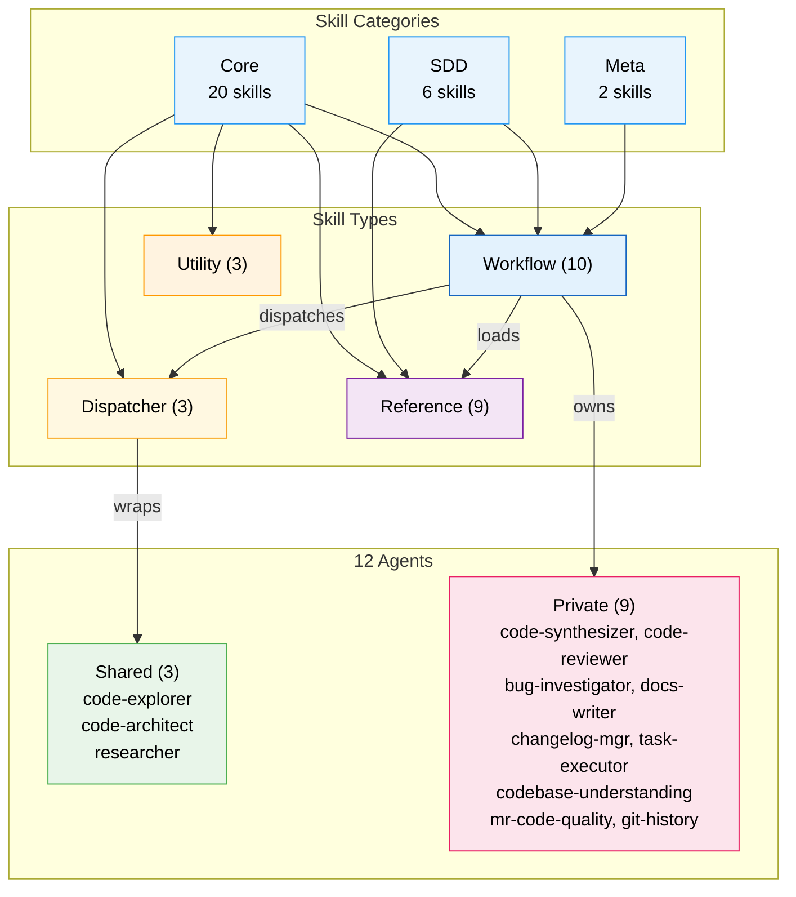
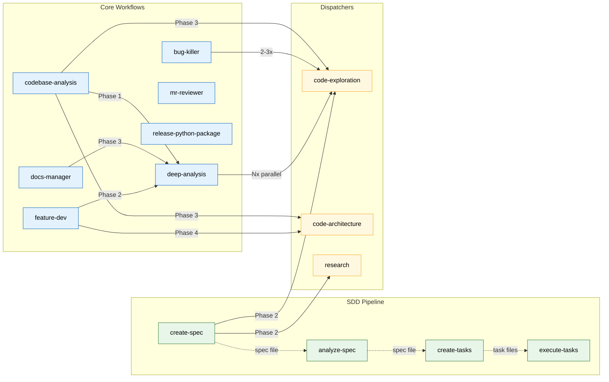
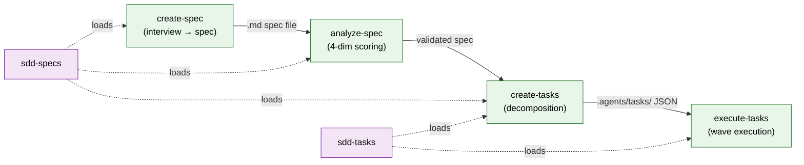

# Codebase Analysis Report

**Analysis Context**: General codebase understanding
**Codebase Path**: `/Users/sequenzia/dev/repos/agent-tools`
**Date**: 2026-03-23

---

## Table of Contents

- [Executive Summary](#executive-summary)
- [Architecture Overview](#architecture-overview)
- [Tech Stack](#tech-stack)
- [Critical Files](#critical-files)
- [Patterns & Conventions](#patterns--conventions)
- [Relationship Map](#relationship-map)
- [Challenges & Risks](#challenges--risks)
- [Recommendations](#recommendations)
- [Analysis Methodology](#analysis-methodology)

---

## Executive Summary

Agent Tools is a **pure markdown/JSON skill and agent library** — a harness-agnostic plugin ecosystem containing 28 skills and 12 agents across ~28,900 lines, with zero compiled code, tests, or build system. The most important architectural insight is the **layered composition model**: workflow skills orchestrate multi-phase processes by dispatching shared agents through thin dispatcher skills and loading reference skills as in-context knowledge — all with a dual execution strategy that makes every skill portable across AI agent platforms. The primary risk is **documentation staleness** — the project has evolved rapidly (59 commits in 7 days) but READMEs and the skills/README.md haven't kept pace, with 4+ known inaccuracies.

---

## Architecture Overview

The codebase implements an **instruction-based architecture** where markdown documents serve as executable specifications for AI agents. There is no traditional source code — skills are structured markdown files with YAML frontmatter that AI platforms interpret at runtime. The entire system is organized around a **4-type taxonomy**:

- **Workflow** skills (10) orchestrate multi-phase processes, dispatch agents, and compose other skills
- **Dispatcher** skills (3) are ultra-thin wrappers around shared agents, providing a single point of access
- **Reference** skills (9) are knowledge bases loaded on-demand as in-context material
- **Utility** skills (3) handle standalone tasks like git commits and change documentation

Skills are organized into 3 categories (`core/`, `sdd/`, `meta/`) that **flatten at deployment time** — categories exist only for repo organization. The **Agent Placement Rule** governs agent ownership: agents start private (nested in their owning skill's `agents/` directory) and are promoted to dispatcher skills only when a second consumer appears, ensuring a single source of truth.

---

## Tech Stack

| Category | Technology | Role |
|----------|-----------|------|
| Content Format | Markdown (`.md`) | All skills, agents, references, and documentation |
| Data Format | JSON | Manifest registry, task files, settings |
| Configuration | YAML (in frontmatter) | Skill/agent metadata and settings |
| Validation | Bash (`validate-manifest.sh`) + `jq` | Manifest ↔ directory ↔ frontmatter sync |
| Diagrams | Mermaid | In-document technical visualizations |
| External Docs | Context7 MCP | Live documentation lookup during research |
| Version Control | Git | Conventional Commits format throughout |

---

## Critical Files

| File | Purpose | Relevance |
|------|---------|-----------|
| `skills/manifest.json` | Authoritative skill registry (28 entries) | **Critical** |
| `skills/README.md` | Full architecture documentation | **High** |
| `skills/core/deep-analysis/SKILL.md` | Hub-and-spoke orchestration pattern | **High** |
| `skills/core/code-exploration/SKILL.md` | Most-consumed dispatcher (5 consumers) | **High** |
| `skills/core/feature-dev/SKILL.md` | Full feature development lifecycle (7 phases) | **High** |
| `skills/sdd/execute-tasks/SKILL.md` | Wave-based task execution orchestrator | **High** |
| `skills/sdd/sdd-tasks/SKILL.md` | Task schema & state machine reference | **High** |
| `skills/sdd/create-spec/SKILL.md` | SDD pipeline entry point | **High** |
| `scripts/validate-manifest.sh` | Manifest ↔ directory integrity check | **Medium** |
| `.claude/agent-alchemy.local.md` | Plugin config (approval, parallelism, TDD) | **Medium** |

### File Details

#### `skills/manifest.json`
- **Key exports**: 28 skill entries with name, type, description, optional allowed_tools
- **Core logic**: Authoritative registry that maps skill names → types → categories → directory paths
- **Connections**: Validated by `scripts/validate-manifest.sh`; must stay in sync with all SKILL.md frontmatter `name` fields

#### `skills/core/deep-analysis/SKILL.md`
- **Key exports**: 6-phase orchestration pattern with reconnaissance, team planning, parallel exploration, and synthesis
- **Core logic**: Canonical hub-and-spoke topology — lead performs recon, dispatches N parallel code-exploration agents, then a single code-synthesizer merges findings. Cross-explorer communication is explicitly forbidden.
- **Connections**: Invoked by feature-dev (Phase 2), docs-manager (Phase 3), codebase-analysis (Phase 1). Auto-approves exploration plan when skill-invoked.

#### `skills/core/code-exploration/SKILL.md`
- **Key exports**: Dispatcher wrapping the `code-explorer` agent — the most-consumed agent in the system
- **Core logic**: Ultra-thin wrapper that receives focus area context (directories, starting files, search patterns) and dispatches the code-explorer agent
- **Connections**: 5 consumers — deep-analysis, bug-killer, docs-manager, codebase-analysis, create-spec. The code-explorer agent loads `project-conventions` and `language-patterns` at activation.

#### `skills/sdd/execute-tasks/SKILL.md`
- **Key exports**: Wave-based parallel task execution with topological dependency resolution
- **Core logic**: 9-step orchestration — loads tasks, builds execution plan (topological waves), dispatches up to 5 parallel task-executor agents per wave, uses result-file polling protocol for completion detection. The only skill with a Write+Edit-capable agent.
- **Connections**: Loads `sdd-tasks` reference. Consumes `.agents/tasks/` JSON files produced by create-tasks. Manages sessions in `.agents/sessions/`.

---

## Patterns & Conventions

### Code Patterns

- **Execution Strategy Dual-Path** (13 skills): Every skill that dispatches agents provides two paths — parallel subagent dispatch when the platform supports it, and sequential inline fallback (read agent .md and follow instructions) when it doesn't. This is the core harness-agnosticism mechanism.

- **Hub-and-Spoke Topology**: Used by deep-analysis (canonical), feature-dev (parallel architects + parallel reviewers), mr-reviewer (3 parallel agents), bug-killer (parallel investigators), and execute-tasks (wave-based parallelism). All enforce no cross-agent communication — coordination flows exclusively through the lead.

- **Knowledge Loading vs. Agent Dispatch**: Two distinct composition mechanisms. Workflow skills load reference skills via explicit "Read and apply" instructions (in-context material). Agent dispatch goes through dispatcher skills which spawn separate agents. These are never confused.

- **Progressive Disclosure**: SKILL.md kept under ~5000 tokens as the entry point. Detail lives in `references/` subdirectories (69 reference files total). Largest: glab (11 refs), sdd-specs (8 refs), create-skill-opencode (9 refs), technical-diagrams (6 refs).

- **File-as-State-Machine** (SDD pipeline): Task status encoded in both JSON field AND directory path (`pending/` → `in-progress/` → `completed/`). File moves ARE state transitions. Enforced by anti-pattern AP-08.

- **Confidence Scoring**: mr-reviewer agents and code-reviewer use scored findings (0-100). Only findings above threshold (typically 80+) are reported.

### Naming Conventions

| Element | Convention | Example |
|---------|-----------|---------|
| Skill directories | kebab-case | `code-exploration`, `create-skill` |
| Agent files | kebab-case matching agent name | `code-explorer.md`, `mr-code-quality.md` |
| Reference files | kebab-case describing content | `decomposition-patterns.md` |
| Entry point | Always uppercase | `SKILL.md` |
| Categories | lowercase single-word | `core`, `sdd`, `meta` |
| Git commits | Conventional Commits | `feat(skills): add analyze-spec` |

### Project Structure

- 3 categories (`core/`, `sdd/`, `meta/`) that flatten at deployment
- `SKILL.md` always at skill root; `agents/` and `references/` as subdirectories
- `internal/reports/` for architecture decision records (not deployed)
- `scripts/` for validation tooling
- `.claude/` for settings, sessions, and exploration cache

---

## Relationship Map

### Skill Invocation Graph

### Agent Capability Matrix

| Agent | Owner | Shared | Read | Glob | Grep | Bash | Write | Edit | Consumers |
|-------|-------|--------|:----:|:----:|:----:|:----:|:-----:|:----:|:---------:|
| code-explorer | code-exploration | Yes | * | * | * | * | | | 5 |
| code-architect | code-architecture | Yes | * | * | * | | | | 2 |
| researcher | research | Yes* | * | * | * | * | | | 1 |
| code-synthesizer | deep-analysis | No | * | * | * | * | | | 1 |
| code-reviewer | feature-dev | No | * | * | * | | | | 1 |
| bug-investigator | bug-killer | No | * | * | * | * | | | 1 |
| docs-writer | docs-manager | No | * | * | * | * | | | 1 |
| changelog-manager | release-python-package | No | * | * | * | * | | * | 1 |
| codebase-understanding | mr-reviewer | No | * | * | * | | | | 1 |
| mr-code-quality | mr-reviewer | No | * | * | * | * | | | 1 |
| git-history | mr-reviewer | No | * | * | * | * | | | 1 |
| task-executor | execute-tasks | No | * | * | * | * | * | * | 1 |

*`researcher` is a single-consumer exception — promoted to dispatcher preemptively.

### SDD Pipeline Data Flow

---

## Challenges & Risks

| Challenge | Severity | Impact |
|-----------|----------|--------|
| **README staleness** | Medium | Root README.md has 4 inaccuracies (SDD skill categorization, meta skill count, SDD skill count, agent write-access claim). skills/README.md missing analyze-spec. New contributors will get incorrect mental models. |
| **No automated testing/CI** | Medium | No tests, CI/CD, or linting beyond manual `validate-manifest.sh`. Structural integrity depends entirely on manual discipline. Broken cross-references or invalid frontmatter won't be caught until runtime. |
| **`question` tool platform dependency** | Medium | 11 of 28 skills mandate the `question` tool for user interaction. All include fallback instructions, but fallback UX (numbered lists in text) is significantly degraded. Platforms without `question` support get a lesser experience. |
| **Rapid evolution outpacing docs** | Medium | 59 commits in 7 days with 15 architectural decision reports, but README updates haven't kept pace. Internal reports provide historical context but aren't discoverable from the main documentation. |
| **Meta skill trigger conflict** | Low | create-skill and create-skill-opencode share near-identical trigger phrases ("create a skill"). May cause ambiguous dispatch in production. |
| **`researcher` dispatcher exception** | Low | Single-consumer dispatcher violates the Agent Placement Rule. Creates precedent for premature promotion. |

---

## Recommendations

1. **Update all README files** _(addresses: README staleness)_: Fix the 4 root README inaccuracies, add analyze-spec to skills/README.md, and consider automating README generation from manifest.json to prevent future drift.

2. **Add manifest validation to pre-commit hook** _(addresses: No automated testing/CI)_: The `validate-manifest.sh` script already exists and works — wiring it into a pre-commit hook would catch skill registry drift automatically with zero new tooling.

3. **Differentiate meta skill trigger phrases** _(addresses: Meta skill trigger conflict)_: Adjust descriptions to use distinct triggers. Suggested: create-skill → "create a portable skill" / "GAS skill"; create-skill-opencode → "create a platform-native skill" / "create an OpenCode skill".

4. **Document write-capable agent exceptions** _(addresses: Rapid evolution outpacing docs)_: task-executor (Write+Edit) and changelog-manager (Edit) break the otherwise-clean read-only agent pattern. This is architecturally intentional but should be explicitly documented as exceptions in skills/README.md.

5. **Consider a CHANGELOG.md** _(addresses: Rapid evolution outpacing docs)_: With 59 commits over 7 days and active development, a changelog would complement the internal/reports/ decision records with a user-facing change summary.

---

## Analysis Methodology

- **Exploration agents**: 3 agents with focus areas: Core Skills Ecosystem (20 skills + 11 agents), SDD Pipeline (6 skills end-to-end), Meta Skills & Infrastructure (2 meta skills + manifest + reports + config)
- **Synthesis**: Findings merged by opus-tier synthesizer with git history analysis (59 commits), cross-reference verification, and completeness evaluation
- **Scope**: All 28 skills, 12 agents, 69+ reference files, 15 internal reports, manifest, configuration, and validation tooling. Excluded: `.claude/sessions/` ephemeral data, worktree artifacts
- **Cache status**: Fresh analysis (previous cache expired)
- **Config files detected**: `skills/manifest.json`, `.claude/agent-alchemy.local.md`, `.claude/settings.json`, `.claude/settings.local.json`
- **Gap-filling**: None needed — all 3 explorer reports rated High confidence across all areas
