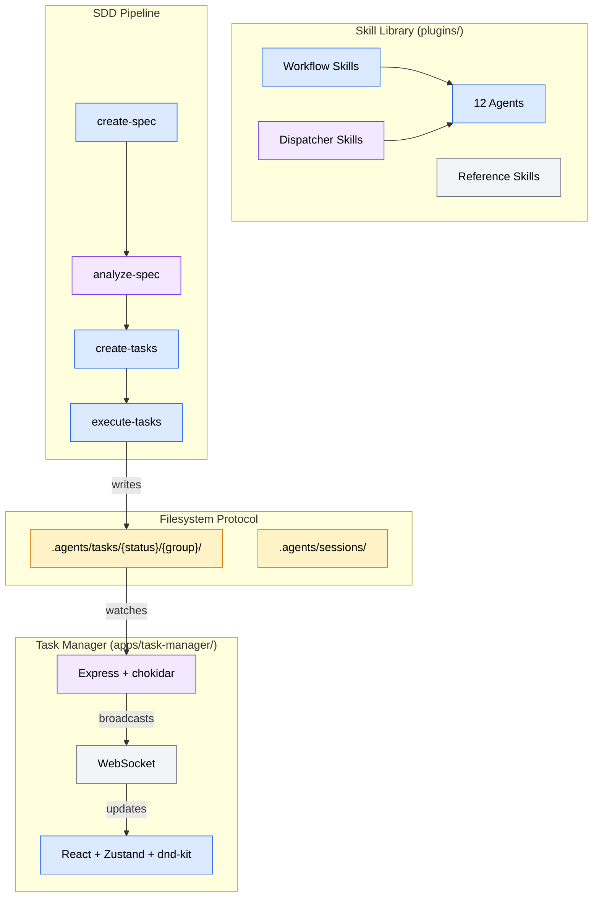
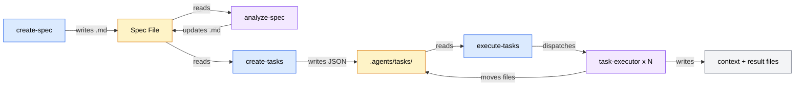
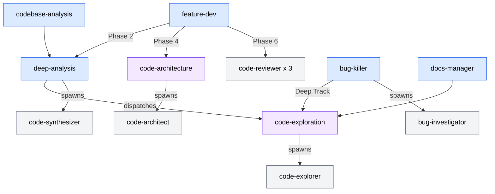

# Codebase Analysis Report

**Analysis Context**: General codebase understanding
**Codebase Path**: `/Users/sequenzia/dev/repos/agent-tools`
**Date**: 2026-04-07

**Table of Contents**
- [Executive Summary](#executive-summary)
- [Architecture Overview](#architecture-overview)
- [Tech Stack](#tech-stack)
- [Critical Files](#critical-files)
- [Patterns & Conventions](#patterns--conventions)
- [Relationship Map](#relationship-map)
- [Challenges & Risks](#challenges--risks)
- [Recommendations](#recommendations)
- [Analysis Methodology](#analysis-methodology)

---

## Executive Summary

Agent Tools is a **dual-domain project**: a harness-agnostic markdown skill library (29 skills, 12 agents) composed with a React/Node.js web app that visualizes agent task execution. The most architecturally significant decision is using the **filesystem as the sole integration point** between AI agents and the UI — no database, no message queue — with directory position encoding task state (`pending/` → `in-progress/` → `completed/`). The primary risk is documentation drift: `CLAUDE.md` references `skills/` paths while the actual source lives in `plugins/`, and the README's structure diagram doesn't match the on-disk layout.

---

## Architecture Overview

The codebase spans two distinct domains connected by a filesystem-based protocol:

**Domain 1: Skill Library** (`plugins/`) — Pure markdown instructions organized into 3 plugin packages (`agent-tools-core`, `agent-tools-meta`, `agent-tools-sdd`). Skills follow a 4-type taxonomy: workflows orchestrate multi-phase processes with agent coordination, dispatchers provide shared agent access, references supply knowledge on demand, and utilities perform standalone tasks. The design is **harness-agnostic** — every workflow includes dual execution paths (subagent dispatch for platforms that support it, sequential inline fallback for those that don't).

**Domain 2: Task Manager App** (`apps/task-manager/`) — A two-tier web application: Node.js/Express 5 backend handles filesystem I/O with chokidar file watchers, while the React 19 frontend renders a Kanban board with drag-and-drop, dependency graphs, and session monitoring. Communication uses REST for CRUD and WebSocket for real-time push events.

**Integration Protocol**: Agents write JSON task files to `.agents/tasks/{status}/{group}/task-N.json`. The Task Manager backend watches these paths, debounces filesystem events, and broadcasts changes over WebSocket. The frontend receives batched updates and reconciles state optimistically. No direct agent-to-app communication exists.

---

## Tech Stack

| Category | Technology | Version | Role |
|----------|-----------|---------|------|
| **Skill Format** | Markdown + JSON | — | Skill definitions, agent instructions, reference knowledge |
| **Frontend** | React | 19.1 | UI framework |
| **State Mgmt** | Zustand | 5.x | 8 stores with selector pattern, no middleware |
| **Drag & Drop** | dnd-kit | 6.x / 10.x | Kanban board column and card DnD |
| **Validation** | Zod | 4.x | Frontend schema validation with `.passthrough()` |
| **Styling** | Tailwind CSS | 4.x | Utility-first CSS |
| **Diagrams** | Mermaid | 11.x | Dependency graph rendering |
| **Backend** | Express | 5.x | REST API server |
| **WebSocket** | ws | 8.x | Real-time event push |
| **File Watching** | chokidar | 4.x | Filesystem event detection |
| **Build** | Vite | 7.x | Frontend bundler + dev server |
| **Language** | TypeScript | 5.8 | Frontend + backend |
| **Testing** | Vitest | 4.x | Test runner with jsdom environment |
| **Linting** | ESLint | 9.x | Code quality (pinned, not 10) |
| **Dev Runner** | tsx | 4.x | TypeScript execution for Express |

---

## Critical Files

| File | Purpose | Relevance |
|------|---------|-----------|
| `plugins/manifest.json` | Authoritative skill registry (29 skills, 3 categories) | High |
| `plugins/core/skills/feature-dev/SKILL.md` | 7-phase feature development lifecycle (most complex workflow) | High |
| `plugins/sdd/skills/execute-tasks/SKILL.md` | Wave-based parallel task execution orchestrator | High |
| `plugins/sdd/skills/create-tasks/SKILL.md` | Spec-to-task decomposition (673 lines, largest SKILL.md) | High |
| `apps/task-manager/src/stores/task-store.ts` | Core Zustand store — optimistic updates, locking, batch mutations | High |
| `apps/task-manager/src/components/KanbanBoard.tsx` | Main UI view — DnD, derived columns, lazy panel loading | High |
| `apps/task-manager/server/watcher.ts` | Dual chokidar watcher with WebSocket broadcast | High |
| `apps/task-manager/server/routes/tasks.ts` | Task CRUD with mtime conflict detection + dual validation | Medium |
| `plugins/core/skills/code-exploration/agents/code-explorer.md` | Most-shared agent (5 consumers) — canonical exploration worker | Medium |
| `apps/task-manager/src/services/transition-validation.ts` | Derived column logic (blocked/failed computed from metadata) | Medium |

### File Details

#### `plugins/manifest.json`
- **Key exports**: Skill registry consumed by AI platforms for routing decisions
- **Core logic**: Maps skill names to types, descriptions, allowed tools, and category paths
- **Connections**: Read by platforms at startup to discover available skills

#### `plugins/sdd/skills/execute-tasks/SKILL.md`
- **Key exports**: 9-step orchestration loop for wave-based parallel execution
- **Core logic**: Topological sort → wave assignment → subagent dispatch → result polling → context merging → retry → archival
- **Connections**: Dispatches `task-executor` agents; reads task files from `.agents/tasks/`; writes session data to `.agents/sessions/`

#### `apps/task-manager/src/stores/task-store.ts`
- **Key exports**: `useTaskStore` — the central state for all task data
- **Core logic**: `moveTaskOptimistic()` with snapshot rollback; `applyBatch()` for WebSocket burst coalescing; pure helper functions (`upsertInto`, `removeFromAll`)
- **Connections**: Consumed by KanbanBoard, TaskDetailPanel, TaskCard; fed by task-service.ts and use-task-file-events.ts hook

---

## Patterns & Conventions

### Code Patterns

- **Hub-and-spoke coordination**: All workflow skills use this topology. Workers explore/execute independently with no cross-agent communication. All coordination flows through the lead agent or synthesizer.
- **File-based state machine**: Task status is encoded by directory position (`pending/`, `in-progress/`, `completed/`). State transitions = physical file moves. The JSON `status` field must always match the directory.
- **Dual execution paths**: Every workflow skill includes an "Execution Strategy" section with two code paths — one for platforms with subagent dispatch, one for sequential inline fallback.
- **Progressive disclosure**: SKILL.md entry points stay under ~5000 tokens. Heavy content lives in `references/*.md` files (73 total), loaded on demand at the phase where they're needed.
- **Optimistic concurrency**: The task-store implements move-with-snapshot — immediately updates UI, then confirms or rolls back based on API response. Locks prevent concurrent moves on the same task.
- **Derived columns**: `blocked` and `failed` are UI-only board columns computed from pending tasks with unresolved `blocked_by` or `last_result: "FAIL"/"PARTIAL"`. Neither maps to a filesystem directory.
- **Atomic writes**: Server uses temp-file + rename pattern for corruption-safe writes.
- **Model tiering**: Opus for synthesis/review/architecture; Sonnet for exploration/investigation.

### Naming Conventions

- **Skill directories**: kebab-case (`code-exploration`, `bug-killer`)
- **Agent files**: kebab-case matching agent name (`code-explorer.md`, `bug-investigator.md`)
- **SKILL.md**: Always uppercase — the universal entry point
- **TypeScript files**: kebab-case for all source files (`task-store.ts`, `api-client.ts`)
- **Status normalization**: Filesystem uses `in-progress` (kebab); JSON uses `in_progress` (underscore); server normalizes between them

### Project Structure

- **Plugin packages**: `plugins/core/` (20 skills), `plugins/sdd/` (8 skills), `plugins/meta/` (2 skills)
- **Agent Placement Rule**: Agents start private (in owning skill's `agents/` dir). Promoted to dispatcher skill when a second consumer appears. Never duplicated across skills.
- **Tests**: Co-located in `__tests__/` directories alongside source files
- **Internal docs**: `internal/reports/` for architecture decision records, `internal/docs/` for analysis reports, `internal/specs/` for product specs

---

## Relationship Map

**SDD Pipeline Data Flow:**

**Skill Composition Graph:**

**Task Manager Real-Time Loop:**

---

## Challenges & Risks

| Challenge | Severity | Impact |
|-----------|----------|--------|
| Documentation path drift | Medium | `CLAUDE.md` references `skills/core/`, `skills/sdd/`, `skills/meta/` and `skills/manifest.json`, but actual directories are `plugins/core/`, `plugins/sdd/`, `plugins/meta/` and `plugins/manifest.json`. README's structure diagram shows `skills/` not `plugins/`. This can mislead developers and AI agents navigating the codebase. |
| KanbanBoard.tsx complexity | Medium | The main view component is the UI complexity hotspot — handles DnD lifecycle, column derivation, keyboard navigation, lazy panel loading, and selection state in a single file. As features grow this becomes harder to maintain and test. |
| No integration tests for filesystem protocol | Medium | The filesystem-as-event-bus pattern connecting agents to the UI has no automated integration tests verifying the end-to-end path: file write → chokidar detection → WebSocket broadcast → store update → UI render. Regressions in this critical path would only surface in manual testing. |
| Manifest vs. on-disk skill count gap | Low | The manifest lists paths as `skills/core` etc. but the actual directory structure is `plugins/core/skills/`. Consumers of the manifest need to know this path mapping — no automated validation exists. |
| Reference file discoverability | Low | 73 reference files across 18 skills are loaded by path (`Read references/foo.md`) with no index or search mechanism. Finding which references exist for a given topic requires manual exploration. |

---

## Recommendations

1. **Align documentation paths with actual directory structure** _(addresses: Documentation path drift)_: Update `CLAUDE.md` and `README.md` to reference `plugins/` instead of `skills/`, or add a `validate-manifest.sh` check that verifies manifest paths resolve to actual directories. The existing `scripts/validate-manifest.sh` could be extended for this.

2. **Extract KanbanBoard subcomponents** _(addresses: KanbanBoard.tsx complexity)_: Consider splitting column derivation, keyboard navigation, and DnD orchestration into focused child components or custom hooks. The `deriveBoardTasks()` function and column rendering logic are natural extraction boundaries.

3. **Add filesystem protocol integration tests** _(addresses: No integration tests for filesystem protocol)_: Write vitest tests that create a temp directory, write task JSON files, initialize the watcher, and assert that WebSocket events arrive with the correct payloads. This would protect the most critical integration seam in the architecture.

4. **Add manifest path validation to CI** _(addresses: Manifest vs. on-disk skill count gap)_: Extend `scripts/validate-manifest.sh` to verify each manifest skill path resolves to a SKILL.md on disk and that the manifest's skill count matches the actual count of SKILL.md files.

---

## Analysis Methodology

- **Exploration agents**: 3 agents (Sonnet) with focus areas: (1) Plugin architecture and core skills, (2) SDD pipeline and task schema, (3) Task Manager web app
- **Synthesis**: Findings merged by lead with targeted git history, file counting, and manifest analysis
- **Scope**: Full codebase — all plugins, the task manager app, scripts, and internal documents
- **Cache status**: Fresh analysis
- **Config files detected**: `apps/task-manager/package.json`, `plugins/manifest.json`, `.claude-plugin/marketplace.json`, `.claude/agent-alchemy.local.md`
- **Gap-filling**: Direct investigation for git commit history (57 commits since March 15), SKILL.md line counts (8822 total), reference file distribution (73 across 18 skills), and plugin packaging structure
