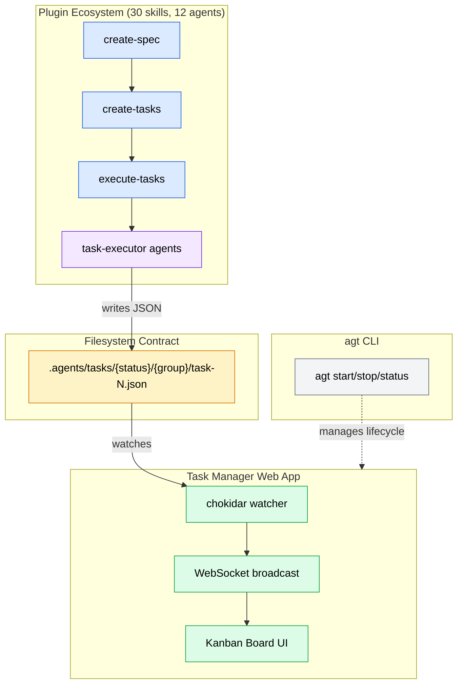
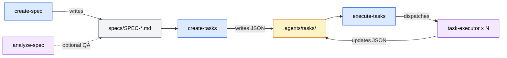
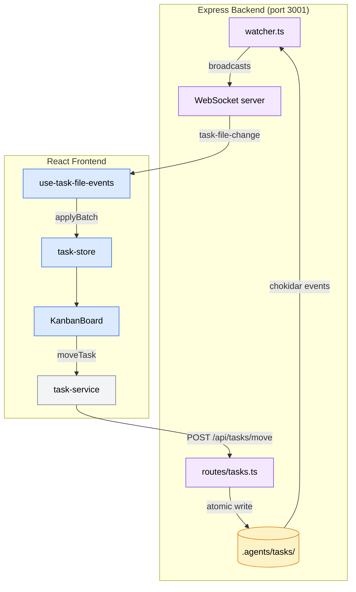
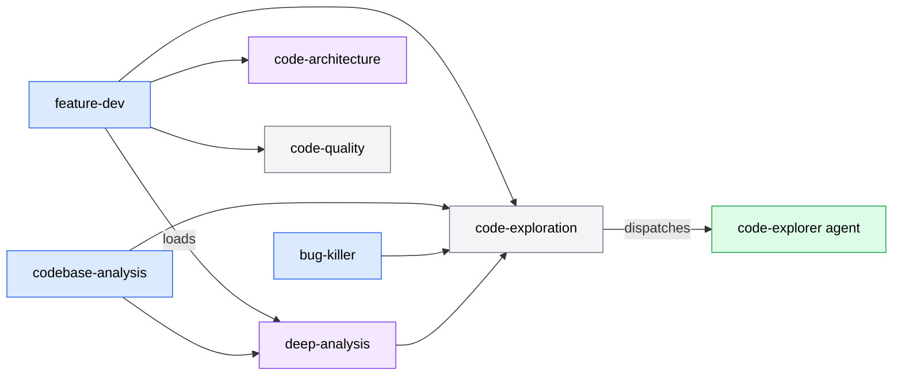

# Codebase Analysis Report

**Analysis Context**: General codebase understanding
**Codebase Path**: `/Users/sequenzia/dev/repos/agent-tools`
**Date**: 2026-04-09

**Table of Contents**
- [Executive Summary](#executive-summary)
- [Architecture Overview](#architecture-overview)
- [Tech Stack](#tech-stack)
- [Critical Files](#critical-files)
- [Patterns & Conventions](#patterns--conventions)
- [Relationship Map](#relationship-map)
- [Challenges & Risks](#challenges--risks)
- [Recommendations](#recommendations)
- [Analysis Methodology](#analysis-methodology)

---

## Executive Summary

agent-tools is a **three-domain system** where AI agents write task JSON files following markdown instructions, a web app watches and visualizes those files in real-time, and a CLI manages the development environment. The most important architectural insight is that the **filesystem is the sole integration contract** between the plugin ecosystem and the web app — they share no code, only a JSON schema defined independently in markdown and Zod. The primary risk is the 1,345-line `KanbanBoard.tsx` God component with the highest churn rate, coupled with zero backend test coverage on the critical task file I/O operations.

---

## Architecture Overview

The project is a **three-tier, filesystem-coupled system** designed for Spec-Driven Development (SDD). The plugin ecosystem provides AI agents with structured markdown instructions to decompose specs into tasks, execute them, and track progress. The web app provides human visibility into that process through a Kanban board with real-time updates. The CLI is operational tooling.

The design philosophy is **loose coupling through filesystem contracts**. The plugin system and web app have zero code dependencies on each other — agents write task JSON files to `.agents/tasks/{status}/{group}/`, and the web app's chokidar watcher detects changes and broadcasts them via WebSocket. This means either domain can evolve independently, and the only coordination required is maintaining schema compatibility.

The plugin system itself is a novel architecture — **programming with natural language, structured as software**. Markdown files serve as executable instructions, filesystem paths serve as an import system (`Read ../skill-name/SKILL.md`), `manifest.json` acts as a package registry, and `references/` subdirectories act as lazily-loaded modules.

---

## Tech Stack

| Category | Technology | Version | Role |
|----------|-----------|---------|------|
| Language | TypeScript | 5.8 | Primary across all apps |
| Language | Markdown | — | Skill/agent definitions (158 files) |
| Frontend | React | 19 | Task Manager UI |
| Bundler | Vite | 7.x | Frontend build + dev server |
| Backend | Express | 5 | REST API + WebSocket host |
| State | Zustand | v5 | Frontend state management (8 stores) |
| Validation | Zod | v4 | Frontend schema validation |
| DnD | dnd-kit | v6 | Kanban drag-and-drop |
| File Watch | chokidar | v4 | Backend filesystem monitoring |
| WebSocket | ws | — | Real-time event broadcast |
| CLI | Commander.js | v13 | CLI argument parsing |
| Testing | vitest | — | Frontend test runner |
| Styling | Tailwind CSS | v4 | UI styling |
| Dev Runner | tsx | — | TypeScript execution in dev |

---

## Critical Files

| File | Purpose | Risk |
|------|---------|------|
| `plugins/manifest.json` | Authoritative registry of all 30 skills | Medium |
| `plugins/core/skills/feature-dev/SKILL.md` | Most complex workflow, loads 9 skills | Medium |
| `plugins/sdd/skills/execute-tasks/SKILL.md` | Wave-based parallel task executor | Medium |
| `plugins/core/skills/code-exploration/SKILL.md` | Canonical dispatcher, 5 consumers | Medium |
| `apps/task-manager/src/components/KanbanBoard.tsx` | Main view: DnD, navigation, 1,345 lines | **High** |
| `apps/task-manager/server/routes/tasks.ts` | All task write ops, conflict detection, 552 lines | **High** |
| `apps/task-manager/server/watcher.ts` | Dual file watcher, WebSocket broadcast | **High** |
| `apps/task-manager/src/stores/task-store.ts` | Core state: optimistic updates, locking, batch | **High** |
| `apps/task-manager/src/services/api-client.ts` | HTTP + WS abstraction (replaced Tauri IPC) | Medium |
| `apps/task-manager/src/types/task.ts` | Zod schemas, TypeScript type source of truth | Medium |

### File Details

#### `apps/task-manager/src/components/KanbanBoard.tsx`
- **Key exports**: `KanbanBoard` component (main application view)
- **Core logic**: DnD context management, column reordering, optimistic move with rollback + red pulse animation, virtual scrolling (>50 cards), keyboard navigation, lazy-loaded detail/spec panels
- **Connections**: Consumes `task-store`, `project-store`; renders `TaskCard`, `TaskDetailPanel`, `SpecViewerPanel`; calls `task-service` for moves

#### `apps/task-manager/server/routes/tasks.ts`
- **Key exports**: Express router for `/api/tasks` endpoints
- **Core logic**: Task file read/write, `normalizeStatus()`/`statusToDirName()` mapping, `atomicWrite()` via temp+rename, mtime-based conflict detection (HTTP 409), `blocked_by` reference validation
- **Connections**: Called by frontend `task-service.ts`; triggers `watcher.ts` file events on writes

#### `plugins/core/skills/feature-dev/SKILL.md`
- **Key exports**: 7-phase feature development lifecycle
- **Core logic**: Exploration → Architecture → Implementation → Review orchestration
- **Connections**: Loads 9 other skills (deep-analysis, code-architecture, code-exploration, code-quality, architecture-patterns, language-patterns, technical-diagrams, changelog-format, project-learnings)

#### `apps/task-manager/src/stores/task-store.ts`
- **Key exports**: `useTaskStore` Zustand store
- **Core logic**: Task data CRUD, optimistic move snapshots with rollback, task locking during moves, stale path tracking, `applyBatch()` for multi-event updates
- **Connections**: Central data hub — consumed by KanbanBoard, TaskDetailPanel, task-selectors; fed by use-task-file-events hook

---

## Patterns & Conventions

### Code Patterns
- **Progressive disclosure**: SKILL.md files kept under ~5,000 tokens; detailed procedures in `references/` subdirectories loaded on demand
- **Dual execution paths**: All workflow skills support both subagent dispatch (parallel) and inline sequential fallback for harnesses without subagent support
- **Agent promotion rule**: Agents start private in owning skill's `agents/`. Promoted to a dispatcher skill only when a second consumer appears — never duplicated
- **Optimistic concurrency control**: Task Manager drag-and-drop immediately updates UI, with mtime-based conflict detection on backend. Failed writes trigger rollback via `MoveSnapshot`
- **Batch mutations**: `applyBatch()` in task-store applies multiple file events in a single Zustand `set()` to prevent render thrashing
- **Double-debounce**: 100ms server-side (chokidar batch) + 50ms frontend-side (use-task-file-events) for file event processing
- **Service layer abstraction**: All HTTP/WebSocket calls wrapped in typed services — components never call `fetch()` directly
- **Atomic writes**: Backend uses temp file + `fs.renameSync()` to prevent partial write corruption

### Naming Conventions
- **Skill directories**: kebab-case (`code-exploration`, `bug-killer`)
- **Agent files**: kebab-case matching agent name (`code-explorer.md`)
- **Commits**: Conventional Commits format `type(scope): description`
- **Filesystem vs JSON normalization**: `in-progress` (directory name) mapped to `in_progress` (JSON field) via explicit functions

### Project Structure
- **Flat category layout**: `plugins/core/skills/`, `plugins/sdd/skills/`, `plugins/meta/skills/`
- **Self-contained apps**: Each app in `apps/` has its own `package.json` — no shared code between domains
- **Internal archive**: `internal/reports/` for AI-generated change docs, `internal/specs/` for SDD spec inputs, `internal/docs/` for analysis reports

---

## Relationship Map

### SDD Pipeline Data Flow

### Task Manager Internal Architecture

### Skill Cross-Loading Dependencies

---

## Challenges & Risks

| Challenge | Severity | Impact |
|-----------|----------|--------|
| KanbanBoard.tsx God component (1,345 lines, 5 responsibilities, highest churn) | High | Regressions on every board feature; difficult to review PRs touching this file |
| Dual schema definition with no automated sync (markdown vs Zod) | High | Silent schema drift; `.passthrough()` masks mismatches at runtime |
| Zero backend test coverage (server/routes/tasks.ts handles all writes) | High | Data loss risk; prior incident (commit eeef02d) lost task fields during status transitions |
| Tauri-to-web migration naming artifacts (61 "IPC" references across 22 files) | Medium | Cognitive overhead for contributors; suggests incomplete migration |
| No CLI test suite (POSIX-specific signal handling) | Medium | Platform-dependent failures; process group management untested |
| Single-threaded watcher bottleneck (module-level singleton) | Medium | Under heavy concurrent writes, events may batch unpredictably |
| Plugin manifest validation is script-only (no CI) | Low | Skills can be added without updating manifest; no automated check |

---

## Recommendations

1. **Decompose KanbanBoard.tsx into focused sub-components** _(addresses: KanbanBoard.tsx God component)_: Extract DnD logic, keyboard navigation, and column reordering into custom hooks or sub-components. Target no component file over ~500 lines. This is the highest-impact refactoring — it touches the most-modified file and makes every future board feature safer.

2. **Add backend integration tests for task file operations** _(addresses: Zero backend test coverage)_: `server/routes/tasks.ts` handles atomic writes, conflict detection, and status transitions. The `eeef02d` commit (field loss during transitions) is evidence this code needs regression protection. Start with the move endpoint and conflict detection path.

3. **Rename IPC artifacts to match current architecture** _(addresses: Tauri-to-web migration naming artifacts)_: Replace `IpcError` -> `ApiError`, `classifyIpcError` -> `classifyApiError`, `withIpcTimeout` -> `withApiTimeout` across 22 files. Low-risk rename that eliminates the largest migration debt.

4. **Add schema drift detection between markdown and Zod** _(addresses: Dual schema definition with no automated sync)_: Either generate Zod from the markdown schema, generate both from a shared JSON Schema, or add a CI test that parses both and compares field sets.

5. **Integrate manifest validation into CI** _(addresses: Plugin manifest validation is script-only)_: `scripts/validate-manifest.sh` already does forward/reverse checks — wire it into a pre-commit hook or CI step.

---

## Analysis Methodology

- **Exploration agents**: 3 agents with focus areas: Plugin ecosystem (explorer-1), Task Manager web app (explorer-2), CLI and infrastructure (explorer-3)
- **Synthesis**: 1 opus-tier synthesizer merged findings with git history analysis, dependency investigation, and cross-domain contract analysis
- **Scope**: Full codebase — all three domains (plugins, apps/task-manager, apps/cli) plus infrastructure (scripts, internal)
- **Cache status**: Fresh analysis (2026-04-09)
- **Config files detected**: `apps/task-manager/package.json`, `apps/cli/package.json`, `plugins/manifest.json`, `.claude/agent-alchemy.local.md`
- **Gap-filling**: Synthesizer performed independent investigation of Tauri migration artifacts, test coverage gaps, git commit history, and schema contract alignment
