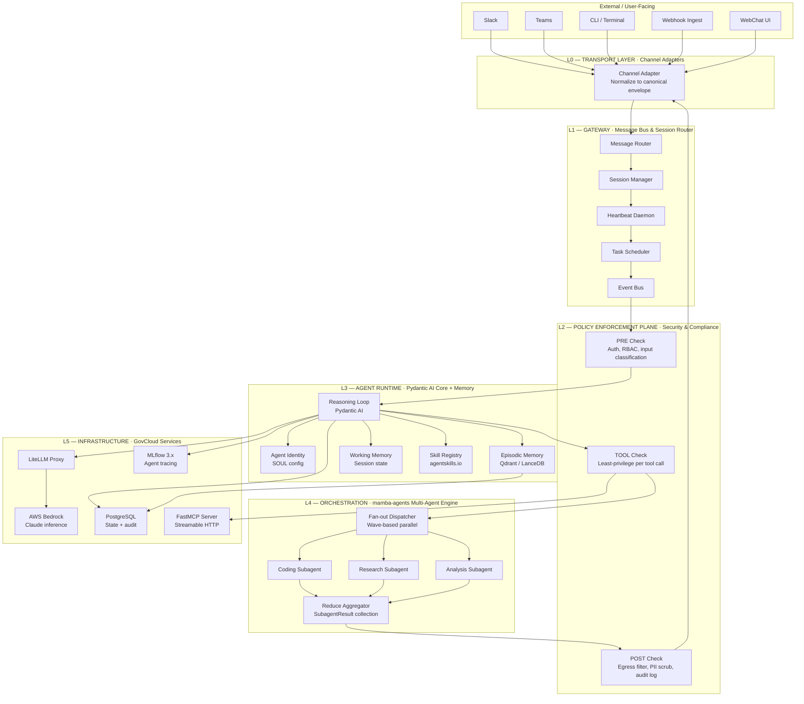
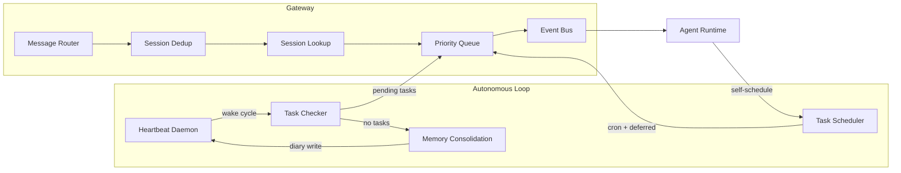
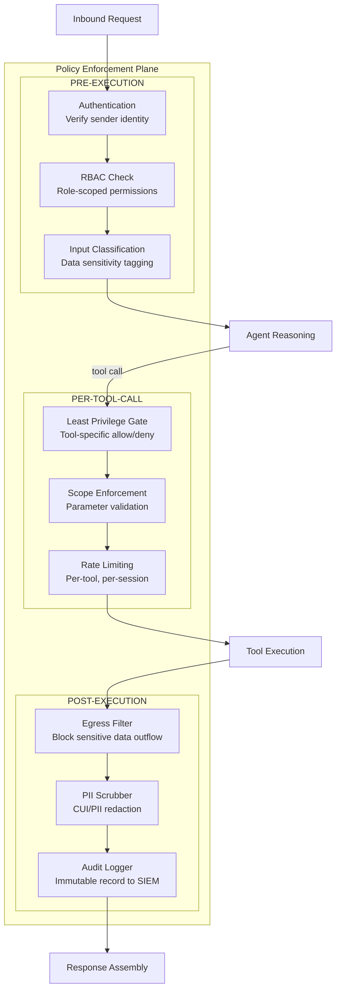
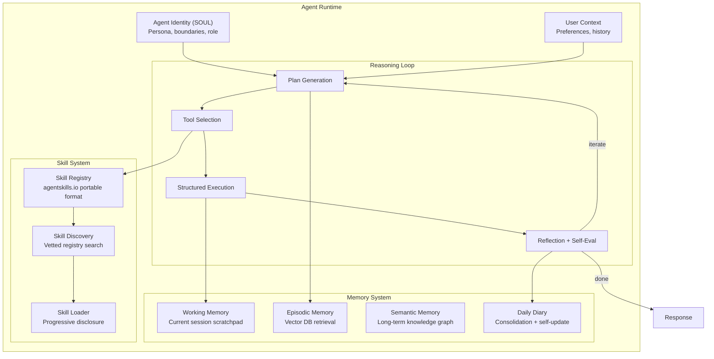
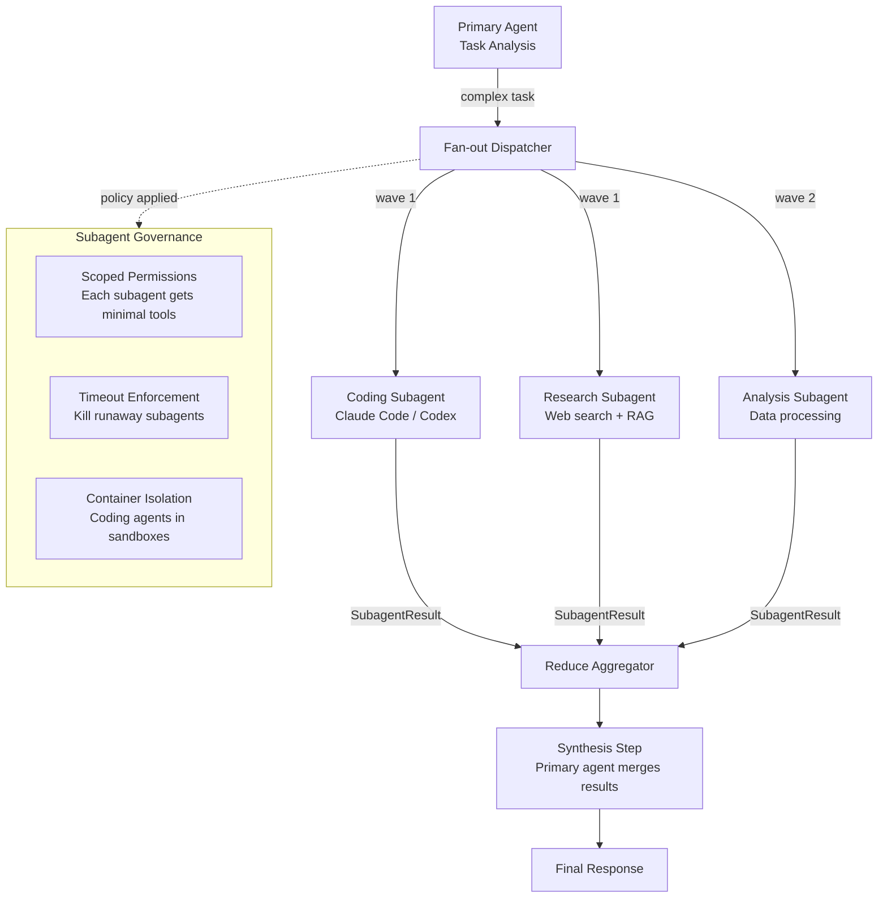
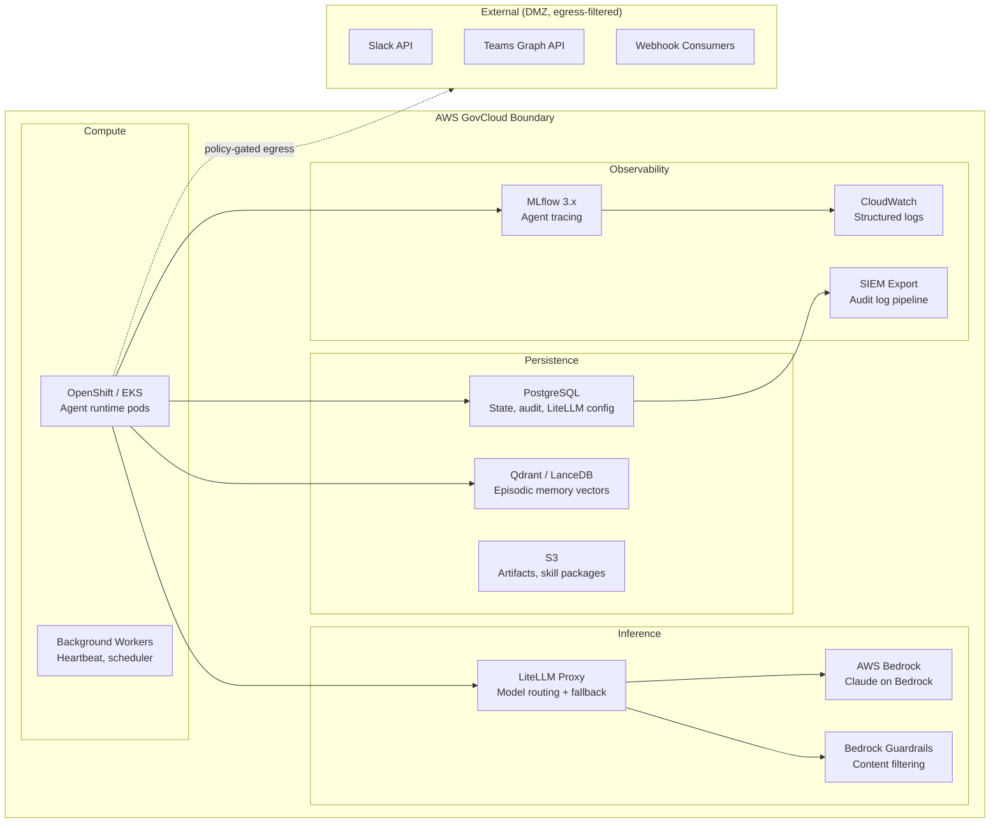
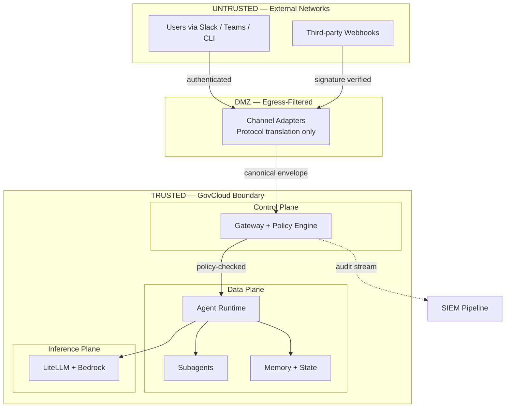
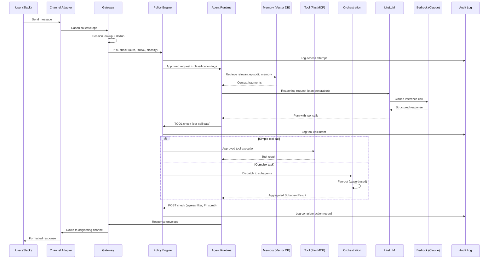
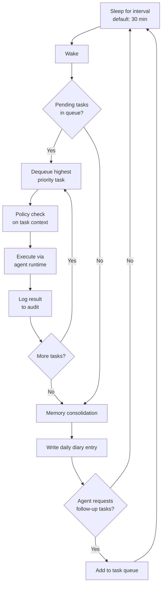

# Enterprise Autonomous Agent Runtime

**Architecture Specification — v0.1 DRAFT**
**Date:** 2026-03-31

An enterprise-grade, GovCloud-native implementation of the "claw pattern" for persistent, autonomous AI agents. Built from scratch on Pydantic AI, FastMCP, LiteLLM, and AWS Bedrock rather than forking from the OpenClaw ecosystem.

---

## System Overview

The runtime is a six-layer stack that transforms a stateless LLM into a persistent, autonomous agent with identity, memory, self-scheduling, and multi-channel presence while keeping every action auditable and every data flow within the GovCloud compliance boundary.



---

## Layer Specifications

### L0 — Transport Layer (Channel Adapters)

Thin, stateless adapters that normalize inbound and outbound messages into a canonical envelope format. Each adapter handles authentication and protocol translation for its specific platform. No business logic lives here.

| Adapter | Technology | Notes |
|---------|-----------|-------|
| Slack | Bolt SDK, socket mode | Workspace-scoped OAuth tokens |
| Teams | Bot Framework, Graph API | Entra ID service principal |
| CLI / Terminal | stdin/stdout with PTY | For developer/operator interaction |
| Webhook Ingest | HTTP POST | Signature verification per source |
| WebChat UI | WebSocket, SSE fallback | Internal-only, behind VPN |

The canonical envelope schema:

```
Envelope:
  id: uuid
  channel: string
  sender_id: string
  sender_role: enum[user, operator, system, heartbeat]
  timestamp: ISO8601
  content: string | structured
  metadata: dict
  session_id: uuid
```

### L1 — Gateway (Message Bus & Session Router)

The single control plane for all agent communication. Every message, whether from a user, a webhook, or the heartbeat daemon, flows through the gateway.



Key behaviors:

- **Session affinity** ensures multi-turn conversations maintain context even across channel switches (start on Slack, continue on CLI).
- **Heartbeat daemon** wakes on a configurable interval (default 30 minutes), checks the task queue, runs pending work, and consolidates memory. This is the mechanism that gives the agent autonomous initiative.
- **Task scheduler** accepts both cron expressions for recurring jobs and one-shot deferred tasks. The agent itself can schedule follow-ups ("check on this PR in 2 hours").
- **Event bus** uses pub/sub internally so that subagent completions, webhook arrivals, and heartbeat wakes all flow through the same dispatch path.

### L2 — Policy Enforcement Plane (Security & Compliance)

This is the most critical layer for enterprise readiness. Every tool call, data access, and LLM request passes through policy enforcement. This is the equivalent of what NVIDIA's OpenShell provides in NemoClaw, rebuilt natively for GovCloud and Bedrock.



The triple-intercept pattern (PRE, TOOL, POST) ensures:

- **PRE:** No unauthenticated or unauthorized requests reach the agent. Input data is classified (public, internal, CUI, PII) before the agent sees it.
- **TOOL:** Each tool call is individually gated. A "read file" tool might be allowed while a "write file" tool is denied for a given role. Parameters are validated against schemas to prevent injection.
- **POST:** Outbound data is scanned for sensitive content before it leaves the GovCloud boundary. Every action produces an immutable audit record exportable to enterprise SIEM pipelines.

Policy definitions are declarative YAML, versioned in Git:

```yaml
policies:
  - name: restrict-external-egress
    scope: all_tools
    rules:
      - deny_if: data_classification in [CUI, PII]
        action: block_and_log
        message: "Blocked: sensitive data cannot leave GovCloud boundary"

  - name: coding-subagent-sandbox
    scope: tools[shell_exec, file_write]
    rules:
      - allow_if: execution_context == "sandboxed_container"
      - deny_if: target_path starts_with ["/etc", "/var", "/home"]
        action: block_and_alert
```

### L3 — Agent Runtime (Pydantic AI Core + Memory)

The reasoning engine. Built on Pydantic AI with structured outputs, dependency injection, and tool use.



Identity and memory persistence:

- **SOUL config** is a structured Pydantic model (not a freeform markdown file like OpenClaw's SOUL.md). It defines the agent's persona, operational boundaries, permitted action categories, and escalation rules. It is versioned and requires operator approval to modify.
- **Episodic memory** uses vector similarity search (Qdrant or LanceDB) to retrieve relevant past interactions and inject them as context. Retrieval is scoped by data classification; the agent cannot surface CUI-tagged memories in an unclassified channel.
- **Daily diary** is written during the heartbeat's memory consolidation phase. It summarizes completed tasks, open items, and observations. Unlike OpenClaw's freeform diary, entries are structured and feed back into the skill discovery loop.

### L4 — Orchestration Layer (mamba-agents)

The fan-out/reduce pipeline for complex, multi-step tasks. When the primary agent determines a task exceeds single-agent scope, it dispatches to specialized subagents.



Key design decisions:

- **Wave-based execution** allows dependencies between subagent groups. Wave 1 subagents run in parallel; wave 2 waits for wave 1 results.
- **SubagentResult dataclasses** enforce structured output from every subagent, preventing the reduce step from dealing with freeform text blobs.
- **Scoped permissions** mean a coding subagent gets `shell_exec` and `file_write` inside its sandbox but cannot access the memory system or send messages to external channels.
- **Timeout enforcement** kills subagents that exceed their time budget, preventing the runaway loops that plague OpenClaw deployments.

### L5 — Infrastructure (GovCloud Services)

All persistence and inference stays within the AWS GovCloud compliance boundary.



Infrastructure notes:

- **LiteLLM Proxy** handles model routing (primary: Claude on Bedrock, fallback: configurable), request/response logging to PostgreSQL, and token usage tracking. All inference requests are logged for audit.
- **Bedrock Guardrails** provide a native, AWS-managed content filtering layer that satisfies compliance requirements without custom implementation.
- **PostgreSQL** is the single relational store for agent state, session data, audit logs, LiteLLM configuration, and task queue persistence. Using a single store simplifies backup, encryption-at-rest, and access control.
- **MLflow 3.x** traces every agent reasoning step, tool call, and subagent delegation for observability and debugging.

---

## Trust Boundaries



Three trust boundaries are enforced:

1. **External to DMZ:** Channel adapters authenticate inbound connections and normalize payloads. No raw external data reaches the agent.
2. **DMZ to GovCloud:** The gateway applies the full PRE policy check before any request enters the trusted boundary. Canonical envelopes are signed.
3. **Data plane to inference plane:** LLM requests are routed through LiteLLM which enforces model selection policy and logs all prompts/completions for audit. Bedrock Guardrails provide an additional content filtering layer.

---

## Request Lifecycle

A complete trace of a single user message through the system:



---

## Heartbeat and Autonomous Loop

The heartbeat daemon is what transforms a reactive chatbot into an autonomous agent. It runs as a background process alongside the main request handler.



Task sources that feed the queue:

- **User-requested:** "Finish this analysis overnight" creates a deferred task.
- **Agent self-scheduled:** The agent identifies follow-up work during reasoning and enqueues it.
- **Cron jobs:** Recurring tasks like daily digests, health checks, or report generation.
- **Event-driven:** Webhook arrivals or subagent completions trigger immediate wake events (bypassing the sleep interval).

---

## Design Principles

**Zero-trust tool execution.** Every tool call passes through the policy enforcement plane. There are no "trusted" tools. Even internal tools like memory reads are policy-gated and audit-logged.

**GovCloud-native inference.** All LLM calls route through LiteLLM to Bedrock. Prompts and completions never leave the GovCloud boundary. Bedrock Guardrails provide a managed content filtering layer that satisfies compliance requirements.

**Auditable by default.** The triple-intercept policy pattern (PRE, TOOL, POST) produces an immutable audit trail for every agent action. Logs export to enterprise SIEM pipelines. Every reasoning step is traced via MLflow.

**Composable subagent delegation.** Complex tasks fan out to specialized subagents through the mamba-agents orchestration layer. Each subagent runs with scoped permissions, enforced timeouts, and container isolation. Results flow back as structured SubagentResult dataclasses.

**Self-extending via vetted skills.** The agent can discover and install new capabilities through the agentskills.io portable skill format. Unlike OpenClaw's ClawHub (which had unvetted community submissions that enabled data exfiltration), skills pass through a review and signing process before entering the registry.

**Persistent autonomy with guardrails.** The heartbeat daemon and task scheduler enable overnight work, recurring jobs, and self-initiated follow-ups. But every autonomous action passes through the same policy enforcement as user-initiated requests.

---

## Comparison: This Architecture vs. ClawVerse Options

| Concern | OpenClaw | NemoClaw | This Architecture |
|---------|----------|----------|-------------------|
| Compliance | None | Early preview, not certified | Built for FedRAMP / DoD IL from day one |
| Inference boundary | Any cloud API | NVIDIA NIM + Nemotron local | AWS Bedrock (GovCloud) via LiteLLM |
| Policy enforcement | None native | OpenShell (forward-looking only) | Triple-intercept (PRE/TOOL/POST), declarative YAML |
| Codebase size | ~430K lines TypeScript | OpenClaw + OpenShell wrapper | Estimated ~15K lines Python |
| Hardware dependency | Any | NVIDIA GPU required | Cloud-native, no GPU dependency |
| Skill vetting | ClawHub (unvetted, exploited) | Inherits ClawHub | Signed, reviewed skill registry |
| Agent identity | Freeform SOUL.md | Inherits OpenClaw | Structured Pydantic model, versioned |
| Subagent governance | Minimal | Minimal | Scoped permissions, timeouts, container isolation |
| Audit trail | None | OpenShell audit logs | Immutable log stream, SIEM export, MLflow traces |

---

## Implementation Phases

**Phase 1 — Foundation (Weeks 1-4).** Agent runtime core: Pydantic AI reasoning loop, SOUL identity model, LiteLLM-to-Bedrock inference, PostgreSQL state persistence. Single-channel adapter (CLI). Basic policy engine with RBAC.

**Phase 2 — Autonomy (Weeks 5-8).** Gateway with session management. Heartbeat daemon and task scheduler. Episodic memory with vector retrieval. Daily diary consolidation. Second channel adapter (Slack or Teams).

**Phase 3 — Orchestration (Weeks 9-12).** mamba-agents fan-out/reduce integration. Subagent governance (scoped permissions, timeouts, sandboxing). Skill registry with signing and progressive disclosure. Coding subagent delegation.

**Phase 4 — Hardening (Weeks 13-16).** Full triple-intercept policy enforcement. Data classification and egress filtering. Audit log pipeline to SIEM. MLflow tracing for all agent operations. Penetration testing and compliance review.

---

*This is a draft architecture specification. All diagrams represent target-state design and are subject to revision during implementation.*
