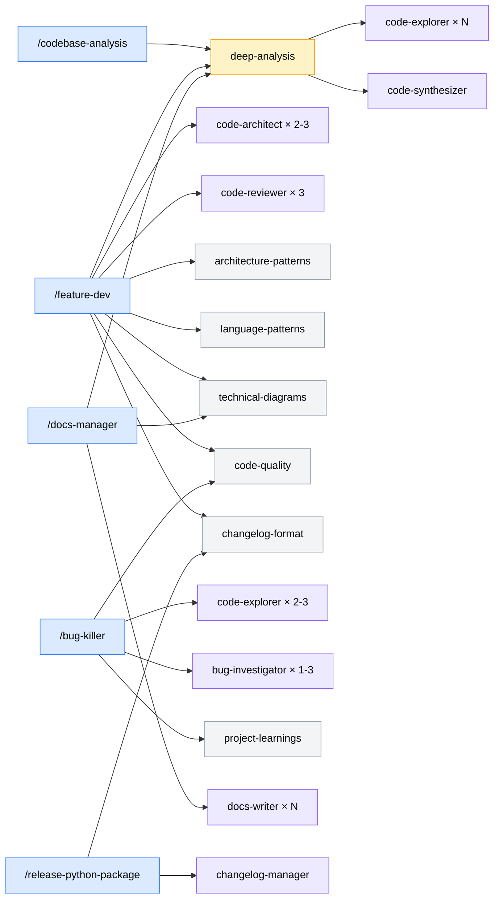
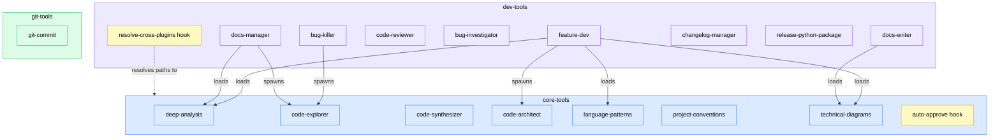
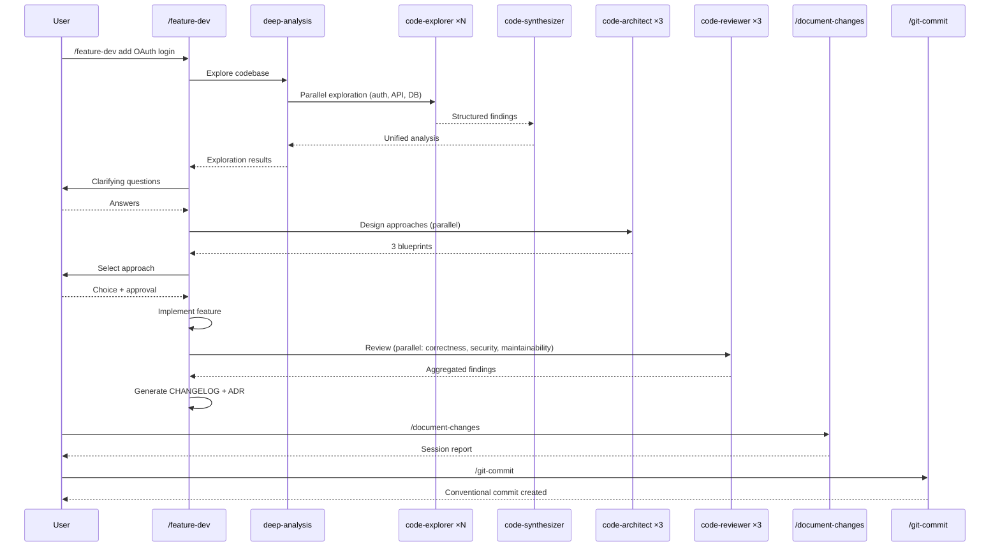

# Agent Alchemy Plugin Ecosystem: Comprehensive Analysis

> **Date:** 2026-03-13
> **Scope:** `claude/core-tools`, `claude/dev-tools`, `claude/git-tools`
> **Totals:** 3 plugins, 7 agents, 15 skills, 2 hooks

---

## Table of Contents

- [1. Ecosystem Overview](#1-ecosystem-overview)
- [2. Plugin Catalog: core-tools](#2-plugin-catalog-core-tools)
- [3. Plugin Catalog: dev-tools](#3-plugin-catalog-dev-tools)
- [4. Plugin Catalog: git-tools](#4-plugin-catalog-git-tools)
- [5. Relationships & Integration Map](#5-relationships--integration-map)
- [6. Gap Analysis & Improvement Proposals](#6-gap-analysis--improvement-proposals)
- [7. Real-World Scenarios](#7-real-world-scenarios)
- [8. Appendix: Complete Metadata Tables](#8-appendix-complete-metadata-tables)

---

## 1. Ecosystem Overview

The Agent Alchemy ecosystem is a three-plugin system that provides a complete AI-powered software development lifecycle. Each plugin has a distinct responsibility layer:

```mermaid
flowchart TD
    classDef core fill:#dbeafe,stroke:#3b82f6,color:#000
    classDef dev fill:#ede9fe,stroke:#8b5cf6,color:#000
    classDef git fill:#dcfce7,stroke:#22c55e,color:#000
    classDef agent fill:#fef3c7,stroke:#f59e0b,color:#000
    classDef skill fill:#fff,stroke:#6b7280,color:#000

    subgraph CORE["core-tools — Foundation Layer"]
        direction TB
        CE[code-explorer]:::agent
        CS[code-synthesizer]:::agent
        CA[code-architect]:::agent
        DA[deep-analysis]:::skill
        CBA[codebase-analysis]:::skill
        LP[language-patterns]:::skill
        PC[project-conventions]:::skill
        TD[technical-diagrams]:::skill
    end

    subgraph DEV["dev-tools — Lifecycle Layer"]
        direction TB
        CR[code-reviewer]:::agent
        BI[bug-investigator]:::agent
        CM[changelog-manager]:::agent
        DW[docs-writer]:::agent
        FD[feature-dev]:::skill
        BK[bug-killer]:::skill
        DM[docs-manager]:::skill
        DC[document-changes]:::skill
        RP[release-python-package]:::skill
        AP[architecture-patterns]:::skill
        CQ[code-quality]:::skill
        CF[changelog-format]:::skill
        PL[project-learnings]:::skill
    end

    subgraph GIT["git-tools — Final Mile"]
        direction TB
        GC[git-commit]:::skill
    end

    FD -->|spawns| CA
    FD -->|spawns 3x| CR
    FD -->|loads| DA
    BK -->|spawns| CE
    BK -->|spawns| BI
    DM -->|loads| DA
    DM -->|spawns| DW
    RP -->|spawns| CM
    DA -->|spawns N| CE
    DA -->|spawns| CS
    CBA -->|loads| DA

    CORE:::core
    DEV:::dev
    GIT:::git
```



### Design Philosophy

| Layer | Plugin | Role | Model Tier |
|-------|--------|------|------------|
| **Foundation** | core-tools | Reusable exploration, analysis, and design building blocks | Opus (synthesis/design), Sonnet (exploration) |
| **Lifecycle** | dev-tools | Orchestrated workflows that compose foundation blocks | Opus (review/docs), Sonnet (investigation/changelog) |
| **Final Mile** | git-tools | Atomic commit automation | Haiku (procedural) |

### Model Tiering Strategy

The ecosystem uses three model tiers strategically:

- **Opus** — Complex reasoning tasks requiring judgment: code-synthesizer, code-architect, code-reviewer, docs-writer
- **Sonnet** — Parallel work requiring breadth: code-explorer, bug-investigator, changelog-manager
- **Haiku** — Procedural scripting with minimal reasoning: git-commit, release-python-package

---

## 2. Plugin Catalog: core-tools

**Path:** `claude/core-tools/`
**Components:** 3 agents, 5 skills, 1 hook
**Purpose:** Foundation layer providing reusable codebase exploration, analysis, synthesis, and design capabilities.

### 2.1 Agents

#### code-explorer

| Property | Value |
|----------|-------|
| **File** | `tools/agents/code-explorer.md` |
| **Model** | Sonnet |
| **Tools** | Read, Glob, Grep, Bash, SendMessage, TaskUpdate, TaskGet, TaskList |
| **Skills Loaded** | project-conventions, language-patterns |
| **Used By** | deep-analysis, bug-killer, docs-manager |

**What it does:** Parallel codebase exploration worker. Assigned a specific focus area (e.g., "authentication flow", "database layer"), it independently finds files, traces execution paths, identifies patterns, and reports structured findings. Multiple explorers run concurrently on different areas.

**Key behaviors:**
- Acknowledges task assignments, marks work `in_progress`, avoids duplicating other explorers' work
- Sends structured findings via SendMessage when complete
- Responds to follow-up questions from the synthesizer with additional targeted exploration
- Loads project-conventions to discover and respect codebase patterns
- Loads language-patterns for language-specific idiom recognition

**Output format:** Structured exploration summary containing: focus area, key files (with purpose and relevance ratings), code patterns observed, important functions/classes with `file:line` references, integration points, and potential challenges.

---

#### code-synthesizer

| Property | Value |
|----------|-------|
| **File** | `tools/agents/code-synthesizer.md` |
| **Model** | Opus |
| **Tools** | Read, Glob, Grep, Bash, SendMessage, TaskUpdate, TaskGet, TaskList |
| **Skills Loaded** | project-conventions, language-patterns, technical-diagrams |
| **Used By** | deep-analysis |

**What it does:** The "brain" of the exploration team. After all explorers complete, the synthesizer merges and deduplicates their findings, identifies conflicts and gaps, asks targeted follow-up questions, and produces a comprehensive unified analysis.

**Deep investigation capabilities:**
- Git blame/log for authorship and change history
- Dependency tree analysis (npm, pip, cargo)
- Static analysis via linters/type checkers
- Cross-cutting concern tracing (logging, auth, error handling)
- Security analysis (auth flows, vulnerability patterns)
- Performance investigation (N+1 queries, memory leaks)

**Session awareness:** Can recover from interrupted sessions by reading persisted exploration findings from `.claude/sessions/__da_live__/explorer-{N}-findings.md`.

**Output format:** Comprehensive synthesis including: architecture overview (with Mermaid diagram), critical files table, file details, relationship map (component dependencies, data flow), patterns & conventions catalog, challenges & risks, recommendations, and open questions.

---

#### code-architect

| Property | Value |
|----------|-------|
| **File** | `tools/agents/code-architect.md` |
| **Model** | Opus |
| **Tools** | Read, Glob, Grep, SendMessage, TaskUpdate, TaskGet, TaskList |
| **Skills Loaded** | technical-diagrams |
| **Used By** | feature-dev |

**What it does:** Read-only design agent that creates implementation blueprints. Given exploration findings and a feature requirement, it produces detailed architectural plans with multiple design approaches. Spawned 2-3 times in parallel by feature-dev, each with a different design philosophy.

**Three design approaches:**
1. **Minimal/Simple** — Fewest files changed, inline solutions, direct implementation
2. **Flexible/Extensible** — Abstractions for reuse, configuration-driven, extension points
3. **Project-Aligned** — Match existing patterns exactly, use established abstractions

**Blueprint contents:** Approach philosophy, overview, files to create (with key structure), files to modify (with code examples), data flow diagrams, API/database changes, error handling, risks & mitigations table, testing strategy, and open questions.

**Design principles:** Match the codebase, minimize blast radius, preserve behavior, enable testing, consider errors, visualize architecture.

---

### 2.2 Skills

#### deep-analysis (Invocable: `/deep-analysis`)

**File:** `skills/deep-analysis/SKILL.md`
**Loaded by:** codebase-analysis, feature-dev, docs-manager, create-spec

The core reusable analysis engine. Orchestrates a hub-and-spoke team of explorers and a synthesizer through 6 phases:

| Phase | Name | What Happens |
|-------|------|-------------|
| 0 | Session Setup | Check cache (24h TTL), detect interrupted sessions, initialize session directory |
| 1 | Reconnaissance & Planning | Rapid codebase mapping, dynamic focus area generation (2-4 areas) |
| 2 | Review & Approval | Present plan for user approval (auto-approved when invoked by another skill) |
| 3 | Team Assembly | Create team, spawn N explorers + 1 synthesizer, create tasks with dependencies |
| 4 | Focused Exploration | Monitor explorer progress, update progress indicators |
| 5 | Evaluation & Synthesis | Completeness check, handle failures, launch synthesis |
| 6 | Completion + Cleanup | Collect results, write cache, present/return, shutdown team |

**Configuration** (via `.claude/agent-alchemy.local.md`):
- `direct-invocation-approval`: true (default) — ask user before proceeding
- `invocation-by-skill-approval`: false (default) — auto-approve when loaded by another skill
- `cache-ttl-hours`: 24 (default)
- `enable-checkpointing`: true (default)
- `enable-progress-indicators`: true (default)

**Error handling:** Per-phase recovery strategies including static template fallback, partial worker failure handling, and session resumption from checkpoints.

---

#### codebase-analysis (Invocable: `/codebase-analysis`)

**File:** `skills/codebase-analysis/SKILL.md`
**References:** `references/report-template.md`, `references/actionable-insights-template.md`

End-to-end codebase understanding workflow built on top of deep-analysis:

| Phase | Name | What Happens |
|-------|------|-------------|
| 1 | Deep Analysis | Run deep-analysis (or use cached results), capture metadata |
| 2 | Reporting | Structured report with Mermaid diagrams: executive summary, architecture, tech stack, critical files, patterns, relationships, risks, recommendations |
| 3 | Post-Analysis Actions | Multi-select: save report, custom report, update docs (README/CLAUDE/AGENTS), keep in memory, address actionable insights |

**Phase 3 actionable insights:** Extracts items from risks and recommendations, severity-ranks them, and for each selected item: assesses complexity (simple/complex-architectural/complex-investigation), proposes fix (may spawn code-architect or code-explorer), and applies approved changes.

---

#### language-patterns (Non-invocable)

**File:** `skills/language-patterns/SKILL.md`
**Loaded by:** code-explorer, code-synthesizer, feature-dev

Reference knowledge for three languages/frameworks:

- **TypeScript:** Strict types, null handling, async/await, naming conventions, file organization, import ordering
- **Python:** Type hints, dataclasses/Pydantic, comprehensions, context managers, pathlib, naming, imports
- **React:** Functional components with hooks, custom hooks, state management hierarchy, derived state, performance optimization (useMemo/useCallback/memo), lazy loading, error boundaries

---

#### project-conventions (Non-invocable)

**File:** `skills/project-conventions/SKILL.md`
**Loaded by:** code-explorer, code-synthesizer

Guide for discovering and applying project-specific conventions:

1. **Project configuration:** Scan `.eslintrc`, `.prettierrc`, `pyproject.toml`, `.editorconfig`, `ruff.toml`, `tsconfig.json`
2. **Existing code patterns:** Analyze directory structures, naming styles, import patterns
3. **Similar features:** Find and study existing implementations for patterns

**Convention areas:** Naming, file structure, error handling, testing, API patterns.
**Conflict resolution:** Prefer newer code → maintained code → documented conventions → ask if unclear.
**Red flags:** Code looking different from surroundings, using patterns not found elsewhere, naming inconsistencies, lint errors.

---

#### technical-diagrams (Non-invocable)

**File:** `skills/technical-diagrams/SKILL.md`
**References:** `references/flowcharts.md`, `references/sequence-diagrams.md`, `references/class-diagrams.md`, `references/state-diagrams.md`, `references/er-diagrams.md`, `references/c4-diagrams.md`
**Loaded by:** code-synthesizer, code-architect, docs-writer, codebase-analysis

Mermaid diagram syntax and styling guidance for 6 diagram types:

| Type | Use Case |
|------|----------|
| Flowchart | Process flows, decision trees, pipelines |
| Sequence | API interactions, message passing, protocols |
| Class | Object models, interfaces, relationships |
| State | State machines, lifecycle management |
| ER | Database schemas, entity relationships |
| C4 | System architecture (context/container/component/dynamic/deployment) |

**Critical styling rules:**
- Always use dark text (`color:#000`) on every node
- Use `classDef` for consistent styling
- Pre-tested safe color palettes (primary/secondary/success/warning/danger/neutral)
- Keep diagrams focused (15-20 nodes max)
- Choose direction deliberately (TD for hierarchies, LR for pipelines)

---

### 2.3 Hook

#### auto-approve-da-session

**Files:** `hooks/hooks.json`, `hooks/auto-approve-da-session.sh`
**Trigger:** PreToolUse for Write, Edit, and Bash tools

Auto-approves file operations targeting deep-analysis session directories:
- `.claude/sessions/__da_live__/*` (active session)
- `.claude/sessions/exploration-cache/*` (cache)
- `.claude/sessions/da-*/*` (archived sessions)

Optional debug logging via `AGENT_ALCHEMY_HOOK_DEBUG=1`.

---

## 3. Plugin Catalog: dev-tools

**Path:** `claude/dev-tools/`
**Components:** 4 agents, 9 skills (5 invocable, 4 non-invocable), 1 hook
**Purpose:** Lifecycle layer providing orchestrated workflows for feature development, debugging, documentation, and release management.

### 3.1 Agents

#### code-reviewer

| Property | Value |
|----------|-------|
| **File** | `tools/agents/code-reviewer.md` |
| **Model** | Opus |
| **Tools** | Read, Glob, Grep, SendMessage, TaskUpdate, TaskGet, TaskList |
| **Used By** | feature-dev (3x parallel) |

**What it does:** Senior-level code review with confidence-scored findings. Only reports findings with confidence >= 80 to reduce noise. Spawned 3 times in parallel by feature-dev, each with a different focus:

1. **Correctness & Edge Cases** — Logic errors, boundary conditions, race conditions
2. **Security & Error Handling** — Injection, auth bypass, error leaks, input validation
3. **Maintainability & Code Quality** — Complexity, naming, coupling, test coverage

**Output format:** Structured report with critical issues, moderate issues, positive observations, and summary assessment.

---

#### bug-investigator

| Property | Value |
|----------|-------|
| **File** | `tools/agents/bug-investigator.md` |
| **Model** | Sonnet |
| **Tools** | Read, Glob, Grep, Bash, SendMessage, TaskUpdate, TaskGet, TaskList |
| **Used By** | bug-killer (deep track, 1-3x parallel) |

**What it does:** Diagnostic investigation specialist. Given a specific hypothesis to test, it gathers evidence through code tracing, diagnostic testing, git history analysis, and state inspection. Reports findings as evidence for/against the hypothesis. **Does NOT fix bugs** — investigation and reporting only.

**Investigation techniques:** Code tracing, diagnostic tests, git history analysis, state/config checks, data inspection.

**Output format:** Hypothesis verdict (confirmed/rejected/inconclusive), evidence (supporting and contradicting), key findings with `file:line` references, and recommendations.

---

#### changelog-manager

| Property | Value |
|----------|-------|
| **File** | `tools/agents/changelog-manager.md` |
| **Model** | Sonnet |
| **Tools** | Bash, Read, Edit, Glob, Grep, AskUserQuestion |
| **Used By** | release-python-package |

**What it does:** Analyzes git history since last release to generate CHANGELOG.md entries. Uses conventional commit prefixes plus secondary signals (PR labels, diff analysis). Enriches entries with PR/issue context via `gh` CLI. Detects breaking changes automatically (removed exports, breaking parameters, return type changes) and asks about ambiguous cases (renames, new required parameters).

**Workflow:** Git analysis → diff analysis → deep diff for API detection → PR enrichment → categorization → entry synthesis → user approval → write to CHANGELOG.md.

---

#### docs-writer

| Property | Value |
|----------|-------|
| **File** | `tools/agents/docs-writer.md` |
| **Model** | Opus |
| **Tools** | Read, Glob, Grep, Bash |
| **Skills Loaded** | technical-diagrams |
| **Used By** | docs-manager |

**What it does:** Generates high-quality markdown documentation from codebase analysis findings. Supports two output format modes:

- **MkDocs-flavored:** Material theme admonitions, tabbed content, code block titles, Mermaid diagrams
- **Basic Markdown:** GitHub-flavored with blockquotes, separate code blocks, standard formatting

**Documentation types:** API references, architecture guides, how-to guides, general pages, change summaries.

**Quality standards:** Accuracy (reads source code to verify), completeness, clarity, practical examples, cross-references.

---

### 3.2 Skills (User-Invocable)

#### feature-dev (Invocable: `/feature-dev`)

**File:** `skills/feature-dev/SKILL.md`
**References:** `references/adr-template.md`, `references/changelog-entry-template.md`

The most comprehensive workflow in the ecosystem. 7 mandatory phases that run continuously without stopping:

| Phase | Name | Agents/Skills Used |
|-------|------|-------------------|
| 1 | Discovery | — (user interaction) |
| 2 | Codebase Exploration | deep-analysis (auto-approved) |
| 3 | Clarifying Questions | — (user interaction) |
| 4 | Architecture Design | code-architect × 2-3, architecture-patterns, language-patterns, technical-diagrams |
| 5 | Implementation | — (requires explicit user approval) |
| 6 | Quality Review | code-reviewer × 3, code-quality |
| 7 | Summary | changelog-format (CHANGELOG entry + ADR) |

**Artifacts generated:**
- ADR document: `internal/docs/adr/NNNN-[feature-slug].md`
- CHANGELOG.md entry under `[Unreleased]`

---

#### bug-killer (Invocable: `/bug-killer [--deep]`)

**File:** `skills/bug-killer/SKILL.md`
**References:** `references/general-debugging.md`, `references/python-debugging.md`, `references/typescript-debugging.md`

Hypothesis-driven debugging with two-track routing:

| Track | Criteria | Agents Used |
|-------|----------|-------------|
| **Quick** | Clear error, localized (1-2 files), obvious fix, no concurrency | None (inline investigation) |
| **Deep** | Spans 3+ files, unclear root cause, intermittent, concurrency/timing, prior failed attempts | code-explorer × 2-3, bug-investigator × 1-3 |

**Auto-escalation:** After 2 rejected hypotheses in quick track, automatically switches to deep track.
**`--deep` flag:** Skips triage, jumps directly to deep track.

**Phases:**
1. Triage & Reproduction → route to track
2. Investigation (language-specific techniques loaded)
3. Root Cause Analysis (hypothesis journal maintained throughout)
4. Fix & Verify (deep track also loads code-quality for broader scan)
5. Wrap-up & Report (loads project-learnings to capture findings in CLAUDE.md)

---

#### docs-manager (Invocable: `/docs-manager`)

**File:** `skills/docs-manager/SKILL.md`
**References:** `references/change-summary-templates.md`, `references/markdown-file-templates.md`, `references/mkdocs-config-template.md`

Documentation management for MkDocs sites and standalone markdown:

| Phase | Name | What Happens |
|-------|------|-------------|
| 1 | Interactive Discovery | Determine type (MkDocs/markdown/change-summary), format, scope |
| 2 | Project Detection & Setup | Auto-detect, conditionally scaffold MkDocs |
| 3 | Codebase Analysis | deep-analysis (or git-based for change summaries) |
| 4 | Documentation Planning | Translate findings → concrete plan → user approval |
| 5 | Documentation Generation | docs-writer agents (parallel for independent, sequential for dependent) |
| 6 | Integration & Finalization | Write files, validate (`mkdocs build --strict`), present |

**Documentation types:**
- MkDocs site (new setup: full/minimal/custom; existing: generate/update/both)
- Standalone markdown (README, CONTRIBUTING, ARCHITECTURE, API docs)
- Change summary (Keep a Changelog, Conventional Commit message, or MkDocs page)

---

#### document-changes (Invocable: `/document-changes`)

**File:** `skills/document-changes/SKILL.md`

Lightweight session change reporter. Generates a markdown report from git state:

- Metadata table (date, branch, author, commits, repo)
- Overview with stats (files, lines added/removed, commit count)
- Files changed table (status, lines, description)
- Change details organized by Added/Modified/Deleted
- Git status (staged/unstaged/untracked)
- Session commits table

**Default output:** `internal/reports/<description>-YYYY-MM-DD.md`

---

#### release-python-package (Invocable: `/release-python-package`)

**File:** `skills/release-python-package/SKILL.md`

Python release automation:

1. Pre-flight checks (branch=main, clean working directory, pull latest)
2. Run tests (`uv run pytest`)
3. Run linting (`uv run ruff check`, `uv run ruff format --check`)
4. Verify build (`uv build`)
5. Changelog update check (optionally spawns changelog-manager)
6. Calculate version from CHANGELOG.md (semver: MAJOR if removed + v>=1.0.0, MINOR if added/changed, PATCH for fixed/security/deprecated)
7. Update CHANGELOG.md (transform `[Unreleased]` → versioned section)
8. Commit changelog
9. Create and push tag

**Model:** Haiku (efficient for procedural scripting)

---

### 3.3 Skills (Non-Invocable)

#### architecture-patterns

**File:** `skills/architecture-patterns/SKILL.md`
**Loaded by:** feature-dev (Phase 4)

Architectural pattern knowledge:
- Layered Architecture (N-Tier)
- MVC (Model-View-Controller)
- Repository Pattern
- Service Layer Pattern
- Event-Driven Architecture (Event Emitter, Message Queue)
- CQRS (Command Query Responsibility Segregation)
- Ports and Adapters (Hexagonal)
- Microservices Patterns (API Gateway, Service Discovery, Circuit Breaker, Saga)

Also covers anti-patterns: Big Ball of Mud, God Object, Spaghetti Code, Golden Hammer, Premature Optimization.

---

#### code-quality

**File:** `skills/code-quality/SKILL.md`
**Loaded by:** feature-dev (Phase 6), bug-killer (Phase 4, deep track)

Code quality principles and review standards:
- **SOLID Principles:** SRP, OCP, LSP, ISP, DIP with examples
- **Core principles:** DRY, KISS, YAGNI
- **Clean Code:** Meaningful names, small functions, no side effects, error handling
- **Testing strategies:** Test pyramid, unit/integration/E2E, behavior vs implementation
- **Code smells:** Long methods, large classes, duplication, dead code, magic numbers, nested conditionals, feature envy
- **Refactoring techniques:** Extract function, inline function, extract variable, rename, replace conditional with polymorphism, introduce parameter object

---

#### changelog-format

**File:** `skills/changelog-format/SKILL.md`
**References:** `references/entry-examples.md`
**Loaded by:** feature-dev (Phase 7), changelog-manager

Keep a Changelog specification:
- Categories (in order): Added, Changed, Deprecated, Removed, Fixed, Security
- Entry rules: imperative mood, user-focused, specific/concise, contextual
- Semantic versioning connection
- What NOT to include: refactoring, dependency updates, test changes, CI/CD, docs-only, style

---

#### project-learnings

**File:** `skills/project-learnings/SKILL.md`
**Loaded by:** bug-killer (Phase 5)

Captures project-specific patterns to CLAUDE.md. Qualification criteria:
- Would a developer unfamiliar with the project likely hit this issue?
- Is this specific to this codebase's architecture, APIs, or conventions?
- Is it something Claude's training data wouldn't cover?

Workflow: Evaluate → check for duplicates → format (imperative, include WHY) → confirm with user → write to CLAUDE.md.

---

### 3.4 Hook

#### resolve-cross-plugins

**Files:** `hooks/hooks.json`, `hooks/resolve-cross-plugins.sh`
**Trigger:** SessionStart

Creates short-name symlinks in plugin cache so cross-plugin paths like `${CLAUDE_PLUGIN_ROOT}/../core-tools/` resolve correctly. Reads `installed_plugins.json` to find correct cached versions with fallback to version sorting.

---

## 4. Plugin Catalog: git-tools

**Path:** `claude/git-tools/`
**Components:** 0 agents, 1 skill
**Purpose:** Atomic commit automation with Conventional Commits format.

### 4.1 Skills

#### git-commit (Invocable: `/git-commit`)

**File:** `skills/git-commit/SKILL.md`
**Model:** Haiku
**Tools:** Bash, AskUserQuestion only

6-step workflow:
1. Check repository state (`git status --porcelain`)
2. Stage all changes (`git add .`)
3. Analyze changes (`git diff --cached --stat` + `git diff --cached`)
4. Construct commit message (Conventional Commits)
5. Create commit (heredoc format)
6. Handle result (success → report hash; hook failure → instruct to fix and retry, **never amend**)

**Commit types:** feat, fix, docs, style, refactor, test, chore, build, ci, perf
**Rules:** Imperative mood, lowercase, <72 chars, no trailing period, no co-author/attribution lines

---

## 5. Relationships & Integration Map

### 5.1 Skill Composition Hierarchy



### 5.2 Cross-Plugin Dependency Flow



### 5.3 End-to-End Feature Development Data Flow



### 5.4 Agent Communication Patterns

| Pattern | Description | Example |
|---------|-------------|---------|
| **Hub-and-spoke** | Lead orchestrates, workers report back independently | deep-analysis: explorers → synthesizer |
| **Parallel-with-merge** | Multiple agents work same scope, results aggregated | feature-dev Phase 6: 3 reviewers → merged findings |
| **Parallel-competitive** | Multiple agents propose alternatives, user selects | feature-dev Phase 4: 2-3 architects → user choice |
| **Sequential-pipeline** | One agent's output feeds the next | bug-killer: explorer findings → investigator hypotheses |
| **Fire-and-forget** | Agent runs independently, no coordination needed | changelog-manager in release workflow |

---

## 6. Gap Analysis & Improvement Proposals

### Priority Ranking

| Priority | Gap | Impact | Effort |
|----------|-----|--------|--------|
| **P1** | No testing skill | High — tests are core to quality | Medium |
| **P1** | project-learnings underutilized | High — lost knowledge capture | Low |
| **P1** | git-commit stages everything | High — security risk | Low |
| **P2** | No PR/review workflow | Medium — workflow gap after commit | Medium |
| **P2** | No refactoring skill | Medium — common developer need | Medium |
| **P2** | Language support limited to TS/Python/React | Medium — excludes major languages | Medium |
| **P3** | No security/performance audit | Medium — specialized need | High |
| **P3** | No CI/CD integration | Medium — specialized need | High |
| **P3** | No migration/schema skill | Low-Medium — specialized need | High |
| **P3** | Python-only release automation | Low — narrow but useful | Medium |

---

### Gap 1: No Testing Skill (P1)

**Problem:** No skill for test generation, test execution monitoring, or coverage analysis. Feature-dev implements features but relies on the developer to write tests. The code-quality skill references testing strategies but doesn't orchestrate test creation.

**Proposed skill: `test-gen`**
- Analyze code changes and generate unit/integration tests
- Load language-patterns for framework-specific patterns (pytest, Jest/Vitest)
- Run tests and report coverage delta
- Integration: standalone invocable OR loaded by feature-dev after Phase 5

---

### Gap 2: project-learnings Underutilized (P1)

**Problem:** Only bug-killer (Phase 5) loads project-learnings. Feature-dev discovers architectural patterns during Phase 2-4. Codebase-analysis discovers conventions during Phase 3. Docs-manager discovers undocumented patterns. None of these capture findings.

**Proposed fix:**
- feature-dev Phase 7: Load project-learnings to capture architectural decisions and patterns
- codebase-analysis Phase 3: Load project-learnings to capture convention insights
- docs-manager Phase 6: Load project-learnings to capture documentation gaps as learnings

---

### Gap 3: git-commit Stages Everything (P1)

**Problem:** `git add .` stages ALL changes, including potential `.env` files, debug artifacts, or unrelated changes. While `.gitignore` provides some protection, this is overly aggressive.

**Proposed fix:**
- Show staged changes summary before committing
- Check for sensitive file patterns (`.env`, `credentials`, `*.key`, `*.pem`)
- Allow selective staging (specific files or all)
- Default to `git add .` but warn and ask confirmation for flagged patterns

---

### Gap 4: No PR/Review Workflow (P2)

**Problem:** After git-commit, there's no automated PR creation, description generation, or review response workflow.

**Proposed skill: `pr-manager`**
- Generate PR descriptions from commit history and code diffs
- Create PRs via `gh` CLI with labels, reviewers, linked issues
- Respond to PR review comments with targeted fixes
- Integration: natural next step after `/git-commit`

---

### Gap 5: No Refactoring Skill (P2)

**Problem:** Code-quality has refactoring techniques as reference, but there's no orchestrated refactoring workflow with safety verification.

**Proposed skill: `refactor`**
- Safe refactoring with before/after test verification
- Code smell detection → suggested refactoring patterns
- Scope controls (function/class/module/cross-cutting)
- Post-refactor validation via code-reviewer agents

---

### Gap 6: Limited Language Support (P2)

**Problem:** language-patterns covers only TypeScript, Python, and React. Go, Rust, Java, C#, and others are unsupported.

**Proposed fix:** Extend language-patterns with on-demand reference files (matching the technical-diagrams pattern):
```
language-patterns/
├── SKILL.md (overview + selection logic)
└── references/
    ├── typescript.md (existing content)
    ├── python.md (existing content)
    ├── react.md (existing content)
    ├── go.md (new)
    ├── rust.md (new)
    └── java.md (new)
```

---

### Gap 7: No Security/Performance Audit (P3)

**Problem:** Code-reviewer checks for security issues as part of review, but there's no dedicated audit workflow for OWASP scanning, dependency auditing, or performance profiling.

**Proposed skill: `audit`**
- OWASP Top 10 focused code scanning
- Dependency vulnerability checking (`npm audit`, `pip-audit`, `cargo audit`)
- Performance profiling integration
- Severity-rated findings with remediation guidance

---

### Gap 8: No CI/CD Integration (P3)

**Problem:** No skill monitors CI pipelines, interprets build failures, or helps debug CI issues.

**Proposed skill: `ci-helper`**
- Monitor GitHub Actions status via `gh run`
- Diagnose build failures with log analysis
- Suggest fixes for common CI patterns (dependency issues, flaky tests, env problems)
- Integration: natural companion to PR workflows

---

### Gap 9: No Migration/Schema Skill (P3)

**Problem:** Database migrations, API versioning, and breaking change management aren't addressed by any existing skill.

**Proposed skill: `migration-helper`**
- Database migration generation (Alembic, Prisma, Drizzle, etc.)
- API versioning guidance
- Breaking change impact analysis
- Backward compatibility verification

---

### Gap 10: Python-Only Release Automation (P3)

**Problem:** release-python-package only supports Python. No npm, Cargo, Go modules, etc.

**Proposed fix:** Either:
- Generalize into a `release` skill with language-specific references (like technical-diagrams)
- Create parallel skills: `release-npm-package`, `release-cargo-package`, etc.

---

## 7. Real-World Scenarios

### Scenario 1: New Developer Onboarding

**Problem:** A developer joins a team with a large unfamiliar codebase.

**Workflow:**
```
/codebase-analysis
```

**What happens:**
1. deep-analysis spawns 3-4 explorers to map authentication, API layer, data models, and infrastructure
2. Synthesizer merges findings into architecture overview with Mermaid diagrams
3. Structured report presented: critical files, patterns, risks, tech stack
4. Developer saves report to `internal/docs/`, updates README, and optionally addresses identified risks

**Value:** Hours of manual exploration → minutes. New developer gets structured understanding with architecture diagrams and actionable insights.

---

### Scenario 2: Implementing OAuth2 Authentication

**Problem:** Add Google and GitHub OAuth2 providers to an existing Express.js application.

**Workflow:**
```
/feature-dev add OAuth2 login with Google and GitHub providers
```

**What happens:**
1. deep-analysis maps existing auth code, session handling, user model
2. User clarifies: which OAuth library, session storage preference, callback URL patterns
3. Three code-architects propose:
   - **Minimal:** Direct passport.js strategies inline in routes
   - **Flexible:** Provider factory pattern with config-driven registration
   - **Project-aligned:** Matches existing auth middleware patterns
4. User selects approach → implementation begins
5. Three reviewers verify: no auth bypass (security), proper error handling (correctness), clean code (maintainability)
6. CHANGELOG entry + ADR generated automatically

**Value:** Architectural decision documented, security reviewed by dedicated agent, patterns matched to existing codebase. Competing designs give user informed choice.

---

### Scenario 3: Debugging an Intermittent Race Condition

**Problem:** Users occasionally report duplicate order submissions.

**Workflow:**
```
/bug-killer --deep users report occasional duplicate order submissions
```

**What happens:**
1. `--deep` skips triage, goes straight to deep investigation
2. 2-3 code-explorers map order submission flow: API endpoint, service layer, database writes
3. Hypotheses generated: missing idempotency key, double-click without debounce, transaction isolation level
4. 1-3 bug-investigators test each hypothesis with git history, state analysis, diagnostic tests
5. Root cause confirmed (e.g., no idempotency key on order creation endpoint)
6. Fix applied with regression test
7. Learning captured in CLAUDE.md: "Order endpoints require idempotency keys — without them, network retries cause duplicates"

**Value:** Systematic investigation instead of guesswork. Evidence-based root cause. Future sessions benefit from captured learnings.

---

### Scenario 4: Setting Up Project Documentation

**Problem:** A project has no documentation beyond a sparse README.

**Workflow:**
```
/docs-manager set up MkDocs site with API reference, architecture guide, and getting started page
```

**What happens:**
1. Discovery: MkDocs site, full setup, three doc types
2. Detection: No existing MkDocs, detects Express.js + PostgreSQL project
3. deep-analysis explores: API endpoints, middleware, database schema, deployment config
4. Plan: 5 pages (index, getting-started, architecture, API reference, deployment)
5. docs-writer agents generate pages in parallel (architecture diagrams via Mermaid)
6. MkDocs scaffolded, `mkdocs build --strict` validates all cross-references

**Value:** Complete documentation site generated from code analysis. Architecture diagrams, API reference, and getting-started guide without manual writing.

---

### Scenario 5: Python Package Release

**Problem:** Time to cut a new release of a Python library.

**Workflow:**
```
/release-python-package
```

**What happens:**
1. Preflight: confirms main branch, clean state, pulls latest
2. Tests pass (`uv run pytest`), lint passes (`uv run ruff`)
3. Build succeeds (`uv build`)
4. changelog-manager reviews git history, enriches entries from PRs
5. Version calculated from CHANGELOG.md categories: new features → MINOR bump
6. CHANGELOG.md updated: `[Unreleased]` → `[1.3.0] - 2026-03-13`
7. Git tag `v1.3.0` created and pushed

**Value:** Consistent, safe releases. No manual version calculation or changelog formatting. Pre-flight checks catch issues before tagging.

---

### Scenario 6: Quick Bug Fix → Document → Commit Pipeline

**Problem:** Quick fix needed for a typo causing 500 errors.

**Workflow:**
```
/bug-killer users getting 500 on /api/users endpoint
/document-changes
/git-commit
```

**What happens:**
1. bug-killer triages as quick track (clear error, localized)
2. Investigates → finds typo in response serializer → fixes → verifies
3. `/document-changes` generates session report with before/after
4. `/git-commit` creates: `fix(api): correct field name in user response serializer`

**Value:** Full audit trail from investigation through commit. Conventional commit message auto-generated from diff analysis.

---

### Scenario 7: Deep Architecture Analysis for Sprint Planning

**Problem:** Team needs to understand a legacy monorepo before planning a modernization sprint.

**Workflow:**
```
/deep-analysis
```

**What happens:**
1. Reconnaissance: 200+ files, Python/Django backend, React frontend, Celery workers
2. Dynamic focus areas generated: Django models & migrations, API views & serializers, React component tree, Celery task graph
3. 4 explorers map each area in parallel (Sonnet — fast, cheap)
4. Synthesizer merges findings (Opus — deep reasoning), asks follow-ups about circular imports found
5. Comprehensive report: architecture diagram, dependency graph, technical debt inventory, modernization recommendations
6. Results cached for 24 hours — subsequent `/feature-dev` or `/docs-manager` runs skip re-analysis

**Value:** Shared team understanding from AI analysis. Cached results accelerate all subsequent workflows in the same session window.

---

## 8. Appendix: Complete Metadata Tables

### All Agents

| # | Agent | Plugin | Model | Tools | Used By |
|---|-------|--------|-------|-------|---------|
| 1 | code-explorer | core-tools | Sonnet | Read, Glob, Grep, Bash, SendMessage, TaskUpdate, TaskGet, TaskList | deep-analysis, bug-killer, docs-manager |
| 2 | code-synthesizer | core-tools | Opus | Read, Glob, Grep, Bash, SendMessage, TaskUpdate, TaskGet, TaskList | deep-analysis |
| 3 | code-architect | core-tools | Opus | Read, Glob, Grep, SendMessage, TaskUpdate, TaskGet, TaskList | feature-dev |
| 4 | code-reviewer | dev-tools | Opus | Read, Glob, Grep, SendMessage, TaskUpdate, TaskGet, TaskList | feature-dev |
| 5 | bug-investigator | dev-tools | Sonnet | Read, Glob, Grep, Bash, SendMessage, TaskUpdate, TaskGet, TaskList | bug-killer |
| 6 | changelog-manager | dev-tools | Sonnet | Bash, Read, Edit, Glob, Grep, AskUserQuestion | release-python-package |
| 7 | docs-writer | dev-tools | Opus | Read, Glob, Grep, Bash | docs-manager |

### All Skills

| # | Skill | Plugin | Invocable | Model Override | Loaded By |
|---|-------|--------|-----------|---------------|-----------|
| 1 | deep-analysis | core-tools | Yes | — | codebase-analysis, feature-dev, docs-manager |
| 2 | codebase-analysis | core-tools | Yes | — | Standalone |
| 3 | language-patterns | core-tools | No | — | code-explorer, code-synthesizer, feature-dev |
| 4 | project-conventions | core-tools | No | — | code-explorer, code-synthesizer |
| 5 | technical-diagrams | core-tools | No | — | code-synthesizer, code-architect, docs-writer, codebase-analysis |
| 6 | feature-dev | dev-tools | Yes | — | Standalone |
| 7 | bug-killer | dev-tools | Yes | — | Standalone |
| 8 | docs-manager | dev-tools | Yes | — | Standalone |
| 9 | document-changes | dev-tools | Yes | — | Standalone |
| 10 | release-python-package | dev-tools | Yes | Haiku | Standalone |
| 11 | architecture-patterns | dev-tools | No | — | feature-dev |
| 12 | code-quality | dev-tools | No | — | feature-dev, bug-killer |
| 13 | changelog-format | dev-tools | No | — | feature-dev, changelog-manager |
| 14 | project-learnings | dev-tools | No | — | bug-killer |
| 15 | git-commit | git-tools | Yes | Haiku | Standalone |

### All Hooks

| # | Hook | Plugin | Trigger | Purpose |
|---|------|--------|---------|---------|
| 1 | auto-approve-da-session | core-tools | PreToolUse (Write, Edit, Bash) | Auto-approve deep-analysis session file operations |
| 2 | resolve-cross-plugins | dev-tools | SessionStart | Create symlinks for cross-plugin path resolution in cache |

### All Reference Files

| # | File | Plugin/Skill | Purpose |
|---|------|-------------|---------|
| 1 | report-template.md | core-tools/codebase-analysis | Phase 2 report structure |
| 2 | actionable-insights-template.md | core-tools/codebase-analysis | Phase 3 insight format |
| 3 | flowcharts.md | core-tools/technical-diagrams | Mermaid flowchart syntax |
| 4 | sequence-diagrams.md | core-tools/technical-diagrams | Mermaid sequence syntax |
| 5 | class-diagrams.md | core-tools/technical-diagrams | Mermaid class syntax |
| 6 | state-diagrams.md | core-tools/technical-diagrams | Mermaid state syntax |
| 7 | er-diagrams.md | core-tools/technical-diagrams | Mermaid ER syntax |
| 8 | c4-diagrams.md | core-tools/technical-diagrams | Mermaid C4 syntax |
| 9 | adr-template.md | dev-tools/feature-dev | ADR document template |
| 10 | changelog-entry-template.md | dev-tools/feature-dev | CHANGELOG entry template |
| 11 | general-debugging.md | dev-tools/bug-killer | Language-agnostic debugging |
| 12 | python-debugging.md | dev-tools/bug-killer | Python-specific debugging |
| 13 | typescript-debugging.md | dev-tools/bug-killer | TypeScript-specific debugging |
| 14 | entry-examples.md | dev-tools/changelog-format | Changelog entry examples |
| 15 | change-summary-templates.md | dev-tools/docs-manager | Change summary formats |
| 16 | markdown-file-templates.md | dev-tools/docs-manager | README/CONTRIBUTING/etc templates |
| 17 | mkdocs-config-template.md | dev-tools/docs-manager | MkDocs YAML config template |
