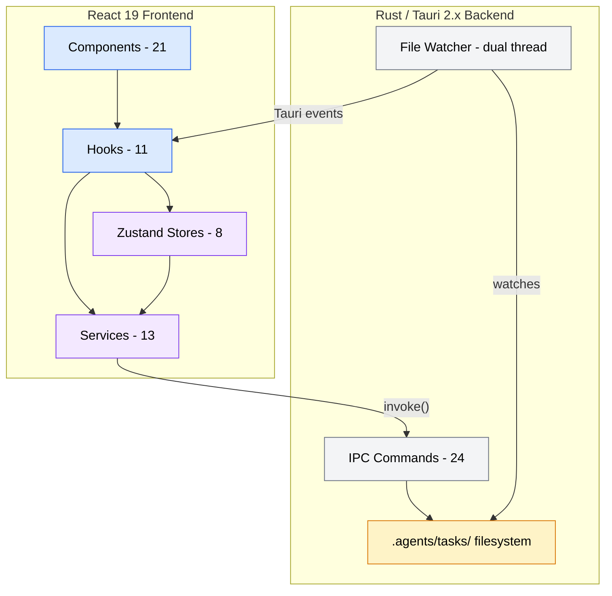
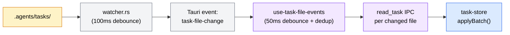
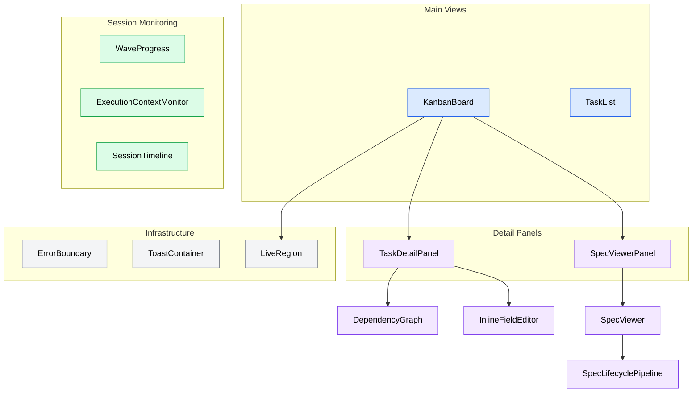

# Codebase Analysis Report

**Analysis Context**: Task Manager Tauri desktop app — SDD pipeline task visualization
**Codebase Path**: `apps/task-manager/`
**Date**: 2026-04-07

## Table of Contents
- [Executive Summary](#executive-summary)
- [Architecture Overview](#architecture-overview)
- [Tech Stack](#tech-stack)
- [Critical Files](#critical-files)
- [Patterns & Conventions](#patterns--conventions)
- [Relationship Map](#relationship-map)
- [Challenges & Risks](#challenges--risks)
- [Recommendations](#recommendations)
- [Analysis Methodology](#analysis-methodology)

---

## Executive Summary

The Task Manager is a well-architected v0.1.0 Tauri 2.x desktop app (~20,600 LOC across 63 source files) that serves as a GUI over a file-based state machine — `.agents/tasks/{status}/{group}/task-N.json`. Its standout architectural strength is the **dual-layer validation with forward compatibility** (Zod `.passthrough()` + Rust serde `#[serde(flatten)]`), which safely handles schema evolution from external SDD pipeline tools. The primary risk is the **KanbanBoard.tsx monolith (1,196 LOC)**, which concentrates drag-and-drop, optimistic updates, keyboard navigation, and panel management into a single component.

---

## Architecture Overview

The app follows a clean **two-tier architecture**: a Rust backend handles all filesystem I/O, OS dialogs, and file watching, while a React 19 frontend manages visualization and user interaction. Communication flows through Tauri's IPC invoke mechanism, with a typed service layer on the frontend acting as the bridge.

The filesystem is the source of truth — there is no database. Tasks live as individual JSON files organized in status directories (`backlog/`, `pending/`, `in-progress/`, `completed/`), grouped by task group. The Rust backend exposes **24 IPC commands** across 6 modules, and a **dual file watcher** (tasks + sessions) pushes real-time changes to the frontend via Tauri events.

The frontend uses **Zustand v5** for state management (8 stores, no middleware), with a selectors pattern to prevent unnecessary re-renders. Hooks bridge stores and services to components, handling event subscriptions, polling, and UI state derivation.



---

## Tech Stack

| Category | Technology | Version | Role |
|----------|-----------|---------|------|
| Backend Language | Rust | 2021 edition | Tauri backend, file I/O, watchers |
| Frontend Language | TypeScript | 5.8 | UI logic, type safety |
| Desktop Framework | Tauri | 2.x | IPC bridge, native OS integration |
| UI Framework | React | 19.1 | Component rendering |
| State Management | Zustand | 5.0 | Global state stores |
| Validation | Zod | 4.3 | Schema validation, type inference |
| Drag & Drop | dnd-kit | 6.3 | Kanban board interactions |
| Styling | Tailwind CSS | 4.2 | Utility-first CSS |
| Bundler | Vite | 7.0 | Dev server, HMR, production builds |
| Testing | vitest + @testing-library/react | 4.1 / 16.3 | Frontend unit + component tests |
| Markdown | react-markdown + remark-gfm | 10.1 / 4.0 | Spec and result rendering |
| File Watching | notify-debouncer-mini | 0.5 | Rust filesystem event debouncing |
| Persistence | tauri-plugin-store | 2.4 | App settings JSON store |

---

## Critical Files

| File | Purpose | Relevance |
|------|---------|-----------|
| `src/components/KanbanBoard.tsx` | Main task visualization with DnD, keyboard nav, lazy panels | High |
| `src/stores/task-store.ts` | Core task state: optimistic updates, locking, batch mutations | High |
| `src-tauri/src/tasks.rs` | Task file I/O, validation, move/update with conflict detection | High |
| `src-tauri/src/watcher.rs` | Dual-threaded file watcher (tasks + sessions) | High |
| `src/services/task-service.ts` | IPC bridge for task operations with Zod validation | High |
| `src/types/task.ts` | Zod schemas as source of truth for all task types | High |
| `src-tauri/src/lib.rs` | App setup, plugin registration, 24 command registrations | Medium |
| `src/services/transition-validation.ts` | Derived column logic (blocked/failed from metadata) | Medium |
| `src/components/FullDependencyGraph.tsx` | Global DAG visualization with animation and pan/zoom | Medium |
| `src-tauri/src/discovery.rs` | BFS project scanner with symlink cycle detection | Medium |

### File Details

#### `src/components/KanbanBoard.tsx` (1,196 LOC)
- **Key exports**: `KanbanBoard` component
- **Core logic**: 6-column board (4 filesystem + 2 derived: "blocked"/"failed"), dnd-kit DnD with pointer + keyboard sensors, optimistic move with rollback, virtual scrolling (>50 cards/column), lazy-loaded `TaskDetailPanel` + `SpecViewerPanel`
- **Connections**: Consumes `task-store` (via selectors), `project-store`, `transition-validation`, `use-keyboard-navigation`, `use-virtual-scroll`, `LiveRegion`

#### `src/stores/task-store.ts` (~300 LOC)
- **Key exports**: `useTaskStore`, actions (`fetchTasks`, `moveTaskOptimistic`, `confirmMove`, `rollbackMove`, `applyBatch`)
- **Core logic**: Immutable state updates via helper functions, optimistic move snapshots in `pendingMoves` Map, `stalePaths` Set for failed re-reads, `lockedTaskIds` Set during moves
- **Connections**: Called by `task-selectors.ts`, `use-task-file-events`, `KanbanBoard`; depends on `task-service`

#### `src-tauri/src/tasks.rs` (~876 LOC)
- **Key exports**: 6 Tauri commands, `Task`/`TaskMetadata`/`TasksByStatus` structs
- **Core logic**: Atomic writes (temp file + rename), mtime-based conflict detection, `blocked_by` reference validation across all task files, status normalization (`in-progress` ↔ `in_progress`), name collision handling with `-N` suffix
- **Connections**: Called by frontend `task-service`; reads/writes `.agents/tasks/` filesystem

#### `src-tauri/src/watcher.rs` (~830 LOC)
- **Key exports**: 4 Tauri commands, `FileChangeEvent`/`FileChangeBatch` structs
- **Core logic**: Two independent threads — task watcher (`.agents/tasks/`, JSON-only filter) and session watcher (`.agents/sessions/`, lock file status detection). 100ms debounce via `notify-debouncer-mini`. Event kind inferred from post-event file existence. Session watcher deduplicates status transitions.
- **Connections**: Emits Tauri events consumed by `use-task-file-events`, `use-result-file-events`, session polling hooks

---

## Patterns & Conventions

### Code Patterns

- **Schema-as-source-of-truth**: Zod schemas define types (`type Task = z.infer<typeof TaskSchema>`), with `.passthrough()` for forward compatibility. Rust mirrors this with `#[serde(flatten)] extra: HashMap<String, Value>`.
- **Optimistic concurrency control**: Every task read captures `mtime_ms`. Writes pass `lastReadMtimeMs` for server-side conflict detection. Frontend maintains snapshot + rollback for optimistic UI.
- **Atomic batch mutations**: `applyBatch()` in `task-store` applies multiple upsert/remove/stale mutations in a single `set()` call, preventing intermediate renders.
- **Derived board columns**: "blocked" (has unresolved `blocked_by`) and "failed" (has `last_result` indicating failure) are computed from pending task metadata in `transition-validation.ts` — not filesystem directories.
- **Service layer abstraction**: All IPC calls wrapped in typed service functions. Components never call `invoke()` directly (with 2-3 legacy exceptions).
- **Selector pattern**: `task-selectors.ts` exports named hooks over specific store slices, preventing unnecessary re-renders.

### Naming Conventions

- **Components**: PascalCase files matching component name (`KanbanBoard.tsx`, `TaskCard.tsx`)
- **Services/hooks/stores**: kebab-case (`task-service.ts`, `use-task-edit.ts`, `task-store.ts`)
- **Rust modules**: snake_case (`tasks.rs`, `watcher.rs`)
- **Tests**: `__tests__/` directories alongside source, matching source file name (`.test.ts`/`.test.tsx`)

### Project Structure

```
apps/task-manager/
├── src/
│   ├── components/     # 21 React components
│   │   └── __tests__/  # Component tests
│   ├── hooks/          # 11 custom hooks
│   │   └── __tests__/
│   ├── services/       # 13 service modules (IPC bridge)
│   │   └── __tests__/
│   ├── stores/         # 8 Zustand stores + selectors
│   │   └── __tests__/
│   ├── types/          # Zod schemas + TypeScript types
│   │   └── __tests__/
│   ├── App.tsx         # Root component
│   └── main.tsx        # Entry point
├── src-tauri/
│   └── src/            # 7 Rust modules
└── package.json
```

---

## Relationship Map

### End-to-End Data Flow

```mermaid
flowchart LR
    FS[".agents/tasks/
    JSON files"]:::warning
    RS["Rust tasks.rs
    (serde parse)"]:::neutral
    SV["task-service.ts
    (Zod validate)"]:::secondary
    STORE["task-store
    (Zustand)"]:::secondary
    SEL["task-selectors"]:::secondary
    KB["KanbanBoard"]:::primary

    FS -->|"read_tasks"| RS
    RS -->|"IPC invoke"| SV
    SV -->|"fetchTasks()"| STORE
    STORE --> SEL
    SEL --> KB

    classDef primary fill:#dbeafe,stroke:#2563eb,color:#000
    classDef secondary fill:#f3e8ff,stroke:#7c3aed,color:#000
    classDef neutral fill:#f3f4f6,stroke:#6b7280,color:#000
    classDef warning fill:#fef3c7,stroke:#d97706,color:#000
```



### Real-Time Update Flow



### Component Dependency Map



---

## Challenges & Risks

| Challenge | Severity | Impact |
|-----------|----------|--------|
| KanbanBoard monolith (1,196 LOC) | High | Concentrates DnD, keyboard nav, optimistic updates, lazy panels, and column derivation in one file — high coupling makes changes risky and testing difficult |
| FullDependencyGraph main-thread layout (1,170 LOC) | Medium | Graph layout computation runs synchronously on the main thread — could cause UI jank for large task graphs (50+ nodes) |
| ipc-error-handler unused in hot paths | Medium | `IpcError` classification and `withIpcTimeout()` are defined but not applied to actual IPC calls — tasks have no timeout protection, and errors rely on ad-hoc string matching |
| Untested code paths | Medium | 3 hooks (`use-project-directory`, `use-result-file-events`, `use-session-timeline`) and `settings-service.ts` lack tests — these are event-driven paths where bugs are hard to catch manually |
| Direct invoke() calls bypassing service layer | Low | `App.tsx` and `SettingsPanel.tsx` call `invoke()` directly (greet, ping, select_project_directory) — inconsistent with the service abstraction pattern |

---

## Recommendations

1. **Extract KanbanBoard sub-components** _(addresses: KanbanBoard monolith)_: Split into `KanbanColumn`, `DragHandlers`, `KeyboardNavigation`, and `BoardFilterBar` modules. The column rendering alone would remove ~400 LOC. This is the highest-impact refactor for maintainability.

2. **Apply ipc-error-handler to service calls** _(addresses: ipc-error-handler unused in hot paths)_: Wrap IPC invocations in `withIpcTimeout()` and use `classifyIpcError()` for consistent error handling. This prevents hung IPC calls from blocking the UI indefinitely.

3. **Offload graph layout to a Web Worker** _(addresses: FullDependencyGraph main-thread layout)_: The topological sort and coordinate computation in `FullDependencyGraph` are pure functions with no DOM dependency — ideal candidates for a Web Worker to prevent main-thread jank.

4. **Add tests for untested hooks and settings-service** _(addresses: Untested code paths)_: Priority order: `use-task-file-events` (event deduplication logic), `use-result-file-events`, `use-session-timeline`, then `settings-service.ts`. These are the most likely sources of subtle bugs.

5. **Route remaining direct invoke() calls through services** _(addresses: Direct invoke() calls bypassing service layer)_: Move the `greet`/`ping` calls to a debug service or remove them (they appear to be scaffolding), and use the existing `project-directory` service in `SettingsPanel.tsx`.

---

## Analysis Methodology

- **Exploration agents**: 3 Sonnet agents with focus areas: Frontend UI Components (explorer-1), State Management/Services/Types (explorer-2), Rust Backend/IPC (explorer-3)
- **Synthesis**: 1 Opus agent merged findings with git history analysis and dependency investigation
- **Scope**: Full `apps/task-manager/` — all 63 source files, 7 Rust modules, package.json/Cargo.toml configs
- **Cache status**: Fresh analysis (2026-04-07)
- **Config files detected**: `package.json`, `tsconfig.json`, `tsconfig.build.json`, `tsconfig.node.json`, `Cargo.toml`, `vite.config.ts`, `vitest.config.ts`, `eslint.config.js`, `capabilities/default.json`
- **Gap-filling**: None needed — explorer reports were comprehensive across all layers
