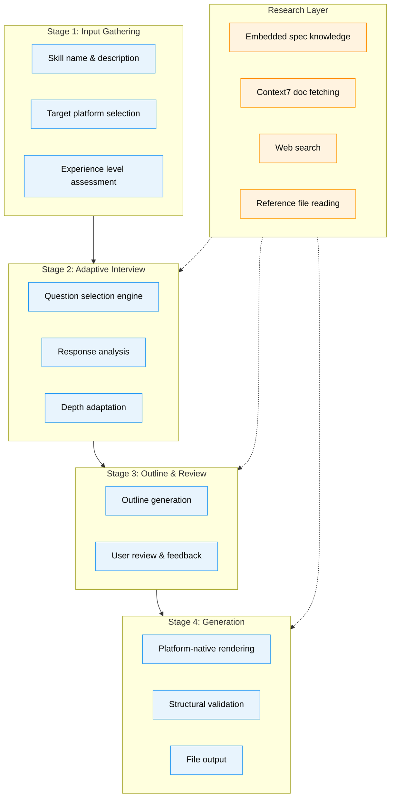

# create-skill PRD

**Version**: 1.0
**Author**: Stephen Sequenzia
**Date**: 2026-03-06
**Status**: Draft
**Spec Type**: New product
**Spec Depth**: Detailed specifications
**Description**: A meta-skill that helps users create agent skills for multiple AI coding agent platforms through an adaptive interview process, producing complete platform-native skill files.

---

## 1. Executive Summary

The `create-skill` skill is a meta-skill built to the Generic Agent Skills specification that guides users through creating agent skills for three target platforms: Generic Agent Skills (agentskills.io), OpenCode, and Codex. It combines an adaptive interview process with hybrid documentation research to produce complete, platform-native, ready-to-use skill files regardless of the user's experience level.

## 2. Problem Statement

### 2.1 The Problem

Creating agent skills from scratch is a multi-dimensional pain point:

- **Format complexity**: Each platform (Generic Agent Skills, OpenCode, Codex) has its own specification format with unique conventions, required fields, and structural expectations. Users must learn and internalize these differences.
- **Boilerplate overhead**: Significant repetitive setup work is required for every new skill — frontmatter, section structure, metadata, and platform-specific scaffolding.
- **Quality gaps**: Skills created manually often miss best practices, omit important sections, or fail to leverage platform-specific capabilities, resulting in skills that work but underperform.

### 2.2 Current State

Users must manually read platform documentation, study examples, and hand-craft skill files from scratch. There is no guided process or tooling that bridges the gap between a user's intent and a well-structured, platform-native skill file.

### 2.3 Impact Analysis

Without this tool, skill creation remains a high-friction activity that:
- Discourages experimentation and iteration on skill design
- Produces inconsistent quality across skills and platforms
- Creates a steep learning curve for new skill authors
- Wastes time on structural concerns instead of skill content and logic

### 2.4 Business Value

Dramatically lowers the barrier to creating high-quality agent skills across multiple platforms. By automating structure, enforcing best practices, and adapting to user experience levels, this skill turns skill authoring from a documentation-heavy chore into a guided, conversational process.

## 3. Goals & Success Metrics

### 3.1 Primary Goals

1. Enable users of any experience level to produce complete, working agent skill files
2. Generate platform-native output that follows each platform's conventions and strengths
3. Provide adaptive depth — quick generation for simple skills, thorough interviews for complex ones

### 3.2 Success Metrics

| Metric | Target | Measurement Method |
|--------|--------|-------------------|
| Structural validity | 100% of generated skills pass platform spec validation | Automated structural validation step |
| Platform coverage | Support all 3 target platforms | Feature completion tracking |
| User completion rate | >80% of started sessions produce a skill file | Session completion tracking |

### 3.3 Non-Goals

- Automated testing or runtime validation of generated skills
- Updating or modifying previously generated skills
- Publishing skills to any platform marketplace
- Multi-platform generation in a single session

## 4. User Research

### 4.1 Target Users

#### Primary Persona: Beginner Skill Author

- **Role/Description**: Developer new to agent skills who wants to create their first skill
- **Goals**: Produce a working skill file without reading extensive documentation
- **Pain Points**: Overwhelmed by platform spec formats, unsure what sections are required vs optional, doesn't know best practices
- **Context**: Has an idea for a skill but doesn't know how to translate it into the right file format

#### Secondary Persona: Experienced Developer

- **Role/Description**: Developer familiar with one or more agent platforms who wants to create skills efficiently
- **Goals**: Skip boilerplate, focus on skill logic, quickly target unfamiliar platforms
- **Pain Points**: Repetitive setup work, format differences across platforms, wants to move fast without sacrificing quality
- **Context**: Creates skills regularly, may be targeting a new platform they haven't used before

### 4.2 User Journey Map

```mermaid
flowchart LR
    A[Invoke create-skill] --> B[Provide name & description]
    B --> C[Select target platform]
    C --> D[Declare experience level]
    D --> E[Adaptive interview]
    E --> F[Review outline]
    F --> G{Approve?}
    G -->|Yes| H[Skill file generated]
    G -->|Provide feedback| E
    H --> I[User receives working skill file]

    classDef default fill:#f9f9f9,stroke:#333,color:#000
    classDef action fill:#d4edda,stroke:#28a745,color:#000
    classDef decision fill:#fff3cd,stroke:#ffc107,color:#000

    class A,B,C,D default
    class E,F action
    class G decision
    class H,I action
```

## 5. Functional Requirements

### 5.1 Feature: Initial Input Gathering

**Priority**: P0 (Critical)

#### User Stories

**US-001**: As a skill author, I want to provide a name, brief description, and target platform for my skill so that the system understands what I'm building.

**Acceptance Criteria**:
- [ ] Prompts the user for a skill name (text input)
- [ ] Prompts for a brief description of what the skill does (text input)
- [ ] Presents the 3 supported target platforms (Generic Agent Skills, OpenCode, Codex) for selection
- [ ] All three inputs are gathered before proceeding to the interview

**Edge Cases**:
- User provides an empty or very short description: Prompt for more detail before proceeding
- User selects an unsupported platform: Display supported platforms and re-prompt

---

### 5.2 Feature: Experience Level Assessment

**Priority**: P0 (Critical)

#### User Stories

**US-002**: As a skill author, I want the system to ask my experience level upfront so that the interview adapts to my knowledge.

**Acceptance Criteria**:
- [ ] Presents experience level options (e.g., Beginner, Intermediate, Advanced)
- [ ] Stores the selected level internally to adapt subsequent interview depth
- [ ] Beginners receive more guidance, explanations, and structured choices
- [ ] Advanced users get a streamlined interview focused on key decisions

**Edge Cases**:
- User selects "Beginner" but provides highly technical responses: Optionally adjust depth upward mid-interview

---

### 5.3 Feature: Adaptive Interview Engine

**Priority**: P0 (Critical)

#### User Stories

**US-003**: As a skill author, I want an interactive interview that gathers the right information for my skill so that the generated output is comprehensive and accurate.

**Acceptance Criteria**:
- [ ] Conducts a multi-round interview with questions adapted to skill complexity and user experience level
- [ ] Covers: target audience, main use cases, specific requirements, constraints, key features, and platform-specific considerations
- [ ] Adapts question depth and count based on skill complexity (simple prompt-based vs multi-step workflow)
- [ ] Builds on previous answers — references what the user already said, skips irrelevant questions
- [ ] Supports early exit if the user signals they want to wrap up
- [ ] Presents a mix of structured choices and open-ended text inputs

**Edge Cases**:
- User gives very terse responses: Ask targeted follow-up questions to fill gaps
- User gives contradictory answers: Flag the inconsistency and ask for clarification
- User wants to go back and change a previous answer: Allow revisions without restarting the interview

---

### 5.4 Feature: Research Integration

**Priority**: P1 (High)

#### User Stories

**US-004**: As a skill author, I want the system to research relevant documentation and examples so that my skill follows current best practices for the target platform.

**Acceptance Criteria**:
- [ ] Embedded core knowledge: Includes each platform's spec structure, required fields, and key conventions with version metadata
- [ ] Dynamic fetching: Uses Context7 MCP tools to fetch latest platform documentation when available
- [ ] Web search: Can search the web for best practices, examples, and platform-specific guidance
- [ ] Existing skill references: Can read existing skill files the user points to as reference material
- [ ] Research is invoked on-demand (user requests it) or proactively (when the system detects uncertainty or platform-specific nuances)

**Edge Cases**:
- Context7 or web search is unavailable: Fall back to embedded knowledge and inform the user
- Fetched docs conflict with embedded knowledge: Prefer the dynamically fetched version and note the discrepancy
- User provides a reference skill file that doesn't match the target platform: Warn and extract transferable patterns only

---

### 5.5 Feature: Outline Generation & Review

**Priority**: P0 (Critical)

#### User Stories

**US-005**: As a skill author, I want to review a detailed outline of my skill before the final file is generated so that I can catch issues early.

**Acceptance Criteria**:
- [ ] Generates a structured outline including: skill name, description, key features, potential use cases, and platform-specific sections
- [ ] Presents the outline in a clear, organized format
- [ ] Allows the user to approve, provide feedback for refinement, or request specific changes
- [ ] After approval, proceeds to skill file generation

**Edge Cases**:
- User wants major changes to the outline: Re-run relevant interview sections and regenerate
- Outline reveals gaps in gathered information: Prompt for the missing details before proceeding

---

### 5.6 Feature: Skill File Generation

**Priority**: P0 (Critical)

#### User Stories

**US-006**: As a skill author, I want a complete, working skill file generated for my target platform so that I can use it immediately.

**Acceptance Criteria**:
- [ ] Generates a complete skill file conforming to the target platform's specification
- [ ] Output is platform-native — follows each platform's conventions, structure, and idioms
- [ ] Prompts the user for the output directory/path before writing
- [ ] Writes the skill file to the specified location
- [ ] Supports skills of any complexity — from simple prompt-based to multi-step workflows with tool integrations

**Edge Cases**:
- Output path doesn't exist: Create the directory or prompt the user
- File already exists at the target path: Warn and ask whether to overwrite

---

### 5.7 Feature: Structural Validation

**Priority**: P1 (High)

*Agent Recommendation — accepted during interview*

#### User Stories

**US-007**: As a skill author, I want the generated skill validated against the platform spec before I see it so that I know it's structurally correct.

**Acceptance Criteria**:
- [ ] Before presenting the generated skill, validates it against the target platform's required fields and structure
- [ ] Checks for: missing required sections, invalid frontmatter fields, structural format violations
- [ ] If validation fails, automatically fixes issues and re-validates before presenting
- [ ] Reports validation status to the user (pass/fail with details)

**Edge Cases**:
- Platform spec has optional fields that enhance quality: Suggest including them but don't mark as validation failures
- Validation identifies an unfixable issue: Present the skill with a clear warning about the issue

---

### 5.8 Feature: Embedded Spec Versioning

**Priority**: P2 (Medium)

*Agent Recommendation — accepted during interview*

#### User Stories

**US-008**: As a skill author, I want the system to track platform spec versions so that I know whether its knowledge is current.

**Acceptance Criteria**:
- [ ] Each embedded platform spec includes version metadata (e.g., `spec_version: 2026-03`)
- [ ] On startup, compares embedded versions against dynamically fetched documentation when available
- [ ] Warns the user if embedded knowledge appears outdated
- [ ] When outdated, offers to use dynamically fetched docs as the primary reference

**Edge Cases**:
- Dynamic fetch fails: Use embedded knowledge without version warning
- Platform releases a breaking spec change: Embedded knowledge may produce invalid output; dynamic fetch is critical in this case

## 6. Non-Functional Requirements

### 6.1 Performance

- Interview should feel conversational — no long pauses between questions unless research is running
- Research operations (Context7/web) should be clearly communicated as in-progress to the user
- Skill file generation should complete within a single response cycle

### 6.2 Portability

- The skill itself is built to the Generic Agent Skills specification (agentskills.io)
- Must be usable by any agent that supports the Generic Agent Skills spec
- No hard dependencies on specific agent implementations or proprietary tool APIs

### 6.3 Extensibility

- Platform support should be modular — adding a new target platform should not require restructuring the core interview engine
- Embedded platform knowledge should be organized in distinct, replaceable sections

## 7. Technical Considerations

### 7.1 Architecture Overview

The skill follows a pipeline architecture with four stages: Input Gathering, Adaptive Interview, Outline/Review, and Generation. Research capabilities are available as a cross-cutting concern accessible from any stage.

### 7.2 Tech Stack

- **Skill format**: Generic Agent Skills specification (agentskills.io)
- **Research tools**: Context7 MCP tools (documentation lookup), web search capabilities, file reading
- **Output**: Markdown-based skill files per target platform conventions

### 7.3 Integration Points

| System | Integration Type | Purpose |
|--------|-----------------|---------|
| Generic Agent Skills spec (agentskills.io) | Target platform | Skill output format + host platform |
| OpenCode Skills spec | Target platform | Skill output format |
| Codex Skills spec | Target platform | Skill output format |
| Context7 MCP | Documentation fetching | Retrieve latest platform docs at runtime |
| Web search | Research | Best practices, examples, and guidance |

### 7.4 Technical Constraints

- Must conform to the Generic Agent Skills specification for its own structure
- Embedded platform knowledge will become stale over time — hybrid approach with dynamic fetching mitigates this
- Quality of generated skills depends on the quality of the interview responses and available documentation
- One target platform per invocation — no multi-target generation

## 8. Scope Definition

### 8.1 In Scope

- Guided skill creation for Generic Agent Skills, OpenCode, and Codex platforms
- Adaptive interview engine that adjusts to user experience level and skill complexity
- Hybrid research: embedded core knowledge + dynamic doc fetching + web search + reference file reading
- Outline generation with user review before final generation
- One-shot skill file generation after outline approval
- Structural validation against target platform spec
- Embedded spec version tracking with staleness detection
- Output path selection by the user

### 8.2 Out of Scope

- **Automated skill testing/validation**: Runtime testing of generated skills is not included; only structural validation is in scope
- **Skill updates/modifications**: Editing or updating previously generated skills is not supported; users edit manually
- **Marketplace publishing**: No integration with any platform's skill marketplace or distribution system
- **Multi-platform generation**: Each invocation targets a single platform; users must run the skill again for additional platforms

### 8.3 Future Considerations

- Multi-platform generation in a single session
- Skill update/modification mode for iterating on existing skills
- Template library with common skill patterns
- Integration with platform marketplaces for one-click publishing
- Skill quality scoring based on best practice adherence

## 9. Implementation Plan

### 9.1 Phase 1: Foundation - OpenCode Skill Generation

**Completion Criteria**: Users can create complete, valid OpenCode skills through a guided interview.

| Deliverable | Description | Dependencies |
|-------------|-------------|--------------|
| Initial input gathering | Skill name, description, target platform, experience level prompts | None |
| Adaptive interview engine | Core question selection, depth adaptation, multi-round flow | Input gathering |
| Embedded OpenCode spec knowledge | OpenCode skill format, required fields, conventions, version metadata | OpenCode documentation |
| Outline generation & review | Structured outline presentation with approval flow | Interview engine |
| OpenCode skill file generation | Platform-native file rendering for OpenCode | Outline approval, embedded knowledge |
| Output path handling | User prompt for output directory, file writing | File generation |

**Checkpoint Gate**: Generated OpenCode skill files pass structural validation against OpenCode spec requirements.

---

### 9.2 Phase 2: Platform Expansion - Generic Agent Skills & Codex

**Completion Criteria**: All three target platforms produce valid, platform-native skill files.

| Deliverable | Description | Dependencies |
|-------------|-------------|--------------|
| Embedded Generic Agent Skills spec knowledge | agentskills.io format, required fields, conventions, version metadata | Phase 1 complete, Generic Agent Skills documentation |
| Embedded Codex spec knowledge | Codex skill format, required fields, conventions, version metadata | Phase 1 complete, Codex documentation |
| Platform-specific interview adaptations | Questions and prompts that surface platform-specific options | Interview engine from Phase 1 |
| Generic Agent Skills file generation | Platform-native rendering for agentskills.io | Embedded knowledge |
| Codex skill file generation | Platform-native rendering for Codex | Embedded knowledge |

**Checkpoint Gate**: All three platforms produce structurally valid, platform-native output. Cross-platform consistency review.

---

### 9.3 Phase 3: Research & Validation

**Completion Criteria**: Dynamic research capabilities are functional and structural validation catches spec violations.

| Deliverable | Description | Dependencies |
|-------------|-------------|--------------|
| Context7 integration | Dynamic documentation fetching for all three platforms | Phase 2 complete |
| Web search integration | Best practice and example research capability | Phase 2 complete |
| Reference file reading | Ability to read and learn from existing skill files | Phase 2 complete |
| Structural validation engine | Pre-output validation against platform specs | Phase 2 complete |
| Spec version tracking | Embedded version metadata + staleness detection via dynamic fetch | Context7 integration |
| Research fallback handling | Graceful degradation when dynamic sources are unavailable | All research integrations |

**Checkpoint Gate**: Research capabilities produce relevant, actionable results. Validation catches known spec violations across all platforms.

## 10. Dependencies

### 10.1 Technical Dependencies

| Dependency | Status | Risk if Delayed |
|------------|--------|-----------------|
| Generic Agent Skills spec (agentskills.io) | Published | Blocks host platform format — critical |
| OpenCode Skills documentation | Published | Blocks Phase 1 — critical |
| Codex Skills documentation | Published | Blocks Phase 2 — high |
| Context7 MCP availability | Available | Degrades research to embedded-only — medium |

## 11. Risks & Mitigations

| Risk | Impact | Likelihood | Mitigation Strategy |
|------|--------|------------|---------------------|
| Quality variance across platforms | High | Medium | Structural validation, platform-specific templates, cross-platform testing |
| Platform spec drift | Medium | Medium | Embedded spec versioning, dynamic doc fetching, staleness warnings |
| Research unreliability | Medium | Low | Hybrid approach — embedded knowledge as baseline, dynamic as enhancement |
| Interview fatigue | Medium | Low | Adaptive depth based on experience level and skill complexity, early exit support |
| Incomplete platform documentation | High | Low | Web search for supplementary examples, community resources |

## 12. Open Questions

| # | Question | Resolution |
|---|----------|------------|
| — | No open questions at this time | — |

## 13. Appendix

### 13.1 Glossary

| Term | Definition |
|------|------------|
| Agent skill | A structured file that defines capabilities, instructions, or workflows for an AI coding agent |
| Generic Agent Skills | An open specification for portable agent skills (agentskills.io) |
| OpenCode | An AI coding agent platform with its own skill specification |
| Codex | OpenAI's coding agent platform with its own skill specification |
| Meta-skill | A skill whose purpose is to create other skills |
| Platform-native | Output that follows the specific conventions and idioms of a target platform |
| Structural validation | Checking a generated skill file against required fields and format rules of its target spec |

### 13.2 References

- Generic Agent Skills specification: https://agentskills.io/specification
- OpenCode Skills documentation: https://opencode.ai/docs/skills
- Codex Skills documentation: https://developers.openai.com/codex/skills

---

*Document generated by SDD Tools*
