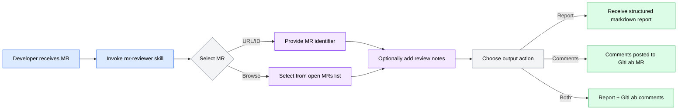
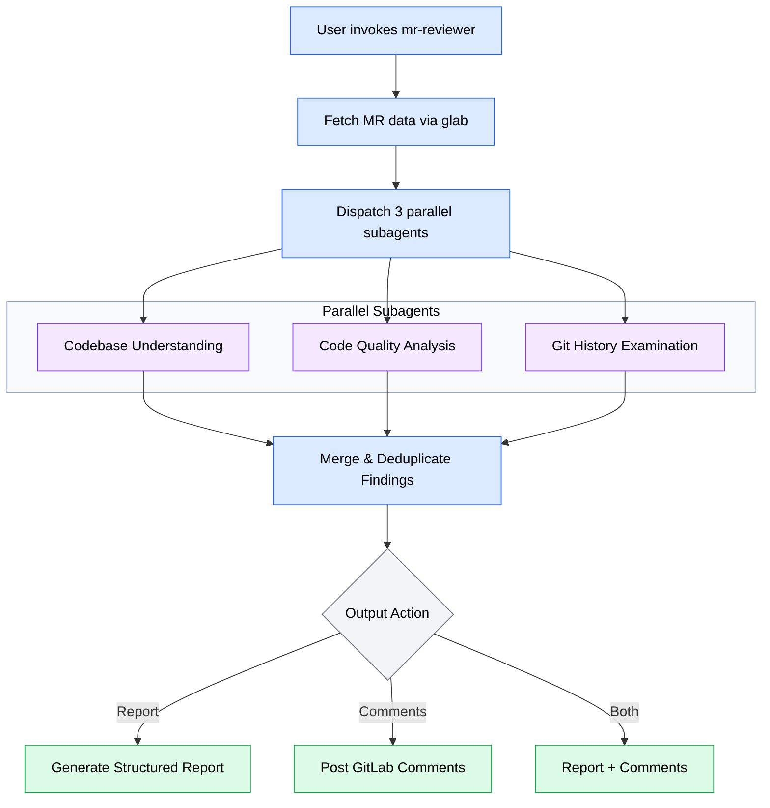

# mr-reviewer-skill PRD

**Version**: 1.0
**Author**: Stephen Sequenzia
**Date**: 2026-03-10
**Status**: Draft
**Spec Type**: New feature
**Spec Depth**: Detailed specifications
**Description**: A skill that dispatches parallel subagents to perform deep MR reviews — analyzing codebase context, code quality, and git history — then compiles findings into structured review reports and/or GitLab line-level comments.

---

## 1. Executive Summary

The `mr-reviewer` skill automates comprehensive merge request reviews for GitLab projects by dispatching three parallel subagents: a codebase understanding agent, a code quality analysis agent, and a git history examination agent. Their findings are merged, deduplicated, and output as either a structured review report, line-level GitLab comments, or both. The skill targets Python and TypeScript/JavaScript codebases and integrates with GitLab via the `glab` CLI tool and the existing `glab` skill.

## 2. Problem Statement

### 2.1 The Problem

Merge request reviews are a critical quality gate, but they suffer from three compounding issues:

- **Lack of codebase context**: Reviewers often lack deep familiarity with the affected areas of the codebase, leading to surface-level feedback that misses architectural implications, convention violations, or subtle regressions.
- **Time and effort cost**: Thorough manual reviews require significant time investment — reading the diff, understanding surrounding code, checking git history for context, and formulating actionable feedback.
- **Inconsistent quality**: Review depth varies across reviewers and across reviews by the same person, depending on time pressure, familiarity, and attention. There is no baseline standard for what a "good review" covers.

### 2.2 Current State

Developers review MRs manually using the GitLab web UI or by checking out the branch locally. The quality of the review depends entirely on the reviewer's familiarity with the codebase, available time, and personal review habits. There is no automated assistance for understanding how changes fit the broader codebase or for checking git history context.

### 2.3 Impact Analysis

Without automated review support:
- Bugs and regressions slip through reviews and reach production
- Developers spend disproportionate time on reviews relative to the feedback quality produced
- New team members cannot provide meaningful reviews until they build deep codebase familiarity
- Review bottlenecks form around senior developers who have the most context

### 2.4 Business Value

Automated, context-aware MR reviews establish a consistent quality baseline for every review regardless of who initiates it. By handling the time-intensive work of codebase exploration, code analysis, and history examination, the skill frees developers to focus on higher-order concerns — architecture decisions, design trade-offs, and domain-specific logic — while ensuring no review falls below a minimum depth.

## 3. Goals & Success Metrics

### 3.1 Primary Goals

1. Deliver balanced MR reviews covering bug detection, code quality, and contextual understanding
2. Produce actionable, severity-categorized findings that developers can act on immediately
3. Integrate seamlessly with GitLab via the `glab` CLI for both input (MR data) and output (comments)

### 3.2 Success Metrics

| Metric | Current Baseline | Target | Measurement Method | Timeline |
|--------|------------------|--------|-------------------|----------|
| Review coverage | Manual, inconsistent | All 3 analysis dimensions covered per review | Verify report sections are populated | Phase 1 |
| Finding actionability | N/A | >80% of findings include specific file, line, and suggested action | Manual audit of generated reports | Phase 1 |
| GitLab comment accuracy | N/A | Line-level comments land on correct diff positions | Verify comments appear on expected lines in GitLab UI | Phase 2 |
| Subagent success rate | N/A | >95% of subagents complete without failure | Track retry/partial-result occurrences | Phase 1 |

### 3.3 Non-Goals

- Automatically generating fix patches for identified issues
- Triggering reviews automatically from CI/CD pipeline events
- Reviewing multiple MRs together or tracking review trends over time
- Supporting languages beyond Python and TypeScript/JavaScript in the initial version

## 4. User Research

### 4.1 Target Users

#### Primary Persona: Any Developer

- **Role/Description**: Any developer on a team who needs to review merge requests, regardless of seniority or role
- **Goals**: Produce thorough, context-aware MR reviews efficiently; catch bugs and quality issues without needing to manually trace through the codebase
- **Pain Points**: Lacks time for deep reviews, unfamiliar with parts of the codebase being changed, inconsistent review quality across different MRs
- **Context**: Working on a GitLab-hosted project with Python and/or TypeScript/JavaScript codebases; has `glab` CLI authenticated and available

### 4.2 User Journey Map



## 5. Functional Requirements

### 5.1 Feature: MR Selection & Input

**Priority**: P0 (Critical)

#### User Stories

**US-001**: As a developer, I want to specify an MR by URL or ID so that I can quickly start a review of a specific merge request.

**US-002**: As a developer, I want to browse and select from open MRs in the current project so that I can choose which MR to review without leaving the terminal.

**US-003**: As a developer, I want to provide optional review notes so that I can guide the review toward specific areas of concern.

**Acceptance Criteria**:
- [ ] Skill accepts MR URL, MR ID (numeric), or interactive selection
- [ ] Interactive selection displays all open MRs in the current project via `glab mr list --output json`
- [ ] User can provide optional free-text review notes to guide the review focus
- [ ] Review notes are additive — the full review always runs, notes add extra attention to specified areas
- [ ] Skill validates that the MR exists and is accessible before proceeding

**Edge Cases**:
- MR ID does not exist or user lacks access: Display clear error with `glab mr view` output
- MR is already merged or closed: Warn user and ask whether to proceed anyway
- No open MRs in project: Display informative message, skip selection

---

### 5.2 Feature: Output Action Selection

**Priority**: P0 (Critical)

#### User Stories

**US-004**: As a developer, I want to choose between a review report, GitLab comments, or both so that I can control how the review findings are delivered.

**Acceptance Criteria**:
- [ ] User is presented with three options: "Produce a detailed review report", "Create comments on the MR directly in GitLab", or "Both"
- [ ] Selection determines which output actions execute after subagent analysis completes
- [ ] Both outputs can be produced in a single review session

---

### 5.3 Feature: Parallel Subagent Analysis

**Priority**: P0 (Critical)

#### User Stories

**US-005**: As a developer, I want the skill to automatically analyze the codebase context, code quality, and git history of an MR so that I receive comprehensive, multi-dimensional review feedback.

**Acceptance Criteria**:
- [ ] Three subagents are dispatched in parallel: codebase understanding, code quality analysis, git history examination
- [ ] Each subagent returns findings in a structured output schema (see Section 7.1)
- [ ] Subagent findings are merged and deduplicated by file path + line range
- [ ] Deduplication preserves the highest severity level and merges context from all sources
- [ ] User-provided review notes are passed to all subagents to inform extra attention areas
- [ ] Failed subagents are retried once; if still failing, review continues with partial results and gaps are noted in the output

**Edge Cases**:
- All three subagents fail: Report error to user with diagnostic information; do not produce empty review
- One subagent produces no findings: Include it in the report as "no issues found in this dimension"
- Subagent timeout: Treat as failure, apply retry-then-partial logic

#### 5.3.1 Codebase Understanding Subagent

**Responsibilities**:
- Analyze files changed in the MR and their surrounding context (direct dependencies, callers, related modules)
- Identify architectural patterns the changes interact with
- Detect convention violations relative to the existing codebase
- Flag integration risks where changes touch cross-cutting concerns

**Depth Configuration**:
- **MR-scoped**: Focus only on changed files and their direct dependencies/callers
- **Feature-scoped** (default): Broader analysis of the feature area — related modules, test files, patterns
- User selects depth per review; default is feature-scoped

#### 5.3.2 Code Quality Analysis Subagent

**Responsibilities**:
- Analyze code changes for bugs, logic errors, and potential regressions
- Assess code quality: readability, maintainability, naming, duplication
- Check adherence to language-specific best practices (Python: PEP 8/ruff patterns, type hints; TypeScript: strict mode, type safety)
- Identify missing error handling, edge cases, and boundary conditions

#### 5.3.3 Git History Examination Subagent

**Responsibilities**:
- Examine git history of changed files to understand the evolution and context of modifications
- Identify whether changes revert or conflict with recent work
- Flag files with high churn rates or recent bug-fix history (higher risk areas)
- Provide context on why existing code was written a certain way (referencing past commits)

---

### 5.4 Feature: Structured Review Report

**Priority**: P0 (Critical)

#### User Stories

**US-006**: As a developer, I want a structured markdown review report with findings organized by severity so that I can quickly prioritize which issues to address.

**Acceptance Criteria**:
- [ ] Report includes: executive summary, findings by severity (Critical, High, Medium, Low), and recommendations
- [ ] Each finding includes: file path, line range, severity, category, description, and suggested action
- [ ] Findings are grouped by severity, then by file
- [ ] Report includes a statistics section: total findings count by severity, files analyzed, subagent coverage
- [ ] Report clearly indicates if any subagent produced partial results
- [ ] Report incorporates user-provided review notes and highlights findings in noted areas

**Edge Cases**:
- No findings at all: Produce a "clean review" report confirming the MR was analyzed and no issues found
- Very large number of findings (50+): Include a "Top Issues" summary section highlighting the most impactful findings

---

### 5.5 Feature: GitLab Comments

**Priority**: P1 (High)

#### User Stories

**US-007**: As a developer, I want the skill to post line-level comments on specific code in the MR diff so that the MR author sees feedback directly in context.

**US-008**: As a developer, I want a summary comment posted on the MR with an overview of the review so that the overall review status is visible at a glance.

**Acceptance Criteria**:
- [ ] Line-level diff discussions are posted via the GitLab Discussions API (`glab api POST /projects/:id/merge_requests/:iid/discussions`) with correct position data (file path, new/old line numbers, diff refs)
- [ ] A summary note is posted via `glab mr note` with overall review statistics and top findings
- [ ] Critical and High severity findings are always posted as individual line-level comments
- [ ] Medium and Low severity findings are batched into the summary note to avoid comment noise
- [ ] Comments include the severity tag, finding description, and suggested action
- [ ] Skill confirms successful comment posting and reports any failures

**Edge Cases**:
- Line-level position data cannot be determined: Fall back to posting as a general MR note referencing the file and line
- API rate limiting: Batch comments and retry with backoff
- MR diff has changed since analysis (force push): Warn user that comments may land on wrong lines

---

### 5.6 Feature: Configurable Analysis Depth

**Priority**: P2 (Medium)

#### User Stories

**US-009**: As a developer, I want to choose how deep the codebase analysis goes so that I can trade off between review thoroughness and speed.

**Acceptance Criteria**:
- [ ] User can select "MR-scoped" (fast, focused) or "Feature-scoped" (thorough, broader context) before the review starts
- [ ] Default is "Feature-scoped" if not specified
- [ ] Depth selection is passed to the codebase understanding subagent to control exploration breadth

---

### 5.7 Feature: Large MR Handling

**Priority**: P2 (Medium)

#### User Stories

**US-010**: As a developer, I want the skill to warn me about very large MRs and offer to focus on high-impact files so that reviews remain useful even for oversized changesets.

**Acceptance Criteria**:
- [ ] MRs with 50+ changed files or 1000+ changed lines trigger a warning
- [ ] Warning includes the MR size metrics and offers the user a choice: review all files or focus on high-impact files
- [ ] "High-impact" prioritization considers: file complexity, number of changes, whether the file is a core module, and git history risk signals
- [ ] If the user chooses to focus, the report clearly notes which files were analyzed and which were skipped

## 6. Non-Functional Requirements

### 6.1 Performance

- Subagent analysis should complete within a reasonable time for typical MRs (under 20 changed files)
- Parallel subagent execution is required to minimize wall-clock time
- GitLab API calls should be batched where possible to reduce round-trips

### 6.2 Security

- The skill relies on the user's existing `glab` authentication; it does not store or manage credentials
- No MR data is persisted beyond the current review session
- Line-level comments are posted under the authenticated user's identity

### 6.3 Reliability

- Subagent failure handling: retry once, then continue with partial results
- GitLab API errors: surface clear error messages with the HTTP status and response body
- Network failures: fail gracefully with actionable error messages

## 7. Technical Considerations

### 7.1 Architecture Overview

The skill follows a dispatch-merge architecture:



#### Subagent Output Schema

All three subagents must return findings in this consistent structure to enable reliable merging:

```
Finding:
  file_path: string          # Relative path to the file
  line_start: number         # Start line of the relevant range
  line_end: number           # End line of the relevant range
  severity: enum             # Critical | High | Medium | Low
  category: string           # e.g., "bug", "code-quality", "convention", "regression-risk"
  source: string             # Which subagent produced this finding
  description: string        # What the issue is
  context: string            # Why this is an issue (codebase context, history, etc.)
  suggested_action: string   # What the author should do
```

#### Finding Deduplication

When merging subagent results:
1. Group findings by `file_path` + overlapping `line_start`/`line_end` ranges
2. For overlapping findings, keep the highest `severity`
3. Merge `description`, `context`, and `source` fields from all contributing findings
4. Preserve all unique `suggested_action` values

### 7.2 Tech Stack

- **Skill format**: GAS (Generic Agent Skills) — YAML frontmatter + Markdown body
- **CLI tool**: `glab` (GitLab CLI)
- **Subagent platform**: Claude Code Agent Teams or background agents
- **Target languages**: Python, TypeScript/JavaScript

### 7.3 Integration Points

| Integration | Type | Purpose |
|-------------|------|---------|
| `glab` CLI | Shell command | Fetch MR data, post comments, list MRs |
| `glab` skill (`@skills/glab`) | Skill reference | Provides glab command patterns and reference files |
| `skills/glab/references/merge-requests.md` | Skill reference | MR subcommand reference for `mr view`, `mr diff`, `mr list`, `mr note`, `mr checkout` |
| `skills/glab/references/api.md` | Skill reference | GitLab API patterns for line-level diff comments via Discussions API |
| GitLab Discussions API | REST API via `glab api` | Post line-level diff comments with position data |
| Local git repository | Git CLI | Checkout MR branch, examine git history |

### 7.4 Technical Constraints

- Line-level comments require the GitLab Discussions API; `glab mr note` only supports general MR comments
- Position data for diff discussions requires: `base_sha`, `head_sha`, `start_sha`, file paths, and line numbers — all obtainable from `glab mr view --output json`
- The skill assumes `glab` is authenticated and the user has access to the target project
- Git history examination requires the MR branch to be available locally (via `glab mr checkout`)

### 7.5 Codebase Context

#### Existing Architecture

This project is a Markdown-only skills repository using the GAS (Generic Agent Skills) format. Skills are stored in `skills/{skill-name}/SKILL.md` with optional `references/` subdirectories for detailed documentation. There is no application code, test suite, or build system.

#### Patterns to Follow

- **GAS skill format**: YAML frontmatter with `name` and `description` fields, Markdown body with numbered sections — used in all existing skills
- **Reference file structure**: `references/` subdirectory for detailed documentation that the main skill loads on demand — used in `skills/glab/`
- **Subagent dispatch**: Multi-stage pipeline with agent delegation — pattern established in `skills/create-skill/`
- **Skill cross-references**: `@skills/glab` syntax for referencing other skills

#### Related Features

- **`create-skill` skill**: Demonstrates the interview-then-generate pipeline pattern with subagent dispatch; provides a structural template for how complex skills are organized in this project

## 8. Scope Definition

### 8.1 In Scope

- MR selection by URL, ID, or interactive browsing of open MRs
- User-provided review notes for guiding review focus (additive)
- Three parallel subagents: codebase understanding, code quality, git history
- Configurable analysis depth (MR-scoped or feature-scoped)
- Structured markdown review report with severity-categorized findings
- GitLab line-level diff comments via Discussions API
- GitLab summary comment via `glab mr note`
- Finding deduplication across subagents
- Large MR detection and prioritization
- Error handling with retry-then-partial strategy
- Python and TypeScript/JavaScript codebases

### 8.2 Out of Scope

- **Auto-fix patch generation**: Generating code fixes for identified issues — too high risk for automated suggestions without human validation
- **CI/CD pipeline integration**: Triggering reviews from pipeline events — requires infrastructure beyond a skill file
- **Multi-MR analysis**: Reviewing multiple MRs together or tracking trends — different product scope
- **Additional language support**: Languages beyond Python and TypeScript/JavaScript — can be added incrementally in future phases

### 8.3 Future Considerations

- Support for additional languages (Go, Ruby, Java, etc.)
- Review templates for different types of MRs (bug fix, feature, refactor)
- Integration with CI/CD to auto-trigger reviews on MR creation
- Review history tracking and trend analysis across MRs
- Custom review rules and coding standards configuration

## 9. Implementation Plan

### 9.1 Phase 1: Core — MR Fetch + Subagents + Report

**Completion Criteria**: Skill can accept an MR, dispatch three subagents, merge findings, and produce a structured markdown report.

| Deliverable | Description | Dependencies |
|-------------|-------------|--------------|
| Skill file scaffold | `skills/mr-reviewer/SKILL.md` with GAS frontmatter, pipeline overview, and section structure | None |
| MR input handling | Accept MR URL/ID or interactive selection; validate MR exists; fetch MR data via `glab mr view --output json` | `glab` skill |
| Review notes input | Collect optional user review notes; pass to all subagents | MR input handling |
| Codebase understanding subagent | Subagent spec with prompt template; analyzes changed files and surrounding context; returns structured findings | MR input handling |
| Code quality analysis subagent | Subagent spec with prompt template; analyzes code changes for bugs, quality, and best practices; returns structured findings | MR input handling |
| Git history examination subagent | Subagent spec with prompt template; examines git history of changed files; returns structured findings | MR input handling |
| Finding merge & deduplication | Logic for merging parallel findings, deduplicating by file+line range, preserving highest severity | All 3 subagents |
| Structured report generation | Produce markdown report: executive summary, findings by severity, statistics, recommendations | Finding merge |
| Error handling | Retry-then-partial strategy for subagent failures | All 3 subagents |

**Checkpoint Gate**: Verify that a sample MR produces a complete report with findings from all three subagent dimensions.

---

### 9.2 Phase 2: GitLab Commenting

**Completion Criteria**: Skill can post line-level diff comments and a summary note on the MR in GitLab.

| Deliverable | Description | Dependencies |
|-------------|-------------|--------------|
| Output action selection | User chooses between report, comments, or both | Phase 1 complete |
| Line-level comment posting | Post Critical/High findings as diff discussions via `glab api` with position data | Phase 1 findings, GitLab Discussions API |
| Summary note posting | Post overall review summary via `glab mr note` with statistics and Medium/Low findings | Phase 1 findings |
| Comment error handling | Handle API failures, rate limiting, and position data issues with fallbacks | Line-level posting |

**Checkpoint Gate**: Verify that comments appear correctly on MR diff lines in the GitLab UI.

---

### 9.3 Phase 3: Refinements — Configurable Depth & Large MR Handling

**Completion Criteria**: Skill supports configurable analysis depth and handles large MRs gracefully.

| Deliverable | Description | Dependencies |
|-------------|-------------|--------------|
| Depth configuration | User selects MR-scoped or feature-scoped analysis; passed to codebase subagent | Phase 1 complete |
| Large MR detection | Detect MRs with 50+ files or 1000+ lines; warn user and offer prioritization | Phase 1 complete |
| High-impact file prioritization | Rank files by complexity, change volume, core module status, and git risk signals | Large MR detection |
| Reference documentation | `references/` files for subagent prompt details, finding schema, and API patterns | Phase 2 complete |

## 10. Dependencies

### 10.1 Technical Dependencies

| Dependency | Owner | Status | Risk if Delayed |
|------------|-------|--------|-----------------|
| `glab` CLI installed and authenticated | User | Required | Skill cannot function without GitLab access |
| `glab` skill (`@skills/glab`) | This project | Available | Provides command patterns and references |
| GitLab Discussions API access | GitLab instance | Required for Phase 2 | Line-level comments unavailable; can fall back to general notes |
| Local git repository with MR branch access | User | Required | Git history subagent cannot analyze without local checkout |

## 11. Risks & Mitigations

| Risk | Impact | Likelihood | Mitigation Strategy |
|------|--------|------------|---------------------|
| GitLab Discussions API position data is complex and error-prone | High | Medium | Validate position data against MR diff before posting; fall back to general notes on failure |
| Subagent analysis quality varies by codebase size/complexity | Medium | Medium | Configurable depth; large MR detection; clear reporting of coverage gaps |
| Parallel subagent failures degrade review quality | Medium | Low | Retry-then-partial strategy; clear gap reporting in output |
| `glab mr checkout` may fail if branch is deleted or rebased | Medium | Low | Detect failure early; fall back to diff-only analysis without local checkout |
| Large MRs overwhelm subagent context windows | High | Medium | Large MR detection and file prioritization; warn user to break up large MRs |

## 12. Open Questions

| # | Question | Owner | Due Date | Resolution |
|---|----------|-------|----------|------------|
| — | No open questions | — | — | — |

## 13. Appendix

### 13.1 Glossary

| Term | Definition |
|------|------------|
| MR | Merge Request — GitLab's term for a pull request |
| glab | GitLab's official CLI tool for interacting with GitLab from the command line |
| Discussions API | GitLab REST API endpoint for creating line-level diff comments on merge requests |
| GAS | Generic Agent Skills — open specification format for portable AI agent skills |
| Subagent | An autonomous agent spawned by the main skill to handle a specific analysis task |

### 13.2 References

- GitLab Discussions API: `POST /projects/:id/merge_requests/:iid/discussions`
- glab CLI documentation: `skills/glab/SKILL.md`
- glab MR commands reference: `skills/glab/references/merge-requests.md`
- glab API reference: `skills/glab/references/api.md`
- GAS format specification: agentskills.io
- Existing skill pattern reference: `skills/create-skill/SKILL.md`

---

*Document generated by SDD Tools*
