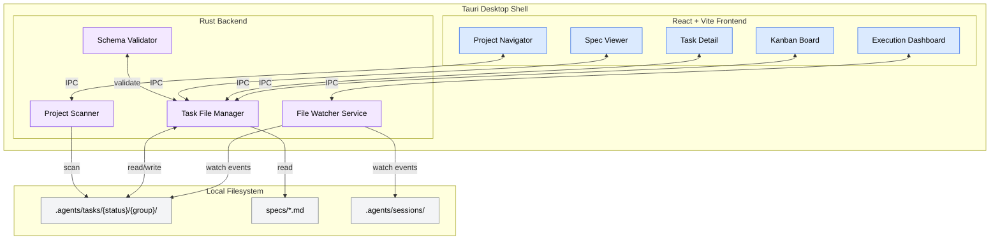
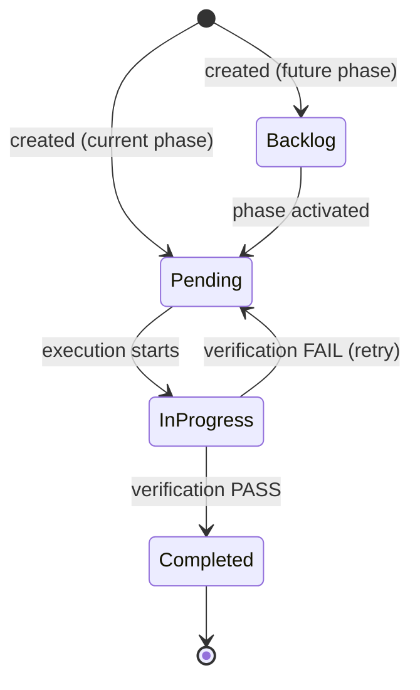

# Task Manager PRD

**Version**: 1.0
**Author**: Stephen Sequenzia
**Date**: 2026-04-06
**Status**: Draft
**Spec Type**: New Product
**Spec Depth**: Detailed Specifications
**Description**: A kanban board desktop app that visualizes the SDD (Spec-Driven Development) pipeline lifecycle, displaying tasks created from specs and their progress through development stages.

---

## 1. Executive Summary

Task Manager is a standalone desktop application built with React + Vite + Tauri that provides a visual management layer over the SDD pipeline's file-based task system. It enables developers to monitor task execution in real-time, navigate across multiple projects and task groups, view full spec lifecycles, and directly manipulate task state through drag-and-drop — all by reading and writing the same JSON files that the SDD pipeline operates on.

## 2. Problem Statement

### 2.1 The Problem

The SDD pipeline manages all task state through JSON files in filesystem directories (`.agents/tasks/{status}/{group}/`). Developers using the pipeline have no visual way to:
- See which tasks are running during wave-based execution
- Understand dependency relationships between tasks
- Track overall progress across a project's task groups
- View the full lifecycle from spec creation through task completion

### 2.2 Current State

Users must manually inspect JSON files and directory structures to understand pipeline state. During `execute-tasks` wave execution, progress is only visible through CLI output. There is no persistent overview of where things stand across specs and task groups, and no way to visualize the dependency graph that drives wave formation.

### 2.3 Impact Analysis

Without visual tooling, SDD users:
- Lose context switching between CLI output and file inspection
- Cannot quickly identify blocked tasks or execution bottlenecks
- Have difficulty understanding wave formation and why certain tasks wait
- Must mentally reconstruct the dependency graph from `blocked_by` arrays scattered across JSON files

### 2.4 Business Value

A visual management layer makes the SDD pipeline accessible to a broader audience, reduces cognitive overhead for existing users, and enables faster debugging of execution issues. It transforms the SDD pipeline from a CLI-only developer tool into a managed workflow system with professional-grade observability.

## 3. Goals & Success Metrics

### 3.1 Primary Goals

1. Provide real-time visibility into task execution during SDD pipeline runs
2. Enable persistent overview of pipeline state across multiple projects and task groups
3. Allow direct task manipulation (state changes, field editing) through an intuitive board UI
4. Display the full spec lifecycle from creation through analysis to task execution

### 3.2 Success Metrics

| Metric | Current Baseline | Target | Measurement Method | Timeline |
|--------|------------------|--------|-------------------|----------|
| Time to understand pipeline state | 2-5 minutes (manual file inspection) | < 10 seconds (visual scan) | User testing | Phase 2 |
| Task state change workflow | CLI + manual file moves | Single drag-and-drop action | Feature completion | Phase 2 |
| Dependency visibility | Read JSON `blocked_by` arrays | Interactive graph visualization | Feature completion | Phase 2 |
| Project switching overhead | Navigate filesystem, re-orient | Click project in sidebar | Feature completion | Phase 3 |
| Spec-to-task traceability | No direct linking | Navigate from spec section to related tasks in < 3 clicks | Feature completion | Phase 3 |

### 3.3 Non-Goals

- Replacing the CLI for spec creation or task execution
- Providing a collaborative multi-user editing experience
- Cloud-based storage or synchronization
- Mobile or tablet interface

## 4. User Research

### 4.1 Target Users

#### Primary Persona: SDD Pipeline Developer

- **Role/Description**: A developer who uses the SDD pipeline (create-spec, create-tasks, execute-tasks) as part of their development workflow
- **Goals**: Monitor execution progress, understand task dependencies, quickly identify blockers, manage task state without leaving a visual context
- **Pain Points**: No visual overview of pipeline state, must read raw JSON to understand task details, cannot easily track wave execution in real-time
- **Context**: Uses the SDD pipeline alongside a code editor and terminal; typically managing one or more active projects with task groups at various stages

#### Secondary Persona: SDD Pipeline Evaluator

- **Role/Description**: A developer or team lead evaluating the SDD pipeline for adoption
- **Goals**: Understand the SDD workflow visually, assess pipeline maturity, see how tasks flow through the system
- **Pain Points**: The file-based state model is opaque without tooling, hard to demo or present to stakeholders
- **Context**: Evaluating SDD for team adoption; may not have existing `.agents/tasks/` directories; needs to understand the pipeline visually without prior CLI experience

### 4.2 User Journey Map

```
[Open App] --> [Select/Discover Project] --> [View Task Board] --> [Monitor Execution OR Edit Tasks] --> [Drill into Task Detail / Spec View]
```

**Typical flow**: User opens Task Manager, selects a project from the sidebar (or it auto-discovers projects). They see the kanban board with tasks organized by state. During an active `execute-tasks` run, they switch to the execution dashboard to monitor wave progress. They click a task card to see its full detail, dependency graph, and linked spec section.

## 5. Functional Requirements

### 5.1 Feature: Kanban Task Board

**Priority**: P0 (Critical)

#### User Stories

**US-001**: As an SDD user, I want to see all tasks organized by state in a kanban board so that I can quickly understand where every task stands.

**Acceptance Criteria**:
- [ ] Board displays columns for core states: Backlog, Pending, In Progress, Completed
- [ ] Board displays extended columns for derived states: Blocked (tasks with unresolved `blocked_by`), Failed (tasks that failed verification)
- [ ] Each task appears as a card showing: title, priority badge, complexity badge, task group, and dependency count
- [ ] Cards are color-coded or badged by priority (critical/high/medium/low)
- [ ] Column headers show task count
- [ ] Board updates in real-time when task files change on disk

**Edge Cases**:
- Empty project (no tasks): Show empty state with guidance
- Very large task groups (50+ tasks): Cards should be scrollable within columns, no layout overflow
- Task file with invalid JSON: Show error indicator on the card, don't crash the board

---

### 5.2 Feature: Drag-and-Drop Task State Management

**Priority**: P0 (Critical)

#### User Stories

**US-002**: As an SDD user, I want to drag a task card between columns so that I can change its state without editing JSON files.

**Acceptance Criteria**:
- [ ] Dragging a card from one column to another triggers a filesystem operation: the JSON file moves from `.agents/tasks/{old-status}/{group}/` to `.agents/tasks/{new-status}/{group}/`
- [ ] The `status` field inside the JSON file is updated to match the new directory
- [ ] The `updated_at` timestamp is set to the current ISO 8601 time
- [ ] UI updates optimistically (card moves immediately), with rollback if the filesystem operation fails
- [ ] Invalid transitions are prevented (e.g., moving to "In Progress" when `blocked_by` tasks are not all completed)
- [ ] JSON schema validation runs before writing the modified file to disk

**Edge Cases**:
- File locked by concurrent `execute-tasks` process: Rollback UI, show notification
- File moved externally between drag start and drop: Detect conflict via timestamp, refresh from disk
- Dragging to the same column: No-op, no filesystem write

---

### 5.3 Feature: Task Detail View

**Priority**: P0 (Critical)

#### User Stories

**US-003**: As an SDD user, I want to click a task card and see its full details so that I can understand its requirements, dependencies, and execution history.

**Acceptance Criteria**:
- [ ] Detail panel (slide-out or modal) displays all task JSON fields: id, title, description, status, acceptance criteria (functional, edge cases, error handling, performance), testing requirements, blocked_by, metadata (priority, complexity, task_group, spec_path, feature_name, source_section, spec_phase, produces_for)
- [ ] Dependency graph visualization showing this task's upstream blockers and downstream dependents
- [ ] Link to the spec section referenced in `metadata.source_section` (opens spec viewer)
- [ ] Execution history showing past attempts (from session result files if available)
- [ ] All fields displayed as read-only in Phase 2; inline editing (priority, complexity, blocked_by, acceptance criteria) is deferred to US-004 (Phase 3)

**Edge Cases**:
- Task with no dependencies: Show "No dependencies" instead of empty graph
- Referenced spec file doesn't exist: Show "Spec not found" with the path
- Circular dependency detected: Highlight the cycle in the dependency graph

---

### 5.4 Feature: Task Field Editing

**Priority**: P1 (High)

#### User Stories

**US-004**: As an SDD user, I want to edit task fields directly in the UI so that I can adjust priority, complexity, or dependencies without opening JSON files.

**Acceptance Criteria**:
- [ ] Editable fields: `metadata.priority`, `metadata.complexity`, `blocked_by`, `acceptance_criteria` sub-fields
- [ ] Field editing uses appropriate input types (dropdown for priority/complexity, multi-select for blocked_by, text area for criteria)
- [ ] Changes write directly to the task's JSON file on disk
- [ ] JSON schema validation runs before every write
- [ ] `updated_at` timestamp is refreshed on save

**Edge Cases**:
- Adding a `blocked_by` reference to a non-existent task ID: Validate and warn
- Editing a task that is currently `in_progress` during execution: Allow but show warning that changes may be overwritten

---

### 5.5 Feature: Real-Time File Watching

**Priority**: P0 (Critical)

#### User Stories

**US-005**: As an SDD user, I want the board to automatically update when tasks change on disk so that I can watch execution progress in real-time.

**Acceptance Criteria**:
- [ ] Tauri Rust backend watches all `.agents/tasks/` subdirectories for the active project(s)
- [ ] File create, move, modify, and delete events are detected and pushed to the React frontend via Tauri IPC events
- [ ] Frontend reconciles file events into board state updates (card appears/moves/updates/disappears)
- [ ] Debounced event processing to handle rapid file changes during wave execution (batch updates within ~100ms window)
- [ ] Watch is active for all loaded projects simultaneously

**Edge Cases**:
- Rapid burst of events during wave execution (10+ files moving at once): Batch into single UI update
- Watched directory deleted: Show project disconnected state, offer to re-scan
- File system events for non-task files in the directory: Ignore gracefully

---

### 5.6 Feature: Multi-Project Navigation

**Priority**: P1 (High)

#### User Stories

**US-006**: As an SDD user, I want to browse and switch between multiple project directories so that I can manage all my SDD projects from one app.

**Acceptance Criteria**:
- [ ] Sidebar or navigation panel lists all discovered/configured projects
- [ ] Each project shows its task groups with task count summaries (pending/in-progress/completed)
- [ ] Clicking a project loads its task board; clicking a task group filters the board to that group
- [ ] Multiple task groups within a project can be viewed simultaneously
- [ ] Projects can be manually added by selecting a directory
- [ ] Project auto-discovery: user configures root directories, app scans for `.agents/tasks/` patterns within them

**Edge Cases**:
- Root directory contains hundreds of subdirectories: Scan asynchronously, show progress, limit depth
- Project directory is removed or renamed: Mark as disconnected, offer to remove from list
- Two projects with the same name: Differentiate by path in the UI

---

### 5.7 Feature: Spec Lifecycle View

**Priority**: P1 (High)

#### User Stories

**US-007**: As an SDD user, I want to see the full spec lifecycle alongside tasks so that I can trace requirements back to their source and understand the pipeline's progression.

**Acceptance Criteria**:
- [ ] Spec viewer displays rendered markdown content of the spec file (referenced by `metadata.spec_path` in tasks)
- [ ] Spec analysis results displayed if `.analysis.md` file exists alongside the spec
- [ ] Pipeline stage indicator shows: Spec Created → Analyzed (optional) → Tasks Generated → Execution In Progress/Complete
- [ ] Tasks linked to specific spec sections (via `metadata.source_section`) are navigable from the spec view
- [ ] Spec viewer supports section-level anchoring for deep links from task detail view

**Edge Cases**:
- Spec file modified after tasks were generated: Show "spec modified since task generation" indicator
- No analysis file exists: Skip analysis stage in pipeline indicator
- Spec references sections that don't match task metadata: Show best-effort matching

---

### 5.8 Feature: Execution Dashboard

**Priority**: P1 (High)

#### User Stories

**US-008**: As an SDD user, I want a full execution dashboard during wave-based task execution so that I can monitor progress, view logs, and understand the dependency flow in real-time.

**Acceptance Criteria**:
- [ ] Wave progress display: current wave number, total waves (estimated), tasks in current wave, overall completion percentage
- [ ] Per-task execution status within the active wave: queued, running, passed, partial, failed
- [ ] Streaming execution logs: display content from session result files (`result-{id}.md`) as they appear
- [ ] Dependency graph animation: highlight tasks as they transition through states, show wave boundaries
- [ ] Context file monitor: display updates to `execution_context.md` as learnings accumulate
- [ ] Session timeline: chronological view of task start/complete events with durations
- [ ] Dashboard activates automatically when `.agents/sessions/__live_session__/` directory is detected

**Edge Cases**:
- Execution interrupted (`.lock` file present but no active process): Show "interrupted session" state with recovery options: (1) Clear stale lock and mark session as interrupted, (2) Archive interrupted session to history, (3) Link to CLI command for resuming execution
- Multiple task groups executing simultaneously: Support switching between active sessions
- Very long execution (50+ tasks): Timeline should be scrollable with summary statistics

---

### 5.9 Feature: Dependency Graph Visualization

**Priority**: P2 (Medium)

#### User Stories

**US-009**: As an SDD user, I want to see an interactive dependency graph so that I can understand task relationships and wave formation.

**Acceptance Criteria**:
- [ ] Full dependency graph rendered for the active task group showing all tasks and their `blocked_by` relationships
- [ ] Nodes colored by current state (backlog/pending/in-progress/completed/failed)
- [ ] Wave boundaries visually indicated (grouping tasks by their topological level)
- [ ] Click a node to navigate to its task detail view
- [ ] `produces_for` relationships shown with distinct edge style (e.g., dashed vs solid)
- [ ] Graph layout adapts to task count (small graphs: force-directed; large graphs: layered/hierarchical)

**Edge Cases**:
- Circular dependencies: Highlight the cycle with warning color, show diagnostic message
- Disconnected subgraphs (independent task chains): Render as separate clusters
- Single task with no dependencies: Show as isolated node

---

### 5.10 Feature: Conflict Detection & Data Integrity

**Priority**: P2 (Medium)

#### User Stories

**US-010**: As an SDD user, I want the app to detect concurrent modifications to task files so that my changes don't accidentally overwrite pipeline state changes.

**Acceptance Criteria**:
- [ ] Before writing any task file, compare current file modification timestamp against last-read timestamp
- [ ] If timestamps differ (external modification detected), refresh from disk and notify user
- [ ] JSON schema validation against the SDD task schema runs before every write operation
- [ ] Schema validation checks: required fields present, `status` matches target directory, `blocked_by` IDs reference existing tasks, valid priority/complexity enum values, valid ISO 8601 timestamps
- [ ] Invalid writes are rejected with a descriptive error message

**Edge Cases**:
- File deleted between read and write: Detect missing file, show "task removed externally" notification
- Schema validation fails due to unknown future fields: Allow unknown fields (forward-compatible), only validate known required fields

## 6. Non-Functional Requirements

### 6.1 Performance

- App startup to rendered board: < 2 seconds for a project with < 100 tasks
- File change event to UI update: < 200ms latency
- Drag-and-drop state change (optimistic UI): < 50ms visual feedback
- Dependency graph rendering: < 1 second for graphs with up to 100 nodes
- Project auto-discovery scan: < 5 seconds for root directories with < 1000 subdirectories

### 6.2 Security

- No network access required — the app operates entirely on the local filesystem
- File operations limited to configured project directories (no access outside user-specified paths)
- No sensitive data handling (task files contain project metadata, not credentials)
- Tauri's security model: CSP headers, IPC allowlisting for only required commands

### 6.3 Scalability

- Support up to 10 concurrent projects with up to 500 tasks each
- Handle rapid file change bursts (20+ events within 100ms) during wave execution without UI lag
- Memory usage proportional to number of loaded tasks (not unbounded growth from file watching)

### 6.4 Accessibility

- Keyboard navigation for all board interactions (move between columns, select cards, open detail)
- Screen reader labels for task cards, status columns, and dashboard elements
- Sufficient color contrast for all state indicators (don't rely on color alone — use icons/badges too)
- Focus management when opening/closing detail panels and dialogs

## 7. Technical Considerations

### 7.1 Architecture Overview

The application follows a two-layer architecture:

1. **Tauri Rust Backend**: Handles all filesystem operations (reading task JSON, watching directories, moving files), exposes functionality to the frontend via Tauri's IPC command system, and manages the native desktop window.

2. **React Frontend**: Renders the kanban board, task detail views, dependency graphs, and execution dashboard. Communicates with the Rust backend exclusively through Tauri IPC commands and event listeners.



### 7.2 Tech Stack

- **Frontend**: React 19, Vite, TypeScript
- **Backend**: Tauri 2.x (Rust)
- **State Management**: Zustand or Jotai (lightweight, well-suited for file-backed state)
- **UI Components**: Tailwind CSS for styling; a drag-and-drop library (e.g., dnd-kit) for kanban interactions
- **Graph Rendering**: D3.js or React Flow for interactive dependency graph visualization
- **Markdown Rendering**: react-markdown or similar for spec file display
- **File Watching**: Tauri's `notify` crate (Rust-side file system watcher)
- **Packaging**: Tauri bundler for macOS (DMG/app bundle), with cross-platform potential for Linux/Windows

### 7.3 Integration Points

| System | Integration Type | Purpose |
|--------|-----------------|---------|
| SDD Task Files | Filesystem (JSON read/write) | Primary data source — task state, metadata, dependencies |
| SDD Spec Files | Filesystem (Markdown read) | Spec lifecycle display, section linking from tasks |
| SDD Session Files | Filesystem (Markdown read) | Execution dashboard — logs, context, progress, results |
| SDD Manifest Files | Filesystem (JSON read) | Task group discovery and summary statistics |

### 7.4 Technical Constraints

- Must not require a running server process beyond the Tauri app itself
- Must work with the existing SDD file format — no modifications to task JSON schema or directory structure
- File operations must be atomic where possible (write to temp file, then rename) to prevent corruption
- Must handle the case where `execute-tasks` is actively modifying files concurrently

### 7.5 SDD Pipeline Context

The app integrates with the SDD pipeline's file-based state machine. Key structures:

#### Task State Directories

```
.agents/tasks/
├── backlog/{group}/task-NNN.json      # Future phase tasks
├── pending/{group}/task-NNN.json      # Ready to execute
├── in-progress/{group}/task-NNN.json  # Currently executing
├── completed/{group}/task-NNN.json    # Finished and verified
└── _manifests/{group}.json            # Group-level statistics
```

#### Task State Machine



> **Note on derived UI states**: The "Blocked" and "Failed" columns shown on the Kanban board (Section 5.1) are **UI-derived states**, not filesystem directories. "Blocked" displays pending tasks with unresolved `blocked_by` references. "Failed" displays tasks that returned to `pending/` after a failed verification attempt, identified by execution result metadata. Both physically reside in their respective state directories (`pending/`, etc.).

#### Wave Execution Model

Tasks are assigned to waves by topological dependency level:
- **Wave 1**: Tasks with no `blocked_by` dependencies
- **Wave 2**: Tasks whose dependencies were all completed in Wave 1
- **Wave N**: Tasks whose dependencies were all completed in prior waves

Within each wave, up to `max_parallel` tasks execute concurrently (default: 5).

#### Session Structure

Active execution creates `.agents/sessions/__live_session__/` containing:
- `execution_plan.md` — Saved wave plan
- `execution_context.md` — Shared cross-task learnings
- `task_log.md` — Execution history table
- `progress.md` — Current wave and completion status
- `result-{id}.md` — Per-task completion signal with outcome (PASS/PARTIAL/FAIL)
- `.lock` — Concurrency guard

Upon execution completion, `__live_session__/` is renamed to a timestamped directory (e.g., `2026-04-06T14-30-00/`) by the SDD pipeline. The Session History feature (Phase 4) reads these archived directories.

## 8. Scope Definition

### 8.1 In Scope

- Kanban board with extended state columns
- Drag-and-drop task state management with filesystem writes
- Full task detail view with dependency graph and spec linking
- Inline task field editing (priority, complexity, dependencies, acceptance criteria)
- Real-time file watching with push-based UI updates
- Multi-project navigation with project auto-discovery
- Full spec lifecycle view (creation, analysis, task generation, execution)
- Execution dashboard with wave progress, logs, graph animation, context updates, session timeline
- JSON schema validation on all write operations
- Conflict detection for concurrent filesystem access
- Optimistic UI with rollback on filesystem operation failure
- macOS desktop app (Tauri)

### 8.2 Out of Scope

- **Triggering execute-tasks from the UI**: Execution is initiated from the CLI; the app is a monitoring/management layer
- **Creating specs from the UI**: Spec creation uses the CLI's interactive interview process
- **User authentication/accounts**: Local desktop app with no user identity concept
- **Cloud sync/remote collaboration**: All data is local filesystem; no network features
- **Creating new tasks from the UI**: Tasks are generated by the `create-tasks` skill from a spec
- **Mobile/tablet interface**: Desktop-only application

### 8.3 Future Considerations

- Cross-platform builds (Linux, Windows) via Tauri's multi-platform support
- CLI command integration (trigger execution from the UI with user confirmation)
- Task creation UI for manual task authoring
- Execution history analytics (success rates, average task duration, common failure patterns)
- Theme customization (light/dark mode, custom color schemes)
- Plugin system for custom board views or integrations

## 9. Implementation Plan

### 9.1 Phase 1: Foundation

**Completion Criteria**: A Tauri desktop app that can open a project directory and display a list of tasks read from JSON files.

| Deliverable | Description | Dependencies |
|-------------|-------------|--------------|
| Tauri app scaffold | React + Vite + Tauri project with TypeScript, Tailwind CSS, and development tooling | None |
| Rust file reading layer | Tauri commands to read task JSON files from `.agents/tasks/` directories, parse and validate structure | Tauri scaffold |
| Task data model | TypeScript types matching the SDD task JSON schema, with Zod or similar for runtime validation | None |
| Basic task list view | React component rendering tasks as cards in a simple list (no board layout yet) | Rust file reading, Task data model |
| Project directory selection | File picker dialog to select a project directory, persist selection | Tauri scaffold |

**Checkpoint Gate**: App launches, reads a real `.agents/tasks/` directory, and displays task cards with correct data.

---

### 9.2 Phase 2: Core Board

**Completion Criteria**: A functional kanban board with drag-and-drop state management, task detail panel, and real-time updates.

| Deliverable | Description | Dependencies |
|-------------|-------------|--------------|
| Kanban board layout | Column-based board rendering tasks by state (Backlog, Pending, Blocked, In Progress, Failed, Completed) | Phase 1 |
| Drag-and-drop engine | dnd-kit integration for dragging cards between columns, with transition validation | Kanban board |
| Task state write-back | Rust commands to move task JSON files between directories and update `status`/`updated_at` fields | Rust file reading |
| Optimistic UI pattern | Immediate UI update on drag, filesystem write, rollback on failure | Drag-and-drop, Task state write-back |
| JSON schema validation | Rust-side validation against SDD task schema before every write | Task state write-back |
| Task detail panel | Slide-out panel showing full task data, acceptance criteria, metadata, and description | Kanban board |
| Dependency graph (basic) | Visualize `blocked_by` relationships for a single task in the detail panel | Task detail panel |
| Real-time file watching | Rust `notify` crate watching task directories, IPC events to frontend, debounced UI reconciliation | Phase 1 |

**Checkpoint Gate**: Users can view tasks on a board, drag to change state, see task details, and watch the board update when files change externally.

---

### 9.3 Phase 3: Multi-Project & Spec Lifecycle

**Completion Criteria**: Users can manage multiple projects, view task groups, and see the full spec lifecycle.

| Deliverable | Description | Dependencies |
|-------------|-------------|--------------|
| Project sidebar | Navigation panel listing projects with task group summaries | Phase 2 |
| Multi-project file watching | Extend watcher to monitor multiple project directories simultaneously | Real-time file watching |
| Task group filtering | Filter board view by task group; show multiple groups | Kanban board |
| Project auto-discovery | Scan configured root directories for `.agents/tasks/` patterns | Project sidebar |
| Spec file reader | Rust command to read and serve spec markdown files | Rust file reading |
| Spec viewer component | Rendered markdown display of spec content with section anchoring | Spec file reader |
| Spec lifecycle indicator | Pipeline stage display (Created → Analyzed → Tasks Generated → Executing → Complete) | Spec viewer |
| Task-to-spec linking | Navigate from task detail `source_section` to corresponding spec section | Task detail, Spec viewer |
| Task field inline editing | Editable fields (priority, complexity, blocked_by, acceptance criteria) with write-back | JSON schema validation |
| Conflict detection | Timestamp-based detection of external modifications before write operations | Task state write-back |

**Checkpoint Gate**: Users can switch between projects, view task groups, read specs alongside tasks, and edit task fields.

---

### 9.4 Phase 4: Execution Dashboard

**Completion Criteria**: Full execution monitoring with wave progress, logs, dependency animation, and session timeline.

| Deliverable | Description | Dependencies |
|-------------|-------------|--------------|
| Session detection | Watch for `.agents/sessions/__live_session__/` creation, auto-activate dashboard | Real-time file watching |
| Wave progress display | Current wave, estimated total, per-task status (queued/running/passed/partial/failed), completion bar | Session detection |
| Result file streaming | Watch and display `result-{id}.md` files as they appear during execution | Session detection |
| Execution context monitor | Display `execution_context.md` updates (learnings, decisions, issues) | Session detection |
| Session timeline | Chronological event log with task start/complete times and durations | Session detection |
| Full dependency graph | Interactive graph for entire task group with wave boundaries, state coloring, `produces_for` edges | Dependency graph (basic) |
| Graph animation | Animate node state transitions during execution (pending → in-progress → completed) | Full dependency graph, Session detection |
| Session history | List archived sessions from `.agents/sessions/`, view past execution summaries | Spec lifecycle |

**Checkpoint Gate**: During an `execute-tasks` run, the dashboard shows real-time wave progress, streaming logs, animated dependency graph, and a session timeline.

---

### 9.5 Phase 5: Polish & Discovery

**Completion Criteria**: Production-ready desktop app with refined UX, keyboard navigation, and robust error handling.

| Deliverable | Description | Dependencies |
|-------------|-------------|--------------|
| Keyboard navigation | Full keyboard support: navigate columns, select cards, open detail, drag via keyboard | All board features |
| Accessibility audit | Screen reader labels, focus management, ARIA attributes, color contrast verification | All UI components |
| Error boundary handling | Graceful recovery from invalid JSON, missing files, watch failures, IPC errors | All features |
| App settings | Persistent configuration: root directories for auto-discovery, UI preferences | Project auto-discovery |
| macOS packaging | Tauri bundler configuration for DMG distribution, app icon, signing | All features |
| Performance optimization | Virtualized lists for large task groups, memoized graph rendering, efficient re-renders | All features |

**Checkpoint Gate**: App is packaged as a macOS DMG, passes accessibility audit, handles all error cases gracefully, and performs within NFR targets.

## 10. Dependencies

### 10.1 Technical Dependencies

| Dependency | Owner | Status | Risk if Delayed |
|------------|-------|--------|-----------------|
| Tauri 2.x stable release | Tauri team | Available | Low — already stable |
| SDD task JSON schema stability | SDD project | Stable | Medium — schema changes would require app updates |
| React 19 | React team | Available | Low |
| dnd-kit or equivalent DnD library | Open source | Available | Low |
| D3.js or React Flow for graph rendering | Open source | Available | Low |

### 10.2 Data Format Dependencies

| Format | Source | Stability |
|--------|--------|-----------|
| Task JSON schema (`.agents/tasks/{status}/{group}/task-NNN.json`) | SDD `sdd-tasks` skill | Stable (v2.0) |
| Manifest JSON (`.agents/tasks/_manifests/{group}.json`) | SDD `create-tasks` skill | Stable |
| Spec markdown format (`specs/*-SPEC.md`) | SDD `create-spec` skill | Stable |
| Session file structure (`.agents/sessions/`) | SDD `execute-tasks` skill | Stable |

## 11. Risks & Mitigations

| Risk | Impact | Likelihood | Mitigation Strategy |
|------|--------|------------|---------------------|
| Race condition with execute-tasks modifying files concurrently | High | High | Conflict detection via timestamps; optimistic UI with rollback; never hold file locks |
| SDD task schema changes breaking the app | Medium | Low | Validate against schema with forward-compatibility (allow unknown fields); version check on startup |
| Large task groups (500+ tasks) causing UI performance issues | Medium | Medium | Virtual scrolling for card lists; debounced file watch events; lazy-load task detail data |
| Tauri fs.watch missing rapid file events during wave execution | Medium | Medium | Debounce with reconciliation — periodically re-scan directory to catch missed events |
| Cross-platform Tauri behavior differences | Low | Medium | Target macOS first; test Linux/Windows in future phases |
| Dependency graph rendering slow for complex task chains | Medium | Low | Use hierarchical layout for large graphs; limit initial render to visible viewport |

## 12. Open Questions

| # | Question | Owner | Due Date | Resolution |
|---|----------|-------|----------|------------|
| 1 | Exact set of extended columns — should "Review" be a column, or is it covered by the existing states? | Product | Phase 2 | Covered by Blocked/Failed extended columns per US-001 AC |
| 2 | Keyboard shortcut scheme — vim-style, VS Code-style, or custom? | Product | Phase 5 | |
| 3 | Should the app display session result file content (full markdown) or just summary data? | Product | Phase 4 | |
| 4 | Auto-discovery depth limit — how deep should root directory scanning go? | Product | Phase 3 | |
| 5 | Should the dependency graph support manual layout adjustment (drag nodes) or auto-layout only? | Product | Phase 4 | |

## 13. Appendix

### 13.1 Glossary

| Term | Definition |
|------|------------|
| SDD | Spec-Driven Development — a pipeline that transforms natural language specs into executable development tasks |
| Task | A single unit of work represented as a JSON file in `.agents/tasks/`, with acceptance criteria and dependencies |
| Task Group | A named collection of tasks generated from a spec (directory name under `.agents/tasks/{status}/`) |
| Wave | A set of tasks with no unresolved dependencies that can execute concurrently |
| Spec | A structured requirements document (markdown) created by the `create-spec` skill |
| Manifest | A JSON file (`.agents/tasks/_manifests/{group}.json`) tracking group-level task statistics |
| Session | An execution run tracked in `.agents/sessions/`, containing logs, context, and results |
| blocked_by | An array of task IDs that must be completed before a task can start |
| produces_for | Metadata indicating which downstream tasks consume this task's output |
| Acceptance Criteria | Structured verification requirements: functional, edge cases, error handling, performance |

### 13.2 References

- SDD Task Schema: `skills/sdd/sdd-tasks/SKILL.md`
- SDD Create Spec: `skills/sdd/create-spec/SKILL.md`
- SDD Create Tasks: `skills/sdd/create-tasks/SKILL.md`
- SDD Execute Tasks: `skills/sdd/execute-tasks/SKILL.md`
- SDD Execute Tasks Inline: `skills/sdd/execute-tasks-inline/SKILL.md`
- Tauri Documentation: https://tauri.app/
- dnd-kit Documentation: https://dndkit.com/
- React Flow Documentation: https://reactflow.dev/

---

*Document generated by SDD Tools*
