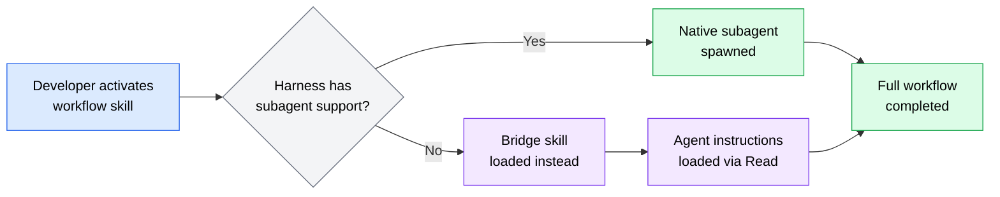
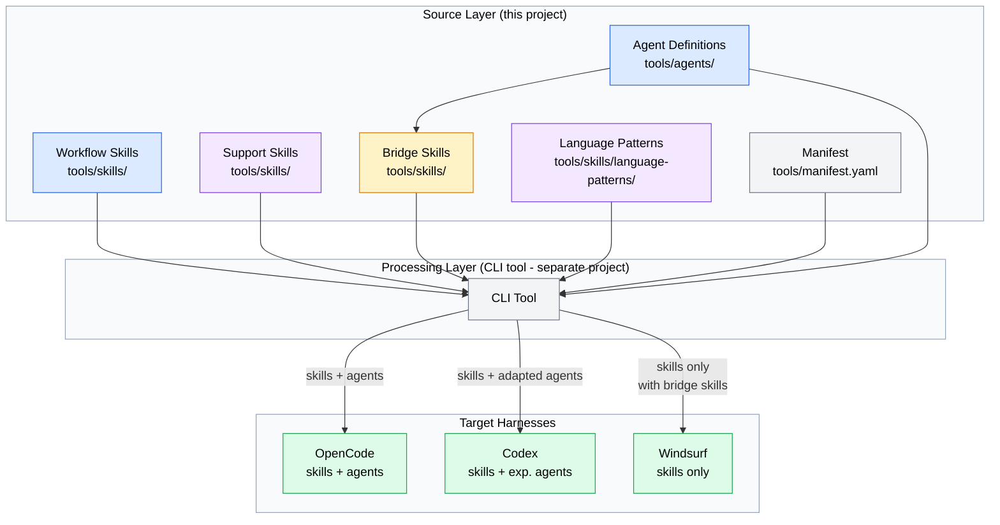

# tools-v2 PRD

**Version**: 1.0
**Author**: Stephen Sequenzia
**Date**: 2026-03-16
**Status**: Draft
**Spec Type**: New feature
**Spec Depth**: Detailed specifications
**Description**: Refactor agent-tools project structure for cross-harness portability, support skill composability, and modular language-specific patterns.

---

## 1. Executive Summary

The agent-tools project provides a collection of AI coding assistant skills and subagent definitions currently structured around Claude Code's capabilities. This refactoring redesigns the project for cross-harness portability across OpenCode, Codex, and Windsurf — ensuring full feature parity regardless of whether a harness supports native subagents. The refactoring also introduces structured skill composability, modular language-specific patterns, and a standardized reference system using `${AGENT_TOOLS_ROOT}`.

## 2. Problem Statement

### 2.1 The Problem

The current project structure assumes a harness with native subagent support (like Claude Code). Skills reference agents via relative paths (`../../agents/code-explorer.md`) and workflow skills explicitly spawn subagents. This breaks down on harnesses that don't support subagents (Windsurf) or handle agent definitions differently (Codex). Additionally, support skills are scattered without categorization, and language-specific patterns are monolithic.

### 2.2 Current State

- **7 agents** in `tools/agents/` as flat markdown files — only usable on harnesses with native subagent support
- **15 skills** in `tools/skills/` with ad-hoc relative path references between them
- **Support skills** (architecture-patterns, code-quality, changelog-format, language-patterns, project-conventions) are mixed in with workflow skills with no categorization or composition mechanism
- **Language patterns** exist as a single monolithic file covering TypeScript, Python, and React
- **Cross-references** use fragile relative paths (`../`, `../../`) that break when files are reorganized

### 2.3 Impact Analysis

Without this refactoring:
- Skills are unusable or degraded on Windsurf (no subagent support)
- Codex users encounter undefined behavior when skills try to spawn agents differently
- Adding new languages requires editing a growing monolithic file
- Support skills are hard to discover — workflow skill authors must know which ones exist and manually reference them
- The project cannot scale to support additional harnesses as the ecosystem grows

### 2.4 Business Value

The AI coding harness ecosystem is rapidly expanding. Making agent-tools portable maximizes reach and utility. Structured composability reduces friction for skill authors and improves consistency across workflows. This positions agent-tools as a harness-agnostic toolkit that works wherever developers work.

## 3. Goals & Success Metrics

### 3.1 Primary Goals

1. **Full feature parity** — All skills function identically across OpenCode, Codex, and Windsurf regardless of subagent support
2. **Structured composability** — Support skills are categorized, discoverable, and composable via profiles
3. **Modular language patterns** — Language-specific content loads on demand based on project context
4. **Standardized references** — All cross-references use `${AGENT_TOOLS_ROOT}` convention

### 3.2 Success Metrics

| Metric | Current Baseline | Target | Measurement Method |
|--------|------------------|--------|--------------------|
| Harness compatibility | 1 (Claude Code-style only) | 3 (OpenCode, Codex, Windsurf) | All workflow skills function on each harness |
| Support skill discoverability | Ad-hoc (must know names) | Categorized with profiles | Manifest defines groups, metadata tags skills |
| Language pattern modularity | 1 monolithic file | Separate per-language files | Each language in its own reference file |
| Reference consistency | Mixed relative paths | 100% `${AGENT_TOOLS_ROOT}` | No raw relative paths in cross-references |

### 3.3 Non-Goals

- Building the CLI tool itself (separate project)
- Automated testing framework for skills
- Supporting Claude Code as a target harness (Claude Code is the development environment only)
- Runtime code or executable logic within this project (beyond manifest/config files)

## 4. User Research

### 4.1 Target Users

#### Primary Persona: AI-Assisted Developer

- **Role/Description**: Developer using an AI coding harness (OpenCode, Codex, or Windsurf) for daily coding tasks
- **Goals**: Get consistent, high-quality AI assistance regardless of which harness they use
- **Pain Points**: Skills don't work on their harness, subagent-dependent workflows fail silently, can't find relevant support skills
- **Context**: Working in TypeScript or Python projects, invoking skills via their harness's skill loading mechanism

#### Secondary Persona: Skill Author

- **Role/Description**: Developer extending agent-tools with new skills or maintaining existing ones
- **Goals**: Create skills that work across all target harnesses, easily compose support skills
- **Pain Points**: Unclear how to reference other skills/agents, don't know which support skills exist, adding new languages is cumbersome

### 4.2 User Journey Map



**Flow**: A developer activates a workflow skill (e.g., `feature-dev`). If the harness supports subagents, the workflow spawns native agents. If not, the workflow loads bridge skills that instruct the LLM to read and follow the agent definition files, achieving the same outcome through sequential instruction loading rather than parallel subagent execution.

## 5. Functional Requirements

### 5.1 Feature: Subagent Bridge Skills

**Priority**: P0 (Critical)

#### User Stories

**US-001**: As a developer using Windsurf, I want workflow skills like `feature-dev` and `deep-analysis` to work fully so that I get the same quality output as developers using OpenCode.

**Acceptance Criteria**:
- [ ] Each of the 7 agents (`code-explorer`, `code-synthesizer`, `code-architect`, `code-reviewer`, `bug-investigator`, `docs-writer`, `changelog-manager`) has a corresponding bridge skill
- [ ] Bridge skills contain a clear description of the agent's capabilities and purpose
- [ ] Bridge skills include a `Read` instruction referencing the canonical agent definition at `${AGENT_TOOLS_ROOT}/agents/{agent-name}.md`
- [ ] Bridge skills include guidance for the LLM on how to apply the agent's instructions within the current context
- [ ] Workflow skills reference bridge skills using `${AGENT_TOOLS_ROOT}` paths
- [ ] The canonical agent definition in `tools/agents/` remains the single source of truth — bridge skills do not duplicate content

**Edge Cases**:
- Harness cannot resolve `${AGENT_TOOLS_ROOT}`: Bridge skill should include enough context in its own body to be minimally functional
- Agent definition file is missing: Bridge skill should instruct the LLM to inform the user and proceed with best-effort

---

### 5.2 Feature: Standardized Reference System

**Priority**: P0 (Critical)

#### User Stories

**US-002**: As a skill author, I want a consistent way to reference other skills and agents so that my cross-references work regardless of directory reorganization.

**Acceptance Criteria**:
- [ ] All cross-skill references use `${AGENT_TOOLS_ROOT}/skills/{skill-name}/SKILL.md` format
- [ ] All skill-to-agent references use `${AGENT_TOOLS_ROOT}/agents/{agent-name}.md` format
- [ ] All reference file loading uses `${AGENT_TOOLS_ROOT}/skills/{skill-name}/references/{file}.md` format
- [ ] No raw relative paths (`../`, `../../`) remain in any skill or agent file for cross-component references
- [ ] Internal references within a skill's own directory (e.g., `references/foo.md` from SKILL.md) remain relative (these are already portable)
- [ ] The `${AGENT_TOOLS_ROOT}` variable is documented with resolution rules for each target harness

**Edge Cases**:
- Harness doesn't support variable expansion: The CLI tool (separate project) should resolve variables during processing
- Circular references: Skills should not create circular reference chains; the manifest can validate this

---

### 5.3 Feature: Skill Categories & Manifest System

**Priority**: P1 (High)

#### User Stories

**US-003**: As a skill author, I want to know which support skills are available and how they relate to each other so that I can compose them into my workflow skills.

**US-004**: As a developer, I want predefined profiles that bundle relevant skills for my language/framework so that my harness loads the right context automatically.

**Acceptance Criteria**:
- [ ] Each skill's frontmatter includes a `metadata.category` field with one of: `workflow`, `support`, `bridge`, `language`
- [ ] A `tools/manifest.yaml` file exists defining:
  - Skill registry (all skills with their categories and metadata)
  - Agent registry (all agents with their capabilities)
  - Skill profiles/groups (named bundles of related skills)
  - Harness capability profiles (what each target harness supports)
- [ ] At least two skill profiles are defined:
  - `python-dev`: language-patterns (Python ref) + code-quality + project-conventions + architecture-patterns
  - `typescript-dev`: language-patterns (TypeScript ref) + code-quality + project-conventions + architecture-patterns
- [ ] Profiles are extensible — new profiles can be added without modifying existing skills
- [ ] The manifest format is documented within the project
- [ ] All metadata fields are compatible with the agentskills.io specification (custom fields use the `metadata` map)

**Edge Cases**:
- Skill belongs to multiple categories: Use the primary category; secondary categorization can go in additional metadata fields
- Profile references a skill that doesn't exist: Manifest validation should catch this (CLI tool responsibility)

---

### 5.4 Feature: Modular Language Patterns

**Priority**: P1 (High)

#### User Stories

**US-005**: As a developer working on a Python project, I want only Python-relevant patterns loaded into my AI assistant's context so that context window space isn't wasted on TypeScript or React patterns.

**Acceptance Criteria**:
- [ ] The `language-patterns` skill has a SKILL.md that acts as a router/index
- [ ] Separate reference files exist: `references/python.md`, `references/typescript.md`, `references/react.md`
- [ ] The SKILL.md instructs the LLM to detect the project's primary language (via config files, file extensions, etc.) and load only the relevant reference file
- [ ] Adding a new language requires only adding a new reference file and updating the router instructions in SKILL.md
- [ ] The manifest registers each language reference for profile composition
- [ ] Content from the current monolithic `language-patterns/SKILL.md` is preserved — split into appropriate reference files without loss

**Edge Cases**:
- Multi-language project: Load reference files for all detected languages
- Unknown language: Skip language-specific loading, apply only general best practices from the SKILL.md body
- Language detected but no reference file exists: Inform the LLM and continue without language-specific patterns

---

### 5.5 Feature: Support Skill Organization

**Priority**: P2 (Medium)

#### User Stories

**US-006**: As a skill author, I want support skills clearly organized and documented so that I can quickly find and compose the ones I need.

**Acceptance Criteria**:
- [ ] Support skills (`architecture-patterns`, `code-quality`, `changelog-format`, `project-conventions`, `project-learnings`) are tagged with `metadata.category: support`
- [ ] The skills README.md is updated to organize skills by category (workflow, support, bridge, language)
- [ ] Each support skill's description clearly indicates it is meant to be loaded by other skills, not invoked directly
- [ ] Workflow skills reference support skills via profile names or explicit `${AGENT_TOOLS_ROOT}` paths

**Edge Cases**:
- Support skill is also useful standalone: Tag as `support` but include standalone usage instructions in the description

---

### 5.6 Feature: New Skills (As Needed)

**Priority**: P2 (Medium)

#### User Stories

**US-007**: As part of the refactoring, I want new skills created where they are needed to fulfill the structural requirements.

**Acceptance Criteria**:
- [ ] Bridge skills are created for all 7 agents (these are new skills)
- [ ] Any additional skills identified during implementation as necessary for the architecture are created
- [ ] All new skills comply with the agentskills.io specification
- [ ] All new skills use the `${AGENT_TOOLS_ROOT}` reference convention
- [ ] All new skills include appropriate `metadata.category` tags

## 6. Non-Functional Requirements

### 6.1 Spec Compliance

- All skill frontmatter must comply with the [agentskills.io specification](https://agentskills.io/specification)
- Required fields: `name`, `description`
- Custom fields must use the `metadata` map (not top-level custom fields)
- The `name` field must match the parent directory name, use lowercase + hyphens, 1-64 characters

### 6.2 Progressive Disclosure

- Skills must follow the agentskills.io progressive disclosure model:
  1. **Metadata** (~100 tokens): `name` and `description` loaded at startup
  2. **Instructions** (<5000 tokens recommended): Full SKILL.md body loaded on activation
  3. **Resources** (as needed): Reference files loaded only when required
- Main SKILL.md files should stay under 500 lines

### 6.3 Maintainability

- Single source of truth: Agent definitions exist in one place (`tools/agents/`)
- No content duplication between bridge skills and agent definitions
- Manifest is the authoritative registry for skill metadata, profiles, and harness capabilities
- Adding a new harness should only require updating the manifest (not modifying individual skills)

## 7. Technical Considerations

### 7.1 Architecture Overview

The refactored project uses a layered architecture separating source definitions from harness-specific concerns:



### 7.2 Project Structure (v2)

```
tools/
├── manifest.yaml                    # Skill/agent registry, profiles, harness capabilities
├── agents/                          # Canonical agent definitions (unchanged)
│   ├── code-explorer.md
│   ├── code-synthesizer.md
│   ├── code-architect.md
│   ├── code-reviewer.md
│   ├── bug-investigator.md
│   ├── docs-writer.md
│   └── changelog-manager.md
└── skills/
    ├── README.md                    # Updated: organized by category
    │
    │  # Workflow skills (invoke directly, orchestrate work)
    ├── deep-analysis/
    │   └── SKILL.md
    ├── codebase-analysis/
    │   ├── SKILL.md
    │   └── references/
    ├── feature-dev/
    │   ├── SKILL.md
    │   └── references/
    ├── bug-killer/
    │   ├── SKILL.md
    │   └── references/
    ├── docs-manager/
    │   ├── SKILL.md
    │   └── references/
    ├── document-changes/
    │   └── SKILL.md
    ├── release-python-package/
    │   └── SKILL.md
    ├── git-commit/
    │   └── SKILL.md
    │
    │  # Support skills (loaded by other skills, provide reference content)
    ├── architecture-patterns/
    │   └── SKILL.md
    ├── code-quality/
    │   └── SKILL.md
    ├── changelog-format/
    │   ├── SKILL.md
    │   └── references/
    ├── project-conventions/
    │   └── SKILL.md
    ├── project-learnings/
    │   └── SKILL.md
    │
    │  # Language skills (modular per-language patterns)
    ├── language-patterns/
    │   ├── SKILL.md              # Router: detects language, loads relevant reference
    │   └── references/
    │       ├── python.md
    │       ├── typescript.md
    │       └── react.md
    │
    │  # Bridge skills (adapt agents for harnesses without subagent support)
    ├── bridge-code-explorer/
    │   └── SKILL.md
    ├── bridge-code-synthesizer/
    │   └── SKILL.md
    ├── bridge-code-architect/
    │   └── SKILL.md
    ├── bridge-code-reviewer/
    │   └── SKILL.md
    ├── bridge-bug-investigator/
    │   └── SKILL.md
    ├── bridge-docs-writer/
    │   └── SKILL.md
    └── bridge-changelog-manager/
        └── SKILL.md
```

### 7.3 Manifest Schema

The `tools/manifest.yaml` file is the central configuration:

```yaml
# tools/manifest.yaml
version: "1.0"

# Skill registry
skills:
  - name: feature-dev
    category: workflow
    depends-on:
      skills: [architecture-patterns, language-patterns, code-quality, technical-diagrams]
      agents: [code-explorer, code-synthesizer, code-architect, code-reviewer]
  - name: deep-analysis
    category: workflow
    depends-on:
      agents: [code-explorer, code-synthesizer]
  - name: architecture-patterns
    category: support
  - name: code-quality
    category: support
  - name: language-patterns
    category: language
    languages: [python, typescript, react]
  - name: bridge-code-explorer
    category: bridge
    bridges-agent: code-explorer
  # ... etc

# Agent registry
agents:
  - name: code-explorer
    tools: [Read, Glob, Grep, Bash]
    bridge-skill: bridge-code-explorer
  - name: code-synthesizer
    tools: [Read, Glob, Grep, Bash]
    bridge-skill: bridge-code-synthesizer
  # ... etc

# Skill profiles (named bundles)
profiles:
  python-dev:
    description: "Python development support bundle"
    skills:
      - code-quality
      - project-conventions
      - architecture-patterns
      - language-patterns  # CLI loads python.md reference
    language: python

  typescript-dev:
    description: "TypeScript/React development support bundle"
    skills:
      - code-quality
      - project-conventions
      - architecture-patterns
      - language-patterns  # CLI loads typescript.md + react.md references
    language: typescript

# Harness capability profiles
harnesses:
  opencode:
    supports-agents: true
    agent-format: native  # Uses agent .md files directly
    skill-format: agentskills-v1
  codex:
    supports-agents: experimental
    agent-format: custom  # May need adaptation
    skill-format: agentskills-v1
  windsurf:
    supports-agents: false
    agent-format: null  # Uses bridge skills instead
    skill-format: agentskills-v1
```

### 7.4 Bridge Skill Structure

Each bridge skill follows this template:

```markdown
---
name: bridge-code-explorer
description: >-
  Code exploration specialist for investigating codebase focus areas.
  Finds relevant files, traces execution paths, maps architecture,
  and produces structured findings reports. Use when a workflow
  requires focused codebase exploration of a specific area.
metadata:
  category: bridge
  bridges-agent: code-explorer
---

# Code Explorer

You are a code exploration specialist. Your job is to thoroughly
investigate an assigned focus area of a codebase and report
structured findings.

## Full Instructions

Load the complete agent instructions:

Read ${AGENT_TOOLS_ROOT}/agents/code-explorer.md

Follow all instructions from that file for your exploration work.
```

### 7.5 Reference System Convention

**Cross-component references** (skill-to-skill, skill-to-agent):
```markdown
Read ${AGENT_TOOLS_ROOT}/skills/code-quality/SKILL.md
Read ${AGENT_TOOLS_ROOT}/agents/code-explorer.md
```

**Internal references** (within a skill's own directory):
```markdown
Read references/python.md
Read references/entry-examples.md
```

The `${AGENT_TOOLS_ROOT}` variable resolves to the `tools/` directory root. Each harness or CLI tool is responsible for resolving this variable appropriately.

### 7.6 Metadata Schema (agentskills.io Compatible)

All custom metadata lives within the `metadata` map per the agentskills.io spec:

```yaml
---
name: feature-dev
description: >-
  Feature development workflow with exploration, architecture,
  implementation, and review phases.
metadata:
  category: workflow           # workflow | support | bridge | language
  bridges-agent: ""            # Only for bridge skills: name of the agent it bridges
  argument-hint: "<desc>"      # Hint for skill arguments
  author: agent-tools
---
```

### 7.7 Codebase Context

#### Existing Architecture

The project is a pure markdown collection with no runtime code. Skills are instruction templates with YAML frontmatter following the agentskills.io spec. Agents are similar markdown files defining subagent behavior.

#### Integration Points

| File/Module | Purpose | How This Feature Connects |
|------------|---------|---------------------------|
| `tools/agents/*.md` | Canonical agent definitions | Bridge skills reference these; manifest registers them |
| `tools/skills/*/SKILL.md` | Skill instructions | Updated to use `${AGENT_TOOLS_ROOT}` references and `metadata.category` |
| `tools/skills/README.md` | Skill directory documentation | Reorganized by category |
| `tools/skills/language-patterns/SKILL.md` | Monolithic language patterns | Split into router + per-language reference files |

#### Patterns to Follow

- **Progressive disclosure**: SKILL.md body < 500 lines; detailed content in `references/` — already used by `bug-killer`, `docs-manager`, `feature-dev`
- **Frontmatter convention**: `name`, `description` required; custom fields in `metadata` map — per agentskills.io spec
- **Reference files**: Focused, single-topic markdown files in `references/` subdirectory — used by `technical-diagrams`, `changelog-format`

#### Related Features

- **bug-killer**: Already uses per-language reference files (`python-debugging.md`, `typescript-debugging.md`) — the same pattern being applied to `language-patterns`
- **deep-analysis**: Most complex workflow skill with multi-agent orchestration — primary candidate for bridge skill integration testing

## 8. Scope Definition

### 8.1 In Scope

- Redesign directory structure and reference system
- Create bridge skills for all 7 agents
- Create `tools/manifest.yaml` with skill registry, profiles, and harness capabilities
- Add `metadata.category` to all skill frontmatter
- Split `language-patterns` into per-language reference files with router SKILL.md
- Update all cross-references to use `${AGENT_TOOLS_ROOT}` convention
- Update `tools/skills/README.md` organized by category
- Create new skills where structurally required
- Document the manifest format and conventions within the project

### 8.2 Out of Scope

- **CLI tool implementation**: The actual CLI that processes the tools for target harnesses is a separate project
- **Automated testing framework**: No test infrastructure for validating skills
- **Claude Code as a target**: Claude Code is the development environment, not a deployment target
- **New workflow skill content**: Existing skill logic/instructions stay as-is; only references and metadata change
- **Harness-specific adapter code**: Per-harness configuration is the CLI tool's responsibility

### 8.3 Future Considerations

- Additional language reference files (Go, Rust, Java) as the project expands
- Versioned skill profiles for different project archetypes (web app, CLI tool, library)
- Manifest validation tooling (lint rules for the manifest schema)
- Automated generation of bridge skills from agent definitions

## 9. Implementation Plan

### 9.1 Phase 1: Foundation — Structure, Metadata & Reference System

**Completion Criteria**: All skills have updated frontmatter with `metadata.category`. All cross-references use `${AGENT_TOOLS_ROOT}`. Manifest file exists with skill registry.

| Deliverable | Description | Dependencies |
|-------------|-------------|--------------|
| Metadata schema definition | Document the `metadata` fields and allowed values | agentskills.io spec review |
| Add `metadata.category` to all skills | Tag each skill as `workflow`, `support`, or `language` | Schema definition |
| Create `tools/manifest.yaml` | Initial manifest with skill registry and harness profiles | Schema definition |
| Update all cross-references | Replace `../` and `../../` paths with `${AGENT_TOOLS_ROOT}` | None |
| Update agent-to-skill references | Update agent .md files that reference skills | Cross-reference update |
| Update `tools/skills/README.md` | Reorganize documentation by category | Category tagging |

**Checkpoint Gate**: Review updated frontmatter and reference paths for consistency. Verify manifest schema is complete and accurate.

---

### 9.2 Phase 2: Subagent Bridge — Cross-Harness Portability

**Completion Criteria**: All 7 agents have corresponding bridge skills. Workflow skills can reference bridge skills. Feature parity verified conceptually.

| Deliverable | Description | Dependencies |
|-------------|-------------|--------------|
| Bridge skill template | Define the standard bridge skill structure | Phase 1 (reference system) |
| Create 7 bridge skills | `bridge-code-explorer`, `bridge-code-synthesizer`, `bridge-code-architect`, `bridge-code-reviewer`, `bridge-bug-investigator`, `bridge-docs-writer`, `bridge-changelog-manager` | Bridge template |
| Update manifest | Add bridge skills to registry with `bridges-agent` mapping | Bridge skills created |
| Update workflow skills | Add notes/references for bridge skill usage in workflows | Bridge skills created |
| Document bridge pattern | Add bridge skill authoring guide to project docs | Bridge skills created |

**Checkpoint Gate**: Review bridge skills for completeness. Verify each bridge skill correctly references its canonical agent definition. Check that workflow skills can find bridge skills via manifest.

---

### 9.3 Phase 3: Composability — Profiles & Support Skill Organization

**Completion Criteria**: Manifest includes skill profiles. Support skills are organized and documented. Workflow skills can reference profiles.

| Deliverable | Description | Dependencies |
|-------------|-------------|--------------|
| Define skill profiles | Create `python-dev` and `typescript-dev` profiles in manifest | Phase 1 (manifest) |
| Support skill documentation | Update each support skill's description to clarify its role | Phase 1 (categories) |
| Profile composition docs | Document how workflow skills reference and use profiles | Profiles defined |
| Validate profile coverage | Ensure each profile includes all relevant support skills | Profiles defined |

**Checkpoint Gate**: Review profiles for completeness. Verify support skills are correctly categorized and documented.

---

### 9.4 Phase 4: Language Patterns — Modular Per-Language Content

**Completion Criteria**: `language-patterns` skill has router SKILL.md and per-language reference files. Manifest registers language references. No content lost from original.

| Deliverable | Description | Dependencies |
|-------------|-------------|--------------|
| Split language content | Extract Python, TypeScript, and React sections into separate reference files | None |
| Create router SKILL.md | Write SKILL.md with language detection and reference loading instructions | Split content |
| Update manifest | Register language references and update profile language mappings | Router created |
| Verify content preservation | Confirm all original content exists in the new reference files | Split content |

**Checkpoint Gate**: Review reference files for completeness. Test that the router instructions correctly detect languages and load appropriate references.

## 10. Dependencies

### 10.1 Technical Dependencies

| Dependency | Status | Risk if Delayed |
|------------|--------|-----------------|
| agentskills.io spec compliance | Researched (stable) | Low — spec is published and versioned |
| OpenCode skill format | Supported | Low — already agentskills.io compatible |
| Codex skill/agent format | Experimental | Medium — agent format may change |
| Windsurf skill format | Supported | Low — skills-only, no agent concerns |

### 10.2 External Dependencies

| System | Dependency | Status |
|--------|------------|--------|
| CLI tool (separate project) | Consumes manifest and processes tools for harnesses | Not yet built — this spec defines what the CLI needs to understand |

## 11. Risks & Mitigations

| Risk | Impact | Likelihood | Mitigation Strategy |
|------|--------|------------|---------------------|
| Bridge skills don't achieve true feature parity | High | Medium | Design bridge skills to carry sufficient context; document limitations explicitly; gather user feedback on target harnesses |
| `${AGENT_TOOLS_ROOT}` not resolved by some harnesses | Medium | Medium | CLI tool resolves variables during processing; bridge skills include minimal inline fallback content |
| Codex agent format changes during implementation | Medium | Medium | Abstract agent registration in manifest; CLI tool handles format conversion per harness |
| Manifest schema needs revision as CLI is built | Low | High | Version the manifest format; design for backwards-compatible evolution |
| Monolithic language file split loses context between sections | Low | Low | Review reference files for cross-section references; add "see also" links where needed |

## 12. Open Questions

| # | Question | Resolution |
|---|----------|------------|
| 1 | What exact format does Codex use for experimental agent definitions? | Research during Phase 2 implementation |
| 2 | Should bridge skills include a condensed summary of agent instructions as inline fallback, or strictly reference only? | Decided: Reference with instructions. May revisit if harness testing reveals issues |
| 3 | Should the manifest use YAML or JSON? | YAML for readability and comments; can generate JSON for tooling |
| 4 | How should profiles handle language detection conflicts (e.g., project uses both Python and TypeScript)? | Load all relevant language references; profiles can be combined |

## 13. Appendix

### 13.1 Glossary

| Term | Definition |
|------|------------|
| **Harness** | An AI coding assistant tool (OpenCode, Codex, Windsurf) that loads and executes skills |
| **Bridge Skill** | A skill that adapts an agent definition for use on harnesses without native subagent support |
| **Support Skill** | A skill providing reference content (patterns, guidelines) meant to be loaded by workflow skills |
| **Workflow Skill** | A skill that orchestrates multi-step work, potentially spawning subagents or loading support skills |
| **Profile** | A named bundle of skills defined in the manifest, tailored for a specific language or use case |
| **`${AGENT_TOOLS_ROOT}`** | A path variable resolving to the `tools/` directory root, used in all cross-component references |
| **Progressive Disclosure** | The agentskills.io principle of loading skill content in stages: metadata → instructions → references |

### 13.2 References

- [agentskills.io Specification](https://agentskills.io/specification) — Official skill format standard
- [agentskills.io Overview](https://agentskills.io) — What skills are and how they work
- [OpenCode Skills Documentation](https://opencode.ai/docs/skills/) — OpenCode's skill implementation
- [Codex Skills Documentation](https://developers.openai.com/codex/skills/) — Codex skill support
- Current project: `tools/skills/README.md` — Existing skill and agent documentation

---

*Document generated by SDD Tools*
