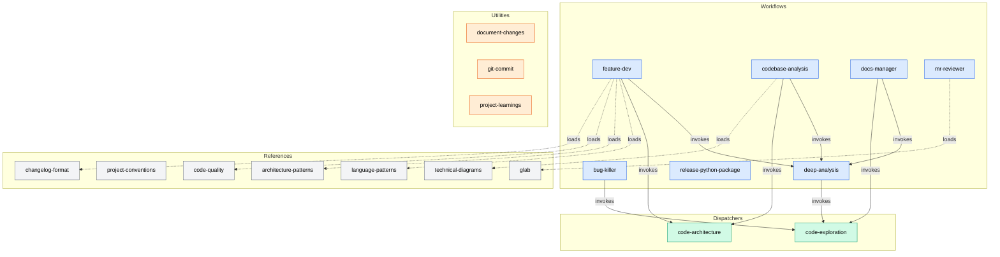

# Core Skills Developer Guide

General-purpose skills for codebase analysis, feature development, debugging, documentation, code review, and git workflows.

## Skill Ecosystem

Core skills are organized into four types that compose together to form a powerful toolkit:

- **Workflow skills** orchestrate multi-phase processes, dispatching agents and invoking other skills to accomplish complex tasks like building features, debugging, or generating documentation.
- **Dispatcher skills** wrap a shared agent behind a canonical entry point. Multiple workflow skills invoke the same dispatcher rather than duplicating agent logic.
- **Reference skills** provide on-demand knowledge — patterns, templates, and best practices — loaded into context by workflow skills when needed.
- **Utility skills** handle standalone tasks like committing code or generating change reports.

The composition model means most workflows don't work in isolation. `feature-dev` invokes `deep-analysis`, which in turn invokes `code-exploration` to dispatch parallel explorer agents. Understanding these relationships is key to understanding how the skills work together.

### Composition Graph



**Solid arrows** = skill invocation (dispatches agents or follows another skill's workflow).
**Dashed arrows** = reference loading (reads knowledge into context).

---

## Quick Reference

| Skill | Type | Command | Description |
|-------|------|---------|-------------|
| `feature-dev` | workflow | `/feature-dev <desc>` | 7-phase feature development lifecycle |
| `bug-killer` | workflow | `/bug-killer <error> [--deep]` | Hypothesis-driven debugging with track routing |
| `codebase-analysis` | workflow | `/codebase-analysis [context]` | Structured analysis with report and diagrams |
| `deep-analysis` | workflow | `/deep-analysis [context]` | Hub-and-spoke exploration with parallel agents |
| `docs-manager` | workflow | `/docs-manager [action]` | MkDocs sites, markdown files, change summaries |
| `mr-reviewer` | workflow | `/mr-reviewer <mr> [--deep]` | 3-agent parallel MR review with GitLab integration |
| `release-python-package` | workflow | `/release-python-package [version]` | Python package release with uv and ruff |
| `code-exploration` | dispatcher | _(invoked by skills)_ | Shared code-explorer agent (5 consumers) |
| `code-architecture` | dispatcher | _(invoked by skills)_ | Shared code-architect agent (2 consumers) |
| `language-patterns` | reference | _(loaded by skills)_ | TypeScript, Python, React patterns |
| `project-conventions` | reference | _(loaded by skills)_ | Project-specific convention discovery |
| `architecture-patterns` | reference | _(loaded by skills)_ | MVC, event-driven, microservices, CQRS |
| `code-quality` | reference | _(loaded by skills)_ | SOLID, DRY, review criteria |
| `technical-diagrams` | reference | _(loaded by skills)_ | Mermaid syntax for 6 diagram types |
| `changelog-format` | reference | _(loaded by skills)_ | Keep a Changelog guidelines |
| `glab` | reference | _(loaded by skills)_ | GitLab CLI patterns (11 reference files) |
| `document-changes` | utility | `/document-changes` | Session change report from git data |
| `git-commit` | utility | `/git-commit` | Conventional commit from staged changes |
| `project-learnings` | utility | _(loaded by skills)_ | Captures patterns into project AGENTS.md |

---

## Quick Start

### Analyze a codebase

```
/codebase-analysis
```

Runs deep-analysis, then generates a structured report with architecture diagrams and actionable recommendations.

### Build a feature

```
/feature-dev add a user profile page with avatar upload
```

Walks through 7 phases: Discovery, Exploration, Questions, Architecture, Implementation, Review, Summary.

### Debug a bug

```
/bug-killer the login form crashes on empty email
```

Forms hypotheses, gathers evidence, confirms root cause, then fixes. Use `--deep` to skip triage and force full investigation.

### Generate documentation

```
/docs-manager
```

Interactive discovery of doc type (MkDocs site, markdown files, or change summary), then deep analysis and generation.

### Review a merge request

```
/mr-reviewer 42
```

Dispatches 3 parallel agents (codebase understanding, code quality, git history), merges findings, posts GitLab comments. Use `--report-only` or `--comments-only` to control output.

### Commit changes

```
/git-commit
```

Stages changes and generates a conventional commit message.

---

## Skill Reference

### Development Lifecycle

#### feature-dev

7-phase feature development workflow. Explores the codebase via deep-analysis, designs architecture via code-architecture, implements the feature, then runs parallel code-reviewer agents for quality review.

| Phase | Purpose |
|-------|---------|
| 1. Discovery | Understand feature requirements, confirm with user |
| 2. Codebase Exploration | Deep analysis via deep-analysis skill |
| 3. Clarifying Questions | Resolve ambiguities before designing |
| 4. Architecture Design | 2-3 code-architect proposals via code-architecture skill |
| 5. Implementation | Build the feature |
| 6. Quality Review | 3 parallel code-reviewer agents |
| 7. Summary | Document accomplishments, ADR, changelog |

**Agents owned:** code-reviewer
**Skills invoked:** deep-analysis, code-architecture
**References loaded:** architecture-patterns, language-patterns, code-quality, changelog-format, technical-diagrams

#### bug-killer

Hypothesis-driven debugging with triage-based track routing. Quick track handles straightforward bugs in 1-2 hypotheses; deep track escalates to parallel investigation agents for complex issues.

| Phase | Purpose |
|-------|---------|
| 1. Triage & Reproduction | Understand, reproduce, route to quick or deep track |
| 2. Investigation | Evidence gathering with language-specific techniques |
| 3. Root Cause Analysis | Hypothesis testing, 5 Whys |
| 4. Fix & Verify | Fix, test, regression test, quality check |
| 5. Wrap-up & Report | Document trail, capture learnings via project-learnings |

**Agents owned:** bug-investigator
**Skills invoked:** code-exploration
**References:** references/python-debugging.md, references/typescript-debugging.md, references/general-debugging.md
**Flags:** `--deep` forces full investigation track (skips triage)

#### codebase-analysis

3-phase analysis workflow that delegates exploration to deep-analysis, generates a structured report with Mermaid diagrams, and offers post-analysis actions (save report, document insights).

| Phase | Purpose |
|-------|---------|
| 1. Deep Analysis | Explore via deep-analysis skill |
| 2. Reporting | Structured report with architecture diagrams |
| 3. Post-Analysis Actions | Save, document, or address insights |

**Skills invoked:** deep-analysis, code-architecture, code-exploration
**References:** references/report-template.md, references/actionable-insights-template.md

---

### Code Review

#### mr-reviewer

Automated merge request review that dispatches 3 parallel agents, merges their findings, and delivers a structured report and/or GitLab line-level comments. Falls back to local branch diff mode when glab is unavailable.

| Step | Purpose |
|------|---------|
| 1. MR Input | Accept MR URL/IID, fetch data, detect large MRs |
| 2. Agent Dispatch | Launch 3 parallel analysis agents |
| 3. Finding Merge | Collect, deduplicate, sort by severity |
| 4. Report Generation | Structured markdown review report |
| 5. GitLab Comments | Line-level + summary comments via glab |

**Agents owned:** codebase-understanding, mr-code-quality, git-history
**Skills loaded:** glab (reference)
**Flags:** `--deep` (feature-scoped exploration), `--report-only`, `--comments-only`
**References:** references/finding-schema.md, references/gitlab-api-patterns.md

---

### Documentation & Release

#### docs-manager

6-phase documentation workflow supporting MkDocs sites, standalone markdown files (README, CONTRIBUTING, ARCHITECTURE), and change summaries. Interactively discovers what the user needs, then generates content via parallel docs-writer agents.

| Phase | Purpose |
|-------|---------|
| 1. Interactive Discovery | Determine doc type, format, and scope |
| 2. Project Detection & Setup | Detect context, conditionally scaffold MkDocs |
| 3. Codebase Analysis | Deep exploration via deep-analysis skill |
| 4. Documentation Planning | Translate findings into plan for user approval |
| 5. Documentation Generation | Launch docs-writer agents for content |
| 6. Integration & Finalization | Write files, validate, present results |

**Agents owned:** docs-writer
**Skills invoked:** deep-analysis, code-exploration
**References:** references/mkdocs-config-template.md, references/markdown-file-templates.md, references/change-summary-templates.md

#### release-python-package

9-step Python package release workflow using `uv` and `ruff`. Fail-fast — stops immediately if any verification step fails.

| Step | Purpose |
|------|---------|
| 1. Pre-flight Checks | Branch, clean directory, pull latest |
| 2. Run Tests | `uv run pytest` |
| 3. Lint & Format | `uv run ruff check` and `ruff format` |
| 4. Build Package | `uv build` |
| 5. Changelog Update | Launch changelog-manager agent |
| 6. Version Calculation | Determine next version from changelog |
| 7. Update CHANGELOG | Replace [Unreleased] with version heading |
| 8. Commit | Stage and commit version bump |
| 9. Tag & Push | Create git tag and push |

**Agents owned:** changelog-manager

#### document-changes

Generates a markdown report documenting codebase changes from the current session — files added, modified, deleted, and a summary of what was done. Uses git diff data as its source.

#### git-commit

Stages all changes and generates a conventional commit message following the Conventional Commits format. Analyzes the diff to determine the appropriate type (feat, fix, refactor, etc.) and scope.

---

### Shared Infrastructure

These skills form the backbone of the composition graph. Workflow skills invoke them rather than implementing exploration or architecture logic directly.

#### deep-analysis (workflow)

Hub-and-spoke exploration pattern: performs rapid reconnaissance, generates dynamic focus areas tailored to the actual codebase, dispatches parallel code-explorer agents via the code-exploration skill, then merges all findings through a code-synthesizer agent.

| Phase | Purpose |
|-------|---------|
| 1. Reconnaissance & Planning | Map codebase, generate focus areas, compose plan |
| 2. Team Exploration | Dispatch parallel code-explorer agents |
| 3. Synthesis | code-synthesizer merges findings with deep investigation |

**Agents owned:** code-synthesizer
**Skills invoked:** code-exploration
**Auto-approval:** When invoked by another skill, the exploration plan is auto-approved to avoid unnecessary interaction.

#### code-exploration (dispatcher)

Canonical entry point for focused codebase exploration. Wraps the shared code-explorer agent, which investigates a specific focus area — finding relevant files, tracing execution paths, and mapping architecture.

**Agent wrapped:** code-explorer
**Consumers (5):** deep-analysis, bug-killer, docs-manager, codebase-analysis, create-spec (SDD)

#### code-architecture (dispatcher)

Canonical entry point for architectural design. Wraps the shared code-architect agent, which produces implementation blueprints with file plans, data flow, risks, and testing strategy. Accepts one of three design approaches: Minimal, Flexible, or Project-Aligned.

**Agent wrapped:** code-architect
**Consumers (2):** feature-dev, codebase-analysis

---

### Knowledge Bases

Reference skills are loaded on demand by workflow skills. They contain no agents and perform no actions — they provide patterns, templates, and best practices.

| Skill | Content | Primary Consumers |
|-------|---------|-------------------|
| `language-patterns` | TypeScript, Python, React patterns, idioms, best practices | feature-dev |
| `project-conventions` | Project-specific convention discovery (naming, structure, patterns) | feature-dev |
| `architecture-patterns` | Design patterns: MVC, event-driven, microservices, CQRS | feature-dev |
| `code-quality` | SOLID, DRY, testing strategies, review criteria | feature-dev, bug-killer |
| `technical-diagrams` | Mermaid syntax for flowcharts, sequence, class, state, ER, C4 diagrams | codebase-analysis, docs-manager |
| `changelog-format` | Keep a Changelog format guidelines and entry examples | feature-dev, release-python-package |
| `glab` | GitLab CLI patterns across 11 reference files (MRs, CI/CD, issues, releases, API, etc.) | mr-reviewer |

---

### Project Memory

#### project-learnings (utility)

Captures project-specific patterns and anti-patterns into the project's AGENTS.md file. Loaded by workflow skills (bug-killer, feature-dev) when they discover knowledge worth encoding for future sessions — e.g., "this project uses a custom ORM wrapper" or "never modify the legacy auth module directly."

---

## Shared Agent Architecture

### Execution Strategy Pattern

Every workflow skill includes dual-path execution instructions:

- **Subagent dispatch available** (e.g., Claude Code): dispatch agents in parallel as subagents
- **Subagent dispatch not available**: execute agents sequentially, reading each agent file and following its instructions inline

This makes skills portable across harnesses with different capabilities.

### Agent Inventory

| Agent | Owner Skill | Shared | Consumers | Tools |
|-------|-------------|--------|-----------|-------|
| code-explorer | code-exploration | Yes | 5 | Read, Glob, Grep, Bash |
| code-architect | code-architecture | Yes | 2 | Read, Glob, Grep |
| code-synthesizer | deep-analysis | No | 1 | Read, Glob, Grep, Bash |
| code-reviewer | feature-dev | No | 1 | Read, Glob, Grep |
| bug-investigator | bug-killer | No | 1 | Read, Glob, Grep, Bash |
| docs-writer | docs-manager | No | 1 | Read, Write, Edit, Glob, Grep, Bash |
| codebase-understanding | mr-reviewer | No | 1 | Read, Glob, Grep |
| mr-code-quality | mr-reviewer | No | 1 | Read, Glob, Grep, Bash |
| git-history | mr-reviewer | No | 1 | Bash, Read, Glob, Grep |
| changelog-manager | release-python-package | No | 1 | Read, Edit, Bash |

---

## Troubleshooting

### deep-analysis takes too long

Large codebases may take several minutes. The skill adjusts focus area count based on codebase size (2 for small, up to 4 for large). When invoked by another skill, the exploration plan is auto-approved to avoid interaction delays.

### code-exploration returns incomplete results

Explorer agents use pattern-based search. Unusual naming conventions or deeply nested structures may need manual guidance. Check that the focus area directories exist and contain the expected files.

### feature-dev skips phases

The workflow is designed to complete all 7 phases. If it stops early, re-invoke with explicit instructions to continue. The "CRITICAL: Complete ALL 7 phases" instruction in the skill prevents this in most cases.

### bug-killer auto-escalates to deep track

This happens when 2 hypotheses are rejected on the quick track — this is expected behavior. Use `--deep` to skip triage and go directly to the deep track when you already know the bug is complex.

### mr-reviewer can't post GitLab comments

- Verify glab authentication: `glab auth status`
- The skill falls back to local mode (report only) if glab is unavailable
- If the MR head SHA changed (force push), line-level comments may fail to attach

### release-python-package fails at pre-flight

The workflow requires a clean working directory on the `main` branch. Commit or stash uncommitted changes before running.

---

## File Map

```
skills/core/
├── architecture-patterns/
│   └── SKILL.md                          # Design patterns reference
├── bug-killer/
│   ├── SKILL.md                          # 5-phase debugging workflow
│   ├── agents/
│   │   └── bug-investigator.md           # Diagnostic investigation agent
│   └── references/
│       ├── general-debugging.md          # Cross-language debugging techniques
│       ├── python-debugging.md           # Python-specific debugging
│       └── typescript-debugging.md       # TypeScript-specific debugging
├── changelog-format/
│   ├── SKILL.md                          # Keep a Changelog reference
│   └── references/
│       └── entry-examples.md             # Changelog entry examples
├── code-architecture/
│   ├── SKILL.md                          # Dispatcher for code-architect
│   └── agents/
│       └── code-architect.md             # Shared implementation blueprint agent
├── code-exploration/
│   ├── SKILL.md                          # Dispatcher for code-explorer
│   └── agents/
│       └── code-explorer.md              # Shared codebase exploration agent
├── code-quality/
│   └── SKILL.md                          # SOLID, DRY, review criteria reference
├── codebase-analysis/
│   ├── SKILL.md                          # 3-phase analysis workflow
│   └── references/
│       ├── actionable-insights-template.md
│       └── report-template.md            # Analysis report structure
├── deep-analysis/
│   ├── SKILL.md                          # Hub-and-spoke exploration workflow
│   └── agents/
│       └── code-synthesizer.md           # Finding synthesis agent
├── docs-manager/
│   ├── SKILL.md                          # 6-phase documentation workflow
│   ├── agents/
│   │   └── docs-writer.md               # Documentation generation agent
│   └── references/
│       ├── change-summary-templates.md   # Changelog/release note templates
│       ├── markdown-file-templates.md    # README, CONTRIBUTING templates
│       └── mkdocs-config-template.md     # MkDocs scaffold template
├── document-changes/
│   └── SKILL.md                          # Session change report utility
├── feature-dev/
│   ├── SKILL.md                          # 7-phase feature development workflow
│   ├── agents/
│   │   └── code-reviewer.md             # Quality review agent
│   └── references/
│       ├── adr-template.md              # Architecture Decision Record template
│       └── changelog-entry-template.md  # Changelog entry template
├── git-commit/
│   └── SKILL.md                          # Conventional commit utility
├── glab/
│   ├── SKILL.md                          # GitLab CLI reference
│   └── references/
│       ├── api.md                        # GitLab API patterns
│       ├── auth-config.md               # Authentication and config
│       ├── ci-cd.md                     # CI/CD pipeline management
│       ├── incidents-changelog.md       # Incidents and changelogs
│       ├── issues.md                    # Issue management
│       ├── merge-requests.md            # MR workflows
│       ├── project-management.md        # Labels, milestones, variables
│       ├── releases.md                  # Release management
│       ├── repositories.md             # Repository operations
│       ├── runners-schedules.md        # Runners and pipeline schedules
│       └── tokens-keys.md             # Access tokens and deploy keys
├── language-patterns/
│   └── SKILL.md                          # TypeScript, Python, React patterns
├── mr-reviewer/
│   ├── SKILL.md                          # 5-step MR review workflow
│   ├── agents/
│   │   ├── codebase-understanding.md    # Convention and architecture analysis
│   │   ├── git-history.md               # Historical context and regression risk
│   │   └── mr-code-quality.md           # Bug and quality analysis
│   └── references/
│       ├── finding-schema.md            # Finding format and severity levels
│       └── gitlab-api-patterns.md       # GitLab API comment patterns
├── project-conventions/
│   └── SKILL.md                          # Convention discovery reference
├── project-learnings/
│   └── SKILL.md                          # Pattern capture utility
├── release-python-package/
│   ├── SKILL.md                          # 9-step release workflow
│   └── agents/
│       └── changelog-manager.md         # CHANGELOG.md management agent
├── technical-diagrams/
│   ├── SKILL.md                          # Mermaid diagram reference
│   └── references/
│       ├── c4-diagrams.md               # C4 architecture diagrams
│       ├── class-diagrams.md            # Class diagrams
│       ├── er-diagrams.md               # Entity-relationship diagrams
│       ├── flowcharts.md                # Flowchart syntax and patterns
│       ├── sequence-diagrams.md         # Sequence diagrams
│       └── state-diagrams.md            # State machine diagrams
└── README.md                             # This file
```

59 markdown files total: 19 SKILL.md + 10 agents + 30 references
