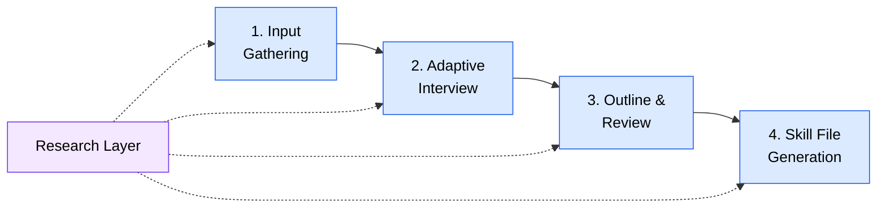

# Meta Skills Developer Guide

Tools for creating portable agent skills through adaptive interview pipelines.

## Overview

Meta skills are "skills that create skills." Both skills in this category guide users through a structured interview process and produce ready-to-use skill files. They share the same 4-stage pipeline architecture but target different platform sets.

Neither skill owns agents — they work entirely through direct user interaction (interview questions, outline review, confirmation prompts) and file generation.

## Choosing a Skill

| Aspect | create-skill | create-skill-opencode |
|--------|-------------|----------------------|
| **Target platforms** | GAS only | GAS, OpenCode, Codex |
| **Stage 1 inputs** | Name, description, depth (3 inputs) | Name, description, platform, depth (4 inputs) |
| **User interaction** | Direct text output | `question` tool (with text fallback) |
| **Plan mode** | Standard | Special handling — generates skill file directly, never defers to execution phase |
| **Reference files** | 6 | 9 |
| **Generation output** | SKILL.md | SKILL.md (+ agents/openai.yaml for Codex) |

**When to use which:**
- **create-skill** — You only need GAS-format skills, or the agent platform does not support the `question` tool
- **create-skill-opencode** — You need OpenCode or Codex native skills, or want the richest interview UX via the `question` tool

---

## Pipeline Overview

Both skills follow a four-stage pipeline with a cross-cutting research layer:



---

### Stage 1: Input Gathering

Collect foundational inputs before the interview begins. All inputs must be gathered before advancing to Stage 2.

| Input | create-skill | create-skill-opencode |
|-------|-------------|----------------------|
| Pre-supplied check | Read context file, extract details | Read context file + validate `platform` argument |
| Skill name | Required | Required |
| Brief description | Required | Required |
| Target platform | N/A (GAS only) | Required — GAS, OpenCode, or Codex |
| Interview depth | Required | Required |

**Interview depth levels** (shared by both):

| Depth | Behavior |
|-------|----------|
| High-Level Overview | Essential categories only, accept defaults, lower end of round count |
| Detailed (recommended) | All categories at moderate depth, confirm key decisions |
| Deep Dive | All categories thoroughly, probe edge cases and advanced config |

### Stage 2: Adaptive Interview

Multi-round interview across 5 categories. Adapts question count and probing depth based on the selected interview depth, perceived skill complexity, and response quality.

| Category | Topics Covered |
|----------|----------------|
| Target Audience | Who uses the skill, experience level, domain context |
| Use Cases | Primary/secondary scenarios, trigger phrases |
| Requirements | Inputs, outputs, dependencies, constraints |
| Features | Core capabilities, optional features, error handling |
| Platform-Specific | GAS portability fields / OpenCode permissions / Codex openai.yaml metadata |

Both skills load interview logic from `references/interview-engine.md`. The platform-specific category adapts based on the target platform (create-skill always uses GAS).

### Stage 3: Outline & Review

Generates a structured outline from interview data with 8 sections: Identity, Features, Use Cases, Workflow, Platform Config, File Structure, Requirements, and Defaults.

The user reviews the outline with three paths:
1. **Approve** — proceed to generation
2. **Feedback** — iterate on specific sections
3. **Major rework** — return to interview for additional questions

Both skills load outline procedures from `references/outline-review.md`.

### Stage 4: Skill File Generation

Renders the final skill file with 4 sub-steps:

| Sub-step | create-skill | create-skill-opencode |
|----------|-------------|----------------------|
| Pre-generation setup | Load GAS spec | Load platform-specific spec |
| Rendering | GAS frontmatter + markdown body | Platform-native frontmatter + body |
| Codex extra | N/A | Generate `agents/openai.yaml` if Codex platform |
| Validation | GAS structural rules | Platform-specific validation rules |

**Output paths** (user selects or accepts default):
- `~/.agents/skills/<skill-name>/` — User-level installation
- `.agents/skills/<skill-name>/` — Project-level installation
- Custom path

Both skills load validation from `references/validation-engine.md`.

---

## Research Layer

Both skills have access to a 4-source research hierarchy, available across all stages:

1. **Context7 MCP** — Fetch latest library/framework documentation
2. **Web search** — Find community patterns and examples
3. **Reference files** — Embedded platform specs and patterns
4. **Embedded knowledge** — Model's training data as fallback

Research is best-effort — skill generation always succeeds regardless of source availability. Higher-ranked sources are preferred when available. Both skills load research procedures from `references/research-procedures.md`.

---

## Quick Start

### Create a portable GAS skill

```
/create-skill
```

### Create a platform-native skill

```
/create-skill-opencode
```

### Create a skill with context file

```
/create-skill path/to/requirements.md
/create-skill-opencode path/to/requirements.md
```

Context files make the interview smarter — questions become more targeted based on the pre-supplied information.

---

## Reference File Inventory

### create-skill (6 files)

| File | Purpose |
|------|---------|
| `platform-knowledge.md` | GAS spec, field definitions, portability rules |
| `interview-engine.md` | Question categories, flow control, depth adaptation |
| `outline-review.md` | Outline generation, review flow, gap detection |
| `generation-engine.md` | Body templates, content mapping, complexity adaptation |
| `validation-engine.md` | Validation flow, structural rules, auto-fix, report format |
| `research-procedures.md` | Documentation fetching, fallback chain, quality indicators |

### create-skill-opencode (9 files)

| File | Purpose |
|------|---------|
| `platform-base.md` | Shared format, field definitions, validation rules |
| `platform-opencode.md` | OpenCode-specific fields, permissions, discovery paths |
| `platform-gas.md` | GAS-specific portability rules |
| `platform-codex.md` | Codex openai.yaml schema, UI metadata |
| `interview-engine.md` | Question categories, flow control, depth adaptation |
| `outline-review.md` | Outline generation, review flow, gap detection |
| `generation-templates.md` | Body templates, content mapping, platform adaptation |
| `validation-engine.md` | Platform-specific validation rules |
| `research-procedures.md` | Documentation fetching, fallback chain |

### Shared Concepts

Both skills share the same conceptual reference structure. Files with similar names serve the same role but are not identical — create-skill-opencode versions contain platform-specific extensions.

| Concept | create-skill | create-skill-opencode |
|---------|-------------|----------------------|
| Platform knowledge | `platform-knowledge.md` | `platform-base.md` + `platform-{gas,opencode,codex}.md` |
| Generation | `generation-engine.md` | `generation-templates.md` |
| Interview | `interview-engine.md` | `interview-engine.md` |
| Outline | `outline-review.md` | `outline-review.md` |
| Validation | `validation-engine.md` | `validation-engine.md` |
| Research | `research-procedures.md` | `research-procedures.md` |

---

## Troubleshooting

### Interview feels too long or too short

You can request depth changes mid-interview. Say "let's speed up" or "go deeper on this topic." High-Level Overview targets the lower end of the round-count range; Deep Dive targets the upper end.

### Generated skill has validation warnings

Warnings are informational and never block output. Auto-fixes are applied where possible. Review the validation report in the post-generation summary.

### question tool not available

- create-skill works without it (uses direct text output natively)
- create-skill-opencode falls back to numbered option lists in text output, or uses `AskUserQuestion` if available

### Overwrite protection triggered

Both skills check for existing files before writing. Choose overwrite, different path, or cancel. If cancelled, the generated content is displayed for manual copy.

### Platform argument not recognized

create-skill-opencode accepts: "gas", "opencode", "codex" (case-insensitive), platform numbers (1/2/3), or full names. If unrecognized, you'll be shown the three valid options.

---

## File Map

```
skills/meta/
├── create-skill/
│   ├── SKILL.md                          # 4-stage GAS skill creation workflow
│   └── references/
│       ├── generation-engine.md          # Body templates and content mapping
│       ├── interview-engine.md           # Question categories and flow control
│       ├── outline-review.md             # Outline generation and review flow
│       ├── platform-knowledge.md         # GAS spec and field definitions
│       ├── research-procedures.md        # Documentation fetching and fallback
│       └── validation-engine.md          # Structural validation and auto-fix
├── create-skill-opencode/
│   ├── SKILL.md                          # 4-stage multi-platform skill creation
│   └── references/
│       ├── generation-templates.md       # Platform-adaptive body templates
│       ├── interview-engine.md           # Question categories and flow control
│       ├── outline-review.md             # Outline generation and review flow
│       ├── platform-base.md              # Shared format and field definitions
│       ├── platform-codex.md             # Codex openai.yaml schema
│       ├── platform-gas.md               # GAS portability rules
│       ├── platform-opencode.md          # OpenCode permissions and discovery
│       ├── research-procedures.md        # Documentation fetching and fallback
│       └── validation-engine.md          # Platform-specific validation rules
└── README.md                             # This file
```

17 markdown files total: 2 SKILL.md + 15 references
