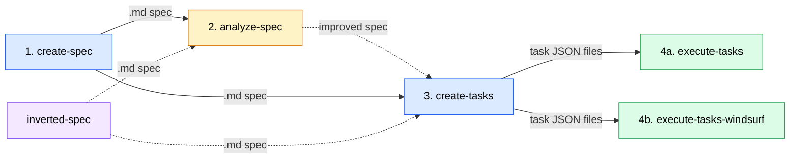
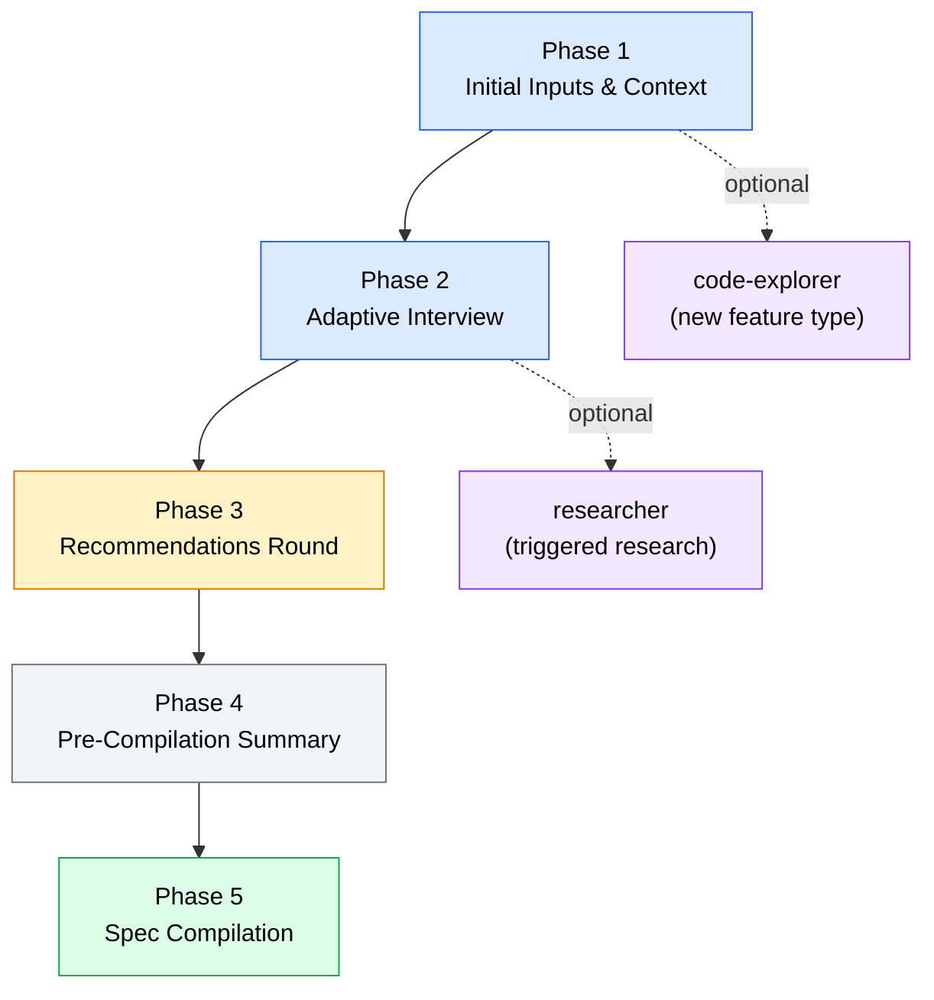
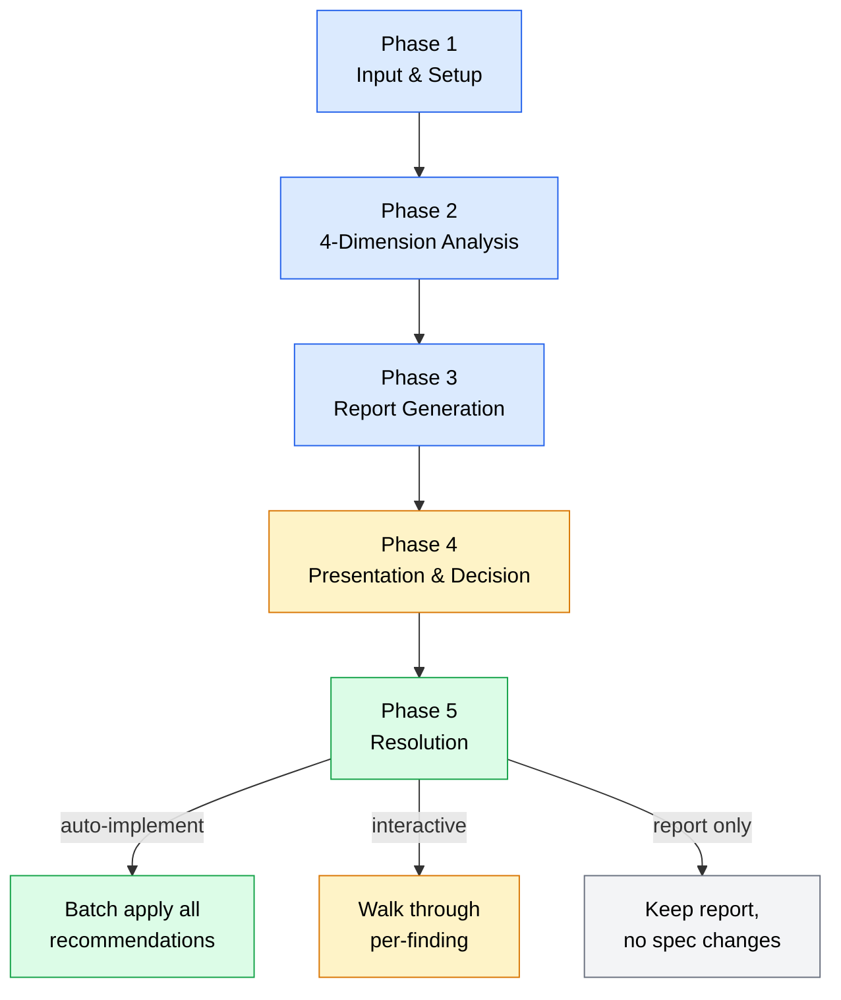
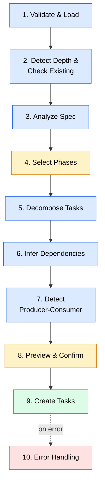
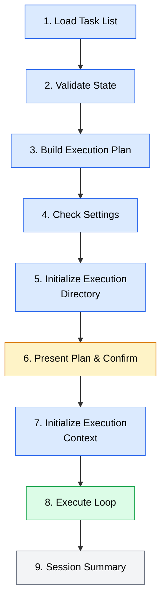
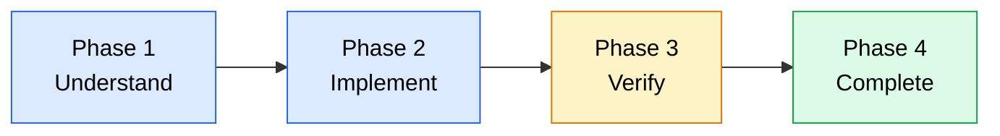
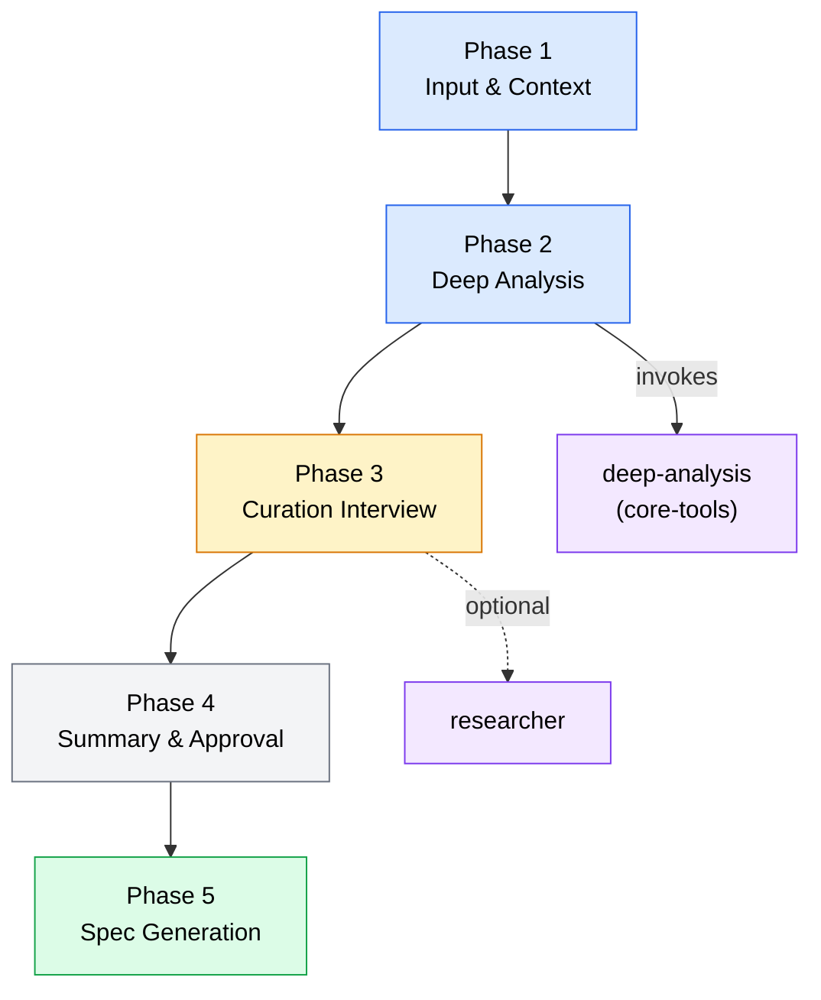
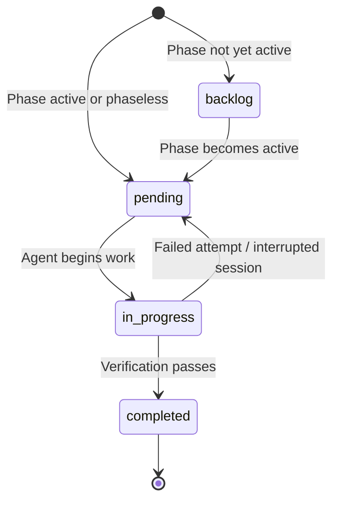
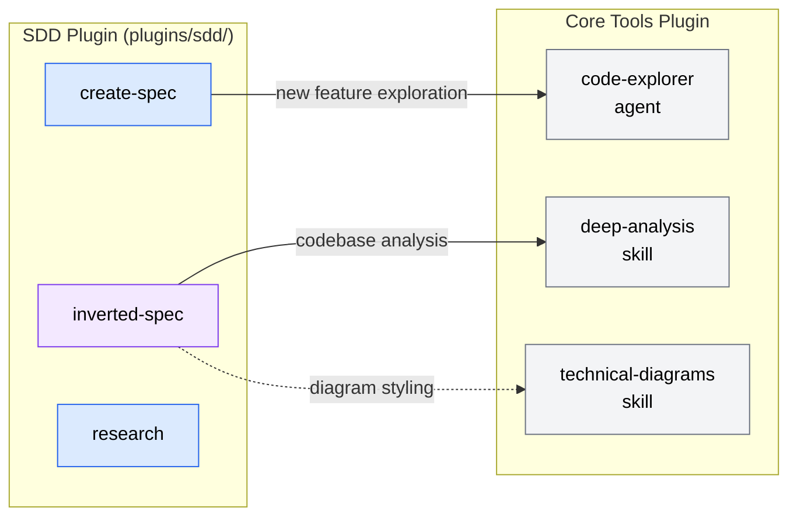

# SDD Pipeline Deep Dive

A comprehensive architectural breakdown of the Spec-Driven Development pipeline — from natural-language requirements through autonomous code execution.

**Date**: 2026-04-06
**Scope**: `plugins/sdd/` (10 skills, 41 files)

---

## Table of Contents

- [Pipeline Overview](#pipeline-overview)
- [Stage 1: Spec Creation](#stage-1-spec-creation-create-spec)
- [Stage 2: Spec Analysis](#stage-2-spec-analysis-analyze-spec)
- [Stage 3: Task Decomposition](#stage-3-task-decomposition-create-tasks)
- [Stage 4: Task Execution](#stage-4-task-execution)
- [Supplementary: Inverted Spec](#supplementary-inverted-spec)
- [Shared Knowledge Base](#shared-knowledge-base)
- [Agent Architecture](#agent-architecture)
- [File-Based State Machine](#file-based-state-machine)
- [Execution Context & Memory](#execution-context--memory)
- [Depth-Aware Processing Model](#depth-aware-processing-model)
- [Cross-Plugin Dependencies](#cross-plugin-dependencies)
- [File Inventory](#file-inventory)

---

## Pipeline Overview

The SDD pipeline transforms natural-language requirements into executed code through four stages, each producing file-based artifacts consumed by the next:

```
create-spec → [analyze-spec] → create-tasks → execute-tasks (or execute-tasks-windsurf)
```



### Skill Inventory

| Skill | Type | Phases/Steps | Purpose |
|-------|------|-------------|---------|
| `create-spec` | workflow | 5 phases | Adaptive interview + spec compilation |
| `analyze-spec` | workflow | 5 phases | Quality gate — 4-dimension scoring |
| `create-tasks` | workflow | 10 phases | Spec feature decomposition into JSON tasks |
| `execute-tasks` | workflow | 9 steps | Wave-based parallel execution (subagent dispatch) |
| `execute-tasks-windsurf` | workflow | 9 steps | Sequential inline execution (no subagents) |
| `inverted-spec` | workflow | 5 phases | Reverse-engineer specs from existing code |
| `sdd-specs` | reference | — | Spec templates, question banks, complexity signals |
| `sdd-tasks` | reference | — | Task JSON schema, lifecycle, operations |
| `research` | dispatcher | — | Wrapper for researcher agent |

### Artifact Flow

```
Stage 1 Output:  specs/SPEC-{name}.md
Stage 2 Output:  specs/SPEC-{name}.analysis.md  (+ improved spec)
Stage 3 Output:  .agents/tasks/{status}/{group}/task-NNN.json
Stage 4 Output:  Modified source files + .agents/sessions/{id}/ archives
```

---

## Stage 1: Spec Creation (`create-spec`)

**Entry point**: `skills/create-spec/SKILL.md`
**Type**: Workflow (5 phases)
**Output**: `.md` spec file (default: `specs/SPEC-{name}.md`)

### Phase Flow



### Phase 1: Initial Inputs & Context

Collects four inputs:
1. **Spec name** — used for filename and title
2. **Spec type** — New feature, Enhancement, Bug fix, Refactor, Integration
3. **Depth level** — High-level, Detailed, or Full-tech
4. **Description** — Brief project description

Optional context file support: passing a file path (e.g., `create-spec requirements.md`) loads existing requirements to make interview questions more targeted. Context makes the interview _smarter_, not _shorter_ — the same number of rounds execute, but questions become more pointed.

For "New feature" type specs, this phase dispatches `code-explorer` agents (from core-tools plugin) to understand the existing codebase before the interview begins.

### Phase 2: Adaptive Interview

Multi-round question-and-answer process with depth-aware budgets:

| Depth | Standard Budget | Expanded Budget |
|-------|----------------|-----------------|
| High-level | 2-3 rounds | 3-5 rounds |
| Detailed | 3-4 rounds | 5-7 rounds |
| Full-tech | 4-5 rounds | 6-8 rounds |

**Complexity detection** triggers expanded budgets. Complexity signals include:
- **High-weight**: Multiple subsystems, 3+ integrations, compliance/regulatory, distributed architecture
- **Medium-weight**: Multi-role auth, complex data models, security concerns, real-time, scale needs
- **Threshold**: 3+ high-weight OR 5+ mixed signals activates expanded budgets

**Question categories** (from `sdd-specs/references/interview-questions.md`):
- Problem & Goals
- Functional Requirements
- Technical Specifications
- Implementation Planning

**Soft ceiling**: ~8 rounds or ~35 questions, with allowance for 2 additional rounds for critical gaps.

**Adaptive strategies**:
- "No preference" handling — offer opinionated defaults with rationale
- Proactive research triggers — compliance topics and uncertainty expressions
- Codebase exploration context — reference patterns found in Phase 1

### Phase 3: Recommendations Round

After the interview, accumulated best-practice recommendations are presented:
- 3-7 recommendations drawn from 9 trigger domains: Authentication, Scale/Performance, Security/Compliance, Real-Time, Files/Media, API Design, Search, Testing/QA, Accessibility
- Each recommendation includes context, rationale, and modification options
- Users can accept, modify, or skip each recommendation
- Accepted recommendations are woven into the final spec

**Inline insights** — brief 1-2 sentence suggestions — are also offered _during_ the interview when triggers are detected, separate from the formal recommendations round.

**Auto-research triggers**: Compliance topics (HIPAA, GDPR, PCI-DSS, SOC 2, WCAG) and expressions of uncertainty can trigger the `researcher` agent (max 2 proactive researches per interview).

### Phase 4: Pre-Compilation Summary

Presents a comprehensive summary of all gathered requirements for user confirmation:
- All interview responses organized by category
- Accepted recommendations
- Research findings (if any)
- Detected complexity signals
- User reviews and confirms before compilation proceeds

### Phase 5: Spec Compilation

Generates the spec from the appropriate depth template:
- **High-level**: Single-pass write (shorter template)
- **Detailed**: Multi-pass incremental write (prevents streaming timeouts)
- **Full-tech**: Multi-pass incremental write (most comprehensive template)

Templates live in `sdd-specs/references/templates/{high-level|detailed|full-tech}.md`.

The compilation includes phase-based implementation milestones (Foundation, Core Features, Enhancement, Polish) and testable acceptance criteria for each feature.

### References Used

| File | Purpose |
|------|---------|
| `create-spec/references/interview-procedures.md` | Round management, question selection |
| `create-spec/references/recommendations-and-summary.md` | Recommendation presentation format |
| `create-spec/references/compilation-and-principles.md` | Compilation strategy, template rules |
| `sdd-specs/references/interview-questions.md` | Question bank by category/depth |
| `sdd-specs/references/complexity-signals.md` | Detection thresholds |
| `sdd-specs/references/recommendation-triggers.md` | Domain-based triggers |
| `sdd-specs/references/recommendation-format.md` | Presentation templates |
| `sdd-specs/references/codebase-exploration.md` | Explorer team setup |
| `sdd-specs/references/templates/` | Three depth templates |

---

## Stage 2: Spec Analysis (`analyze-spec`)

**Entry point**: `skills/analyze-spec/SKILL.md`
**Type**: Workflow (5 phases)
**Input**: `.md` spec file
**Output**: `.analysis.md` report + optionally improved spec

This is an **optional quality gate** — specs can skip directly to `create-tasks`.

### Phase Flow



### Analysis Dimensions

The spec is scored across four dimensions with configurable weights:

#### Dimension 1: Requirements Extraction (30% weight)
- Functional requirements: features, user stories, acceptance criteria, workflows
- Non-functional requirements: performance, security, scalability
- Gap detection heuristics: cross-section gaps, implied requirements
- Conflict detection: contradicting requirements across sections

#### Dimension 2: Risk & Feasibility (20% weight)
- Technical risks: integration density, distributed architecture, compliance, real-time, scale
- Implementation challenges: underspecified interfaces, circular dependencies, missing error handling
- Scalability and security risk checklists
- Depth-aware flagging: high-level specs get only critical risks flagged; full-tech gets everything

#### Dimension 3: Quality Audit (25% weight)
Pattern-based detection using 25 patterns across 4 categories:
- **INC (Inconsistencies)**: INC-01 through INC-04 — contradictions, terminology drift, version mismatches
- **MISS (Missing Information)**: MISS-01 through MISS-05 — missing error handling, auth, validation, monitoring
- **AMB (Ambiguities)**: AMB-01 through AMB-05 — vague requirements, unquantified targets, undefined terms
- **STRUCT (Structure Issues)**: STRUCT-01 through STRUCT-05 — section ordering, duplicate content, orphaned references

#### Dimension 4: Completeness (25% weight)
Section-by-section scoring against the depth template:
- High-level: 5+ sections expected
- Detailed: 8+ sections expected
- Full-tech: 12+ sections expected
- Per-section scores: 100%, 75%, 50%, 25%, 0%
- Overall: weighted average (90-100 Excellent, 75-89 Good, 60-74 Needs Improvement, 0-59 Significant Issues)

### Finding Format

Each finding is documented as:
```
FIND-NNN
  Dimension: Requirements/Risk/Quality/Completeness
  Category: INC/MISS/AMB/STRUCT/etc.
  Severity: Critical/Warning/Suggestion
  Location: Section reference
  Issue: Description
  Impact: What could go wrong
  Recommendation: Suggested fix
  Status: Open/Resolved/Skipped
```

Cross-dimensional deduplication ensures the same issue isn't flagged by multiple dimensions.

### Resolution Modes

After the analysis report is presented, the user chooses a resolution path:
1. **Auto-implement all** — batch-apply all recommendations via Edit tool
2. **Interactive review** — walk through findings individually (accept/modify/skip per finding)
3. **Report only** — keep the `.analysis.md` without modifying the spec

Interactive review processes findings in severity order (Critical first), supports grouping of same-section or cascading findings, and uses batch rewrite to consolidate accepted changes atomically.

### References Used

| File | Purpose |
|------|---------|
| `analyze-spec/references/analysis-dimensions.md` | Scoring methodology, depth-aware criteria |
| `analyze-spec/references/common-findings.md` | 25 detection patterns |
| `analyze-spec/references/report-template.md` | Report structure |
| `analyze-spec/references/interview-guide.md` | Interactive review question patterns |

---

## Stage 3: Task Decomposition (`create-tasks`)

**Entry point**: `skills/create-tasks/SKILL.md`
**Type**: Workflow (10 phases)
**Input**: `.md` spec file
**Output**: JSON task files in `.agents/tasks/{status}/{group}/task-NNN.json`

This is the most complex skill by phase count (10 phases), responsible for transforming prose requirements into atomic, dependency-tracked, machine-executable task definitions.

### Phase Flow



### Decomposition Strategy

Tasks are decomposed using **layer-pattern decomposition** — features are broken down following a standard layer ordering:

```
Data Model → API/Service → Business Logic → UI/Frontend → Integration → Tests
```

Six decomposition patterns handle different feature types:

| Pattern | Layer Sequence | When Used |
|---------|---------------|-----------|
| Standard Feature | Model → API → Logic → UI → Integration → Tests | Default for most features |
| Authentication | User Model → Session → Auth Endpoints → Middleware → Frontend Auth → Tests | Auth-related features |
| CRUD | Model → GET list → GET single → POST → PUT → DELETE → Validation → UI → Tests | Data management features |
| Integration | Config → Client SDK → API Methods → Transformers → Sync/Webhook → Monitoring → Tests | External service integration |
| Background Job | Infrastructure → Job Impl → Scheduling → Monitoring → Tests | Async processing |
| Migration | Analysis → Preparation → Migration → Transition → Cleanup | Refactoring work |

### Complexity Sizing

Each task is assigned a complexity indicator:

| Size | Scope | Typical Effort |
|------|-------|---------------|
| XS | Single function | Trivial |
| S | Single file | Small |
| M | 2-5 files | Moderate |
| L | Multiple components | Large |
| XL | System-wide | Very large |

### Dependency Inference

Dependencies are automatically inferred from four sources:

1. **Layer dependencies** — higher layers depend on lower (Data Model before API before UI)
2. **Phase dependencies** — Phase N tasks depend on Phase N-1 completion
3. **Explicit spec references** — "requires", "blocks", "depends on" statements map to `blocked_by`
4. **Cross-feature dependencies** — shared infrastructure (e.g., auth setup) unblocks all consumers

**Validation rules**:
- Circular dependency detection with weakest-link breaking
- Warning on excessive dependencies (>5 per task)
- Orphan task identification (no dependencies and no dependents)

### Producer-Consumer Detection

Phase 7 adds `produces_for` metadata annotations when it detects that one task's output is directly consumed by another. This enables downstream tasks to receive additional context about what was produced upstream during execution.

### Phase-Aware Generation

If the spec contains implementation phases (Section 9):
- Selected phase tasks → `pending/` status
- Future phase tasks → `backlog/` status
- Phaseless specs → all tasks `pending/`

CLI support: `--phase 1,2` generates tasks only for specific phases.

### Merge Mode

When re-running `create-tasks` against an existing task set:
- Tasks are matched by `task_uid` composite key (`spec_path:feature:layer:sequence`)
- Pending/backlog tasks are updated with new content
- Completed tasks are preserved unchanged
- Obsolete tasks (no longer in spec) prompt user for keep/delete decision

### References Used

| File | Purpose |
|------|---------|
| `create-tasks/references/decomposition-patterns.md` | Pattern templates by feature type |
| `create-tasks/references/dependency-inference.md` | Automatic dependency rules |
| `create-tasks/references/testing-requirements.md` | Test type mappings by layer |
| `sdd-tasks/references/task-schema.md` | Task JSON schema |
| `sdd-tasks/references/anti-patterns.md` | Validation checks |

---

## Stage 4: Task Execution

Two execution variants share the same task schema, verification patterns, and session management but differ in concurrency model:

| Aspect | `execute-tasks` | `execute-tasks-windsurf` |
|--------|-----------------|----------------------|
| Concurrency | Wave-based parallel (up to N agents) | Sequential (one at a time) |
| Agent dispatch | Subagent dispatch (task-executor) | Inline in orchestrator context |
| Context sharing | Snapshot → per-task files → merge | Direct read-modify-write |
| Result signaling | Result file as completion signal | Result file for record-keeping |
| Config | `--max-parallel N` supported | No parallelism config |
| Harness requirement | Subagent dispatch capability | Any harness |

### Orchestration Loop (9 Steps)

Both variants follow the same 9-step structure:



#### Step 1: Load Task List
- Glob-based discovery: scan `.agents/tasks/{pending,in-progress}/**/*.json`
- Build task index with dependency graph

#### Step 2: Validate State
- Handle edge cases: empty list, all completed, circular dependencies, no unblocked tasks
- Circular dependency detection with weakest-link breaking

#### Step 3: Build Execution Plan
- Topological sort assigns tasks to dependency-level waves
- Priority sort within each wave: critical > high > medium > low, then "unblocks most" tiebreaker
- Resolve max parallel from CLI → settings → default (5)

#### Step 4: Check Settings
- Read `.agents/settings.md` for `max_parallel`, `default_retries`

#### Step 5: Initialize Execution Directory
- Generate `task_execution_id` (format: `{group}-YYYYMMDD-HHMMSS` or `exec-session-YYYYMMDD-HHMMSS`)
- Archive stale `__live_session__/` if exists
- Recover interrupted tasks (reset `in_progress` → `pending`)
- Concurrency guard with 4-hour lock timeout
- Create session files:

```
.agents/sessions/__live_session__/
├── execution_plan.md       # Saved execution plan
├── execution_context.md    # Shared learnings
├── task_log.md             # Execution history table
├── progress.md             # Current status
├── tasks/                  # Archived completed task files
├── context-{id}.md         # Per-task learnings (subagent only)
└── result-{id}.md          # Per-task results
```

#### Step 6: Present Plan & Confirm
- Display execution plan to user with wave breakdown
- Single confirmation gate before autonomous execution begins

#### Step 7: Initialize Execution Context
- Merge learnings from prior sessions (if any)
- Compact old task history entries (keep last 5 in full, summarize older)

#### Step 8: Execute Loop
This is where the two variants diverge:

**Subagent variant (`execute-tasks`)**:
1. Find unblocked tasks, sort by priority, take up to `max_parallel`
2. Snapshot `execution_context.md` for this wave
3. Mark tasks `in_progress`, dispatch `task-executor` agents in parallel
4. Poll for result files with 45-minute timeout (via `poll-for-results.sh`)
5. Batch process results, update logs
6. Within-wave retry for failed tasks (if attempts remain)
7. Merge context from per-task `context-{id}.md` files, clean up
8. Archive completed tasks, rescan for next wave

**Inline variant (`execute-tasks-windsurf`)**:
1. Find next unblocked task by priority
2. Re-read `execution_context.md` (context refresh — "file as external memory")
3. Execute 4-phase workflow inline (Understand → Implement → Verify → Complete)
4. Update `execution_context.md` directly (append task history, update patterns/decisions/issues)
5. Context compaction every ~5 tasks (keep last 5 full, summarize older)
6. Move to next task

#### Step 9: Session Summary
- Final `progress.md` update
- Display summary (tasks completed, failed, skipped)
- Archive `__live_session__/` to `.agents/sessions/{id}/`

### Task Executor: 4-Phase Workflow

Whether dispatched as a subagent or executed inline, each task follows the same 4-phase workflow:



**Phase 1: Understand** — Load execution context, read task JSON, parse acceptance criteria, explore affected codebase areas, understand scope

**Phase 2: Implement** — Follow dependency-aware layer order (data → service → API → tests → config), apply existing coding standards, write implementation + tests

**Phase 3: Verify** — Walk through structured acceptance criteria categories:
- `functional`: All must pass → PASS
- `edge_cases`: Failures → PARTIAL
- `error_handling`: Failures → PARTIAL
- `performance`: Failures → PARTIAL
- Run test suite: Any test failure → FAIL

**Phase 4: Complete** — Determine final status, move task file to appropriate directory, write context contribution, write result file

### Verification Pass/Fail Rules

```
All Functional PASS + Tests PASS                          → PASS
All Functional PASS + Tests PASS + Edge/Error/Perf issues → PARTIAL
Any Functional FAIL or Test FAIL                          → FAIL
```

### Result File Protocol

Each task produces an 18-line result file (`result-{id}.md`):

```markdown
# Task Result: [task-001] Task Title
status: PASS
attempt: 1/3

## Verification
- Functional: 3/3
- Edge Cases: 1/1
- Error Handling: 1/1
- Tests: 5/5 (0 failures)

## Files Modified
- src/models/user.ts: Description

## Issues
None
```

**Ordering invariant** (subagent variant): `context-{id}.md` must be written FIRST, `result-{id}.md` LAST — the result file signals completion, so context must already be available when the orchestrator reads it.

### Retry Handling

- Default: 3 attempts per task (configurable via `--retries N` or `.agents/settings.md`)
- Failed tasks retain `in_progress` status for retry
- Retry context includes the previous failure reason and attempt number
- After max retries exhausted, task remains `in_progress` and is reported as failed

### References Used

| File | Purpose |
|------|---------|
| `execute-tasks/references/orchestration.md` | 9-step loop (subagent variant) |
| `execute-tasks-windsurf/references/orchestration.md` | 9-step loop (inline variant) |
| `execute-tasks/references/execution-workflow.md` | 4-phase task workflow |
| `execute-tasks/references/verification-patterns.md` | Pass/fail rules |
| `execute-tasks/scripts/poll-for-results.sh` | Polling script for subagent results |
| `execute-tasks/agents/task-executor.md` | Agent definition (4-phase) |

---

## Supplementary: Inverted Spec

**Entry point**: `skills/inverted-spec/SKILL.md`
**Type**: Workflow (5 phases)
**Purpose**: Reverse-engineer a spec from an existing codebase

This skill operates outside the standard pipeline flow but produces the same `.md` spec format, making its output compatible with `analyze-spec`, `create-tasks`, and `execute-tasks`.

### Phase Flow



### Curation Interview (Phase 3)

Four-stage interview that fills gaps code cannot reveal:

| Stage | Purpose | Rounds |
|-------|---------|--------|
| A: Feature Curation | User selects which discovered features to include | 1-2 |
| B: Gap-Filling | Questions code can't answer (problem statement, success metrics, personas, business value) | 1-3 |
| C: Optional Research | Research topics surfaced during analysis/interview | 0-1 |
| D: Assumption Validation | Confirm top 3-5 inferences from analysis | 1 |

Question budgets scale with depth: high-level ~8-14, detailed ~12-20, full-tech ~16-26 total questions.

### Provenance Annotations

Every requirement in an inverted spec carries a source annotation:
- `[Inferred]` — derived from code analysis
- `[Inferred — low confidence]` — uncertain inference
- `[Inferred, Adjusted]` — user-corrected analysis finding
- `[Stated]` — user-provided during curation interview
- `[Researched]` — from external research via researcher agent

### Analysis-to-Spec Mapping

| Analysis Section | Spec Section(s) |
|-----------------|----------------|
| Architecture Overview | Executive Summary, System Overview |
| Critical Files | Codebase Context: Integration Points |
| File Details | Patterns to Follow, Data Models |
| Relationship Map | Dependencies, Integration Points (with diagrams) |
| Patterns & Conventions | Architecture style, specific patterns |
| Challenges & Risks | Risks & Mitigations, Technical Constraints |
| Recommendations | Implementation Plan, Deployment & Operations |
| Open Questions | Open Questions (direct pass-through) |

### References Used

| File | Purpose |
|------|---------|
| `inverted-spec/references/curation-interview.md` | 4-stage interview procedures |
| `inverted-spec/references/analysis-to-spec-mapping.md` | Analysis → spec section mapping |
| `inverted-spec/references/compilation-guide.md` | Header format, provenance, compilation steps |

---

## Shared Knowledge Base

Two reference skills provide shared schemas and templates consumed by multiple workflow skills:

### `sdd-specs` (Spec Knowledge)

**Consumers**: `create-spec`, `analyze-spec`, `inverted-spec`

| Reference File | Content |
|----------------|---------|
| `references/interview-questions.md` | Question bank by category (Problem & Goals, Functional, Technical, Implementation) and depth |
| `references/complexity-signals.md` | High/medium/low weight signals, complexity threshold rules |
| `references/recommendation-triggers.md` | 9 trigger domains with detection patterns |
| `references/recommendation-format.md` | Presentation templates for inline insights and formal recommendations |
| `references/codebase-exploration.md` | Team-based explorer setup for "new feature" specs |
| `references/templates/high-level.md` | High-level spec template |
| `references/templates/detailed.md` | Detailed spec template |
| `references/templates/full-tech.md` | Full-tech spec template |

### `sdd-tasks` (Task Knowledge)

**Consumers**: `create-tasks`, `execute-tasks`, `execute-tasks-windsurf`

| Reference File | Content |
|----------------|---------|
| `references/task-schema.md` | Complete JSON schema with field definitions, validation rules, examples |
| `references/operations.md` | File-based CRUD procedures (create, read, update, move, delete, query, merge) |
| `references/anti-patterns.md` | 8 common mistakes: circular deps, over-granular tasks, missing active_form, batch status updates, duplicate creation, summary-only consumption, missing task_group, status/directory mismatch |

---

## Agent Architecture

The SDD plugin defines 2 agents and references 2 external agents:

### Internal Agents

#### Task Executor (`execute-tasks/agents/task-executor.md`)

The worker agent that executes individual tasks. Follows the 4-phase workflow (Understand, Implement, Verify, Complete) described above. Key responsibilities:
- Read shared execution context for cross-task learnings
- Parse structured acceptance criteria
- Implement code changes following existing patterns
- Verify against each criteria category
- Write context contributions and result files
- Manage task file transitions between status directories

#### Researcher (`research/agents/researcher.md`)

Knowledge specialist for external research. Uses a tiered approach:
1. **Tier 1**: Official documentation, specifications, standards (via web search)
2. **Tier 2**: Codebase patterns and existing implementations
3. **Tier 3**: Built-in knowledge (fallback)

Covers compliance/regulatory research (GDPR, HIPAA, PCI-DSS), technology/architecture, best practices, and competitive analysis. Returns structured findings with source attribution and caveats.

### External Agent References

| Agent | Source Plugin | Used By |
|-------|-------------|---------|
| `code-explorer` | core-tools | `create-spec` (new feature codebase exploration) |
| `deep-analysis` | core-tools | `inverted-spec` (comprehensive codebase understanding) |

These are referenced but not defined within the SDD plugin. The `research` skill serves as a dispatcher — it wraps the `researcher` agent for use by other skills.

---

## File-Based State Machine

The task lifecycle is managed entirely through the file system — no database, no API, no shared memory. State is encoded in directory paths:

```
.agents/tasks/
├── _manifests/
│   └── {group}.json              # Group-level metadata + statistics
├── backlog/
│   └── {group}/task-NNN.json     # Future-phase tasks (status: backlog)
├── pending/
│   └── {group}/task-NNN.json     # Ready to execute (status: pending)
├── in-progress/
│   └── {group}/task-NNN.json     # Currently being worked (status: in_progress)
└── completed/
    └── {group}/task-NNN.json     # Finished + verified (status: completed)
```

### Status Transitions



### Task JSON Schema

```json
{
  "id": "task-001",
  "title": "Create User data model",
  "active_form": "Creating User data model",
  "description": "Full description... Source: specs/SPEC-Auth.md Section 7.3",
  "acceptance_criteria": {
    "functional": ["User model has email, name, password_hash fields", "..."],
    "edge_cases": ["Handle duplicate email gracefully"],
    "error_handling": ["Return 400 on invalid email format"],
    "performance": ["Model queries complete under 100ms"]
  },
  "testing_requirements": [
    { "type": "unit", "target": "User model validation" },
    { "type": "integration", "target": "Database operations" }
  ],
  "status": "pending",
  "blocked_by": [],
  "owner": null,
  "created_at": "2026-04-06T10:00:00Z",
  "updated_at": "2026-04-06T10:00:00Z",
  "metadata": {
    "priority": "high",
    "complexity": "M",
    "task_group": "user-authentication",
    "task_uid": "specs/SPEC-Auth.md:user-auth:model:001",
    "spec_path": "specs/SPEC-Auth.md",
    "feature_name": "User Authentication",
    "source_section": "7.3 Data Models",
    "spec_phase": 1,
    "spec_phase_name": "Foundation",
    "produces_for": ["task-005"]
  }
}
```

### Key Design Principles

- **Status = directory**: A task's status is determined by which directory it's in, not the `status` field alone (directory is authoritative if they disagree)
- **Sequential IDs**: `task-NNN` with never-reused IDs
- **Composite UID**: `task_uid` (spec_path:feature:layer:sequence) enables deduplication in merge mode
- **DAG dependencies**: `blocked_by` forms a directed acyclic graph; execution order derived from topological sort
- **Manifest files**: Per-group metadata with task counts, complexity breakdowns, and timestamps

---

## Execution Context & Memory

The execution context system allows cross-task knowledge sharing — patterns discovered while implementing one task become available to all subsequent tasks.

### Context Structure

```markdown
# Execution Context

## Project Patterns
- Naming conventions discovered
- Architecture patterns identified

## Key Decisions
- Implementation choices made and rationale

## Known Issues
- Problems encountered and workarounds

## File Map
- Key files and their roles

## Task History
### Task task-001: Create User model
- Status: PASS
- Key learnings: ...
- Files modified: ...
```

### Context Strategies by Variant

**Subagent variant** (`execute-tasks`):
1. **Before wave**: Orchestrator snapshots `execution_context.md`
2. **During wave**: Each agent reads snapshot, writes discoveries to isolated `context-{id}.md`
3. **After wave**: Orchestrator merges all `context-{id}.md` files into `execution_context.md`, deletes individual files
4. **No write contention**: Agents never write to the shared file simultaneously

**Inline variant** (`execute-tasks-windsurf`):
1. **Before each task**: Re-read `execution_context.md` (places learnings at top of recency window)
2. **After each task**: Direct read-modify-write to `execution_context.md`
3. **Every ~5 tasks**: Context compaction — keep last 5 Task History entries in full, summarize older entries
4. **No contention**: Single-threaded execution

### Session Management

- **Single-session invariant**: Lock file prevents concurrent execution
- **Lock timeout**: 4 hours (handles abandoned sessions)
- **Interrupted recovery**: Stale `__live_session__/` archived with timestamp, `in_progress` tasks reset to `pending`
- **Session archival**: Completed sessions moved to `.agents/sessions/{id}/` with all artifacts

---

## Depth-Aware Processing Model

The entire pipeline adapts its behavior based on the spec depth level. This is a cross-cutting concern that affects every stage:

| Aspect | High-Level | Detailed | Full-Tech |
|--------|-----------|----------|-----------|
| **Interview rounds** | 2-3 (3-5 expanded) | 3-4 (5-7 expanded) | 4-5 (6-8 expanded) |
| **Spec template** | 5+ sections | 8+ sections | 12+ sections |
| **Compilation strategy** | Single-pass write | Multi-pass incremental | Multi-pass incremental |
| **Analysis flagging** | Critical risks only | Most risks | All risks flagged |
| **Completeness scoring** | Lenient thresholds | Moderate thresholds | Strict thresholds |
| **"Don't flag" list** | Longest (many expected gaps) | Moderate | Shortest (everything expected) |
| **Curation questions** (inverted) | ~8-14 | ~12-20 | ~16-26 |

---

## Cross-Plugin Dependencies



**Current state**: These dependencies are implicit — referenced in SKILL.md content but not declared in any manifest or frontmatter. If the core-tools plugin is absent or its agents are renamed, the SDD skills will fail at runtime without a clear error message.

---

## File Inventory

```
plugins/sdd/
└── skills/
    ├── README.md                                    # Pipeline architecture guide (654 lines)
    │
    ├── sdd-specs/                                   # Reference: spec knowledge base
    │   ├── SKILL.md
    │   └── references/
    │       ├── interview-questions.md
    │       ├── complexity-signals.md
    │       ├── recommendation-triggers.md
    │       ├── recommendation-format.md
    │       ├── codebase-exploration.md
    │       └── templates/
    │           ├── high-level.md
    │           ├── detailed.md
    │           └── full-tech.md
    │
    ├── sdd-tasks/                                   # Reference: task knowledge base
    │   ├── SKILL.md
    │   └── references/
    │       ├── task-schema.md
    │       ├── operations.md
    │       └── anti-patterns.md
    │
    ├── create-spec/                                 # Stage 1: Spec creation (5 phases)
    │   ├── SKILL.md
    │   └── references/
    │       ├── interview-procedures.md
    │       ├── recommendations-and-summary.md
    │       └── compilation-and-principles.md
    │
    ├── analyze-spec/                                # Stage 2: Spec analysis (5 phases)
    │   ├── SKILL.md
    │   └── references/
    │       ├── analysis-dimensions.md
    │       ├── common-findings.md
    │       ├── report-template.md
    │       └── interview-guide.md
    │
    ├── create-tasks/                                # Stage 3: Task decomposition (10 phases)
    │   ├── SKILL.md
    │   └── references/
    │       ├── decomposition-patterns.md
    │       ├── dependency-inference.md
    │       └── testing-requirements.md
    │
    ├── execute-tasks/                               # Stage 4a: Parallel execution (9 steps)
    │   ├── SKILL.md
    │   ├── agents/
    │   │   └── task-executor.md
    │   ├── references/
    │   │   ├── orchestration.md
    │   │   ├── execution-workflow.md
    │   │   └── verification-patterns.md
    │   └── scripts/
    │       └── poll-for-results.sh
    │
    ├── execute-tasks-windsurf/                        # Stage 4b: Sequential execution (9 steps)
    │   ├── SKILL.md
    │   └── references/
    │       └── orchestration.md
    │
    ├── inverted-spec/                               # Supplementary: code-to-spec (5 phases)
    │   ├── SKILL.md
    │   └── references/
    │       ├── curation-interview.md
    │       ├── analysis-to-spec-mapping.md
    │       └── compilation-guide.md
    │
    └── research/                                    # Dispatcher: researcher agent
        ├── SKILL.md
        └── agents/
            └── researcher.md
```

**Totals**: 10 skills | 9 SKILL.md | 2 agents | 28 references | 1 script | 1 README | **41 files**
