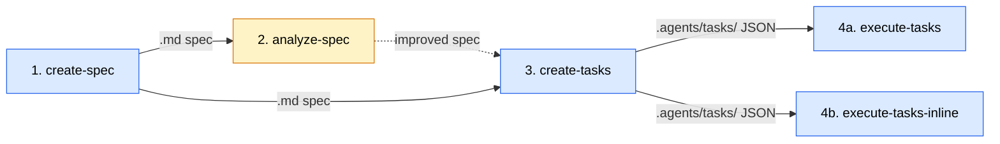

# SDD Pipeline Developer Guide

A complete guide to the Spec-Driven Development pipeline — from requirements gathering through autonomous task execution. For a more comprehensive overview of the SDD skills, see [Deep Dive](./DEEP-DIVE.md).

## Pipeline Overview

The SDD pipeline transforms natural language requirements into executed code through four stages:

```
create-spec → [analyze-spec] → create-tasks → execute-tasks (or execute-tasks-inline)
```

Each stage produces file-based artifacts consumed by the next. Two reference skills (`sdd-specs` and `sdd-tasks`) provide shared schema definitions, templates, and patterns.



| Stage | Skill | Type | Purpose |
|-------|-------|------|---------|
| 1 | `create-spec` | workflow | Adaptive interview + spec compilation |
| 2 | `analyze-spec` | workflow | Optional quality gate — scores spec across 4 dimensions |
| 3 | `create-tasks` | workflow | Decomposes spec features into dependency-tracked JSON tasks |
| 4a | `execute-tasks` | workflow | Wave-based parallel execution with subagent dispatch |
| 4b | `execute-tasks-inline` | workflow | Sequential inline execution without subagents |
| — | `sdd-specs` | reference | Spec templates, question banks, complexity signals |
| — | `sdd-tasks` | reference | Task JSON schema, lifecycle, execution patterns |
| — | `research` | dispatcher | Researcher agent for best practices and compliance research |

> **Supplementary:** `inverted-spec` is a special-use-case skill that reverse-engineers specs from existing codebases. Its output is compatible with the pipeline (it produces the same `.md` spec format), but it operates outside the standard pipeline flow. See [inverted-spec](#inverted-spec) below.

---

## Quick Start

### 1. Create a Specification

```
/create-spec
```

The skill walks you through an adaptive interview process:
1. **Name, type, and depth** — Choose between high-level, detailed, or full-tech documentation
2. **Adaptive interview** — Multi-round questions tailored to your project's complexity
3. **Recommendations** — Proactive best-practice suggestions based on detected patterns
4. **Compilation** — Generates a structured spec from the selected template

**With context file:**
```
/create-spec path/to/requirements.md
```
Loads a context file to make the interview smarter (not shorter — questions become more targeted).

**Output:** A `.md` spec file (default: `specs/SPEC-{name}.md`)

### 2. Analyze the Spec (Optional)

```
/analyze-spec specs/SPEC-Auth.md
```

Scores your spec across four dimensions:
- **Requirements** — Feature completeness, acceptance criteria coverage
- **Risk & Feasibility** — Technical risks, implementation challenges
- **Quality** — Pattern-based issue detection (25 patterns, 6 categories)
- **Completeness** — Section-by-section scoring against the depth template

**Resolution paths:**
- **Auto-implement all** — Batch-apply all recommendations
- **Interactive review** — Walk through findings individually (accept/modify/skip)
- **Report only** — Keep the `.analysis.md` report without modifying the spec

### 3. Generate Tasks

```
/create-tasks specs/SPEC-Auth.md
```

Decomposes spec features into structured JSON tasks:
- Applies layer decomposition (Data Model → API → Logic → UI → Tests)
- Infers blocking dependencies from layer relationships
- Detects producer-consumer relationships between tasks
- Supports phase-aware generation from Section 9 implementation plans

**Phase filtering:**
```
/create-tasks specs/SPEC-Auth.md --phase 1,2
```
Generate tasks only for specific implementation phases.

**Output:** Individual JSON files in `.agents/tasks/pending/{group}/`

### 4. Execute Tasks

```
/execute-tasks
```

Runs all unblocked tasks in dependency order with wave-based parallelism:

```
/execute-tasks --task-group user-authentication    # Filter by group
/execute-tasks --max-parallel 3                    # Limit concurrency
/execute-tasks --retries 1                         # Custom retry limit
/execute-tasks task-005                            # Execute specific task
```

The orchestrator:
1. Builds a dependency-aware execution plan
2. Shows you the plan and asks for confirmation
3. Dispatches `task-executor` agents per wave (default: up to 5 concurrent)
4. Each agent follows a 4-phase workflow: Understand → Implement → Verify → Complete
5. Verification uses structured `acceptance_criteria` (functional, edge cases, error handling, performance)
6. Results are shared between waves via `execution_context.md`

---

## Special Use Case: Reverse-Engineering from Code

The `inverted-spec` skill generates pipeline-compatible specs from **existing codebases** rather than from scratch. It is not part of the standard pipeline flow — use it when you have an existing implementation and want to produce a spec for documentation, refactoring, or feeding into `create-tasks`.

```
/inverted-spec path/to/codebase
```

The process:
1. **Deep analysis** — Parallel exploration of codebase structure, patterns, and architecture (via `deep-analysis` skill)
2. **Feature curation** — Select which discovered features to include ("take this, leave this")
3. **Gap-filling interview** — Provide context code can't reveal (problem statement, users, metrics)
4. **Spec compilation** — Generates the same template-based spec with `[Inferred]`/`[Stated]` provenance markers

**Output:** A `.md` spec file in the same format as `create-spec`, compatible with `analyze-spec`, `create-tasks`, and `execute-tasks`.

---

## Skill Reference

### create-spec

**Phases:** 5

| Phase | Purpose |
|-------|---------|
| 1. Initial Inputs | Spec name, type, depth, description; codebase exploration for "new feature" type |
| 2. Adaptive Interview | Multi-round questions from question bank with recommendation triggers |
| 3. Recommendations Round | Accumulated best-practice suggestions (skip for high-level) |
| 4. Pre-Compilation Summary | Present requirements for user confirmation |
| 5. Spec Compilation | Generate from template (high-level / detailed / full-tech) |

**Spec types:** "New product" or "New feature" (the latter triggers codebase exploration)

**Depth levels:**

| Depth | Sections | Tasks per Feature |
|-------|----------|-------------------|
| High-level | Executive overview, feature priorities | 1-2 |
| Detailed | User stories, acceptance criteria, technical architecture | 3-5 |
| Full-tech | API specs, data models, testing strategy, deployment | 5-10 |

**Agents invoked:** `code-explorer` (codebase exploration), `researcher` (best practices research)

**Key references:**
- `sdd-specs/references/interview-questions.md` — Question bank by category and depth
- `sdd-specs/references/complexity-signals.md` — Complexity detection thresholds
- `sdd-specs/references/recommendation-triggers.md` — Best-practice trigger patterns
- `sdd-specs/references/templates/` — Three depth-level templates

### analyze-spec

**Phases:** 5

| Phase | Purpose |
|-------|---------|
| 1. Input & Setup | Validate spec, detect depth, load analysis references |
| 2. Analysis | Four-dimension inline analysis |
| 3. Report Generation | Scored `.analysis.md` report |
| 4. Presentation & Decision | Summary + resolution path selection |
| 5. Resolution | Auto-implement (5A) or interactive review (5B) |

**Analysis dimensions:**
1. **Requirements Extraction** — Parse functional/non-functional requirements, detect gaps and conflicts
2. **Risk & Feasibility** — Technical risks, integration density, compliance signals
3. **Quality Audit** — Pattern-based detection (INC, MISS, AMB, STRUCT categories)
4. **Completeness Scoring** — Per-section scores against depth template

**Finding format:** `FIND-NNN` with dimension, category, severity, location, issue, impact, recommendation, status

**Key references:**
- `analyze-spec/references/analysis-dimensions.md` — Scoring criteria per dimension
- `analyze-spec/references/common-findings.md` — 25 detection patterns across 6 categories
- `analyze-spec/references/report-template.md` — Analysis report structure
- `analyze-spec/references/interview-guide.md` — Interactive review question patterns

### create-tasks

**Phases:** 10

| Phase | Purpose |
|-------|---------|
| 1. Validate & Load | Parse arguments, validate spec, load references |
| 2. Detect Depth & Check Existing | Depth detection, existing task scan |
| 3. Analyze Spec | Feature extraction, section mapping, phase extraction |
| 4. Select Phases | Interactive or CLI-driven phase selection |
| 5. Decompose Tasks | Layer-pattern decomposition with phase-aware mapping |
| 6. Infer Dependencies | Layer + phase + explicit + cross-feature dependencies |
| 7. Detect Producer-Consumer | `produces_for` metadata annotation |
| 8. Preview & Confirm | Summary table + user approval |
| 9. Create Tasks | Write JSON files (fresh or merge mode) |
| 10. Error Handling | Circular deps, missing info, phase errors |

**Decomposition patterns:** Standard Feature, Authentication, CRUD, Integration, Background Job, Migration

**Layer ordering:** Data Model → API/Service → Business Logic → UI/Frontend → Integration → Tests

**Merge mode:** When re-running on an existing task group:
- Matches by `task_uid` composite key
- Preserves `completed` tasks (never modified)
- Updates `pending`/`backlog` task content while keeping IDs
- Presents obsolete tasks for user decision

**Key references:**
- `create-tasks/references/decomposition-patterns.md` — Pattern templates by feature type
- `create-tasks/references/dependency-inference.md` — Automatic dependency rules
- `create-tasks/references/testing-requirements.md` — Test type mappings

### execute-tasks (Subagent Dispatch)

Requires a harness that supports subagent dispatch (e.g., Claude Code with Agent tool). Dispatches parallel task-executor agents per wave for concurrent execution.

**Steps:** 9

| Step | Purpose |
|------|---------|
| 1. Load Task List | Scan `.agents/tasks/` directories, build task index |
| 2. Validate State | Edge cases: empty list, all completed, circular deps |
| 3. Build Execution Plan | Topological wave assignment, priority sorting |
| 4. Check Settings | Read `.agents/settings.md` for preferences |
| 5. Initialize Session | Create `__live_session__/` with context, log, progress files |
| 6. Present Plan & Confirm | Show plan, get user approval |
| 7. Initialize Context | Merge learnings from prior sessions if available |
| 8. Execute Loop | Wave dispatch → poll results → retry → merge context → next wave |
| 9. Session Summary | Results, archive session to `.agents/sessions/{id}/` |

**Configuration:**

| Setting | Default | CLI Flag | Settings File |
|---------|---------|----------|---------------|
| Max parallel agents | 5 | `--max-parallel N` | `.agents/settings.md` |
| Max retries per task | 3 | `--retries N` | — |
| Task group filter | all | `--task-group slug` | — |

**Key behaviors:**
- **Autonomous after confirmation** — No user prompts between tasks once execution starts
- **Wave-based parallelism** — Subagent dispatch for concurrent task execution within waves
- **Single-session invariant** — `.lock` file prevents concurrent executions
- **Interrupted session recovery** — Stale sessions archived, `in_progress` tasks reset to `pending`
- **Dynamic unblocking** — Dependency graph refreshed after each wave

**Key references:**
- `execute-tasks/references/orchestration.md` — 9-step procedure details
- `execute-tasks/references/execution-workflow.md` — 4-phase agent workflow (shared with inline variant)
- `execute-tasks/references/verification-patterns.md` — Verification and pass/fail rules (shared with inline variant)

### execute-tasks-inline (Sequential)

Optimized for harnesses without subagent dispatch. Executes all tasks sequentially in the orchestrator's own context using a "File as External Memory" pattern for cross-task knowledge sharing.

**Steps:** Same 9-step loop as `execute-tasks`, but Step 8 (Execute Loop) is fundamentally different:
- Tasks execute sequentially, one at a time
- `execution_context.md` is re-read before each task (context refresh) and updated directly after
- No subagent dispatch, no polling, no per-task context files
- Context compaction every ~5 tasks prevents unbounded growth

**Configuration:**

| Setting | Default | CLI Flag | Settings File |
|---------|---------|----------|---------------|
| Max retries per task | 3 | `--retries N` | `.agents/settings.md` |
| Task group filter | all | `--task-group slug` | — |

**Key behaviors:**
- **Sequential execution** — All tasks execute inline, one at a time
- **File as External Memory** — `execution_context.md` serves as persistent cross-task memory
- **Context compaction** — Task History compacted every ~5 tasks to prevent bloat
- **Same session management** — Lock files, interrupted recovery, archival all identical

**Key references:**
- `execute-tasks-inline/references/orchestration.md` — Inline-specific 9-step procedure
- `execute-tasks/references/execution-workflow.md` — 4-phase workflow (shared)
- `execute-tasks/references/verification-patterns.md` — Verification and pass/fail rules (shared)

### research (Dispatcher)

Wraps the `researcher` agent for invocation by other skills. Not used standalone — currently consumed by `create-spec` for proactive best-practice research during the interview.

**Agent:** `researcher` (`research/agents/researcher.md`)

**Inputs** (provided by calling skill):
- **Research topic** — the subject to investigate (e.g., "GDPR data retention requirements")
- **Context** — why this research is needed, what project or spec it informs
- **Specific questions** — 1-3 focused questions the research should answer
- **Depth level** — brief summary vs. comprehensive analysis

**Execution:**
- If subagent dispatch is available: dispatches researcher as a subagent
- If not: reads `agents/researcher.md` and follows its instructions inline

**Researcher agent approach (tiered):**
1. **Tier 1:** Official documentation, specifications, standards (via web search)
2. **Tier 2:** Codebase patterns and existing implementations
3. **Tier 3:** Built-in knowledge (fallback)

**Topics:** Compliance/regulatory (GDPR, HIPAA, PCI-DSS, SOC 2, WCAG), technology/architecture, best practices, competitive analysis

### Supplementary: inverted-spec

Not part of the core pipeline. Reverse-engineers specs from existing codebases for documentation, refactoring, or feeding into `create-tasks`.

**Phases:** 5

| Phase | Purpose |
|-------|---------|
| 1. Input & Context | Codebase path, scope, depth, spec name, initial context |
| 2. Deep Analysis | Invoke deep-analysis for comprehensive codebase understanding |
| 3. Curation Interview | Feature selection, gap-filling, optional research, assumption validation |
| 4. Summary & Approval | Present compiled findings for user review |
| 5. Spec Generation | Compile spec from template with provenance annotations |

**Spec type:** `Inverted` — reverse-engineered from codebase (distinct from create-spec's "New product"/"New feature")

**Provenance annotations:** `[Inferred]` (code-derived), `[Stated]` (user-provided), `[Researched]` (external research)

**Agents invoked:** `code-explorer` + `code-synthesizer` (via deep-analysis), `researcher` (optional research)

**Key references:**
- `inverted-spec/references/curation-interview.md` — 4-stage interview procedures
- `inverted-spec/references/analysis-to-spec-mapping.md` — How analysis maps to spec sections
- `inverted-spec/references/compilation-guide.md` — Header format, provenance rules, compilation steps

---

## Task Schema

Tasks are individual JSON files stored in `.agents/tasks/{status}/{group}/task-NNN.json`.

### Directory Structure

```
.agents/tasks/
├── _manifests/           # Group-level metadata
│   └── {group}.json
├── backlog/              # Future-phase tasks
│   └── {group}/
├── pending/              # Ready to execute
│   └── {group}/
├── in-progress/          # Currently being worked on
│   └── {group}/
└── completed/            # Finished and verified
    └── {group}/
```

**Status transitions are file moves.** When a task goes from `pending` to `in_progress`, its JSON file physically moves from `pending/{group}/` to `in-progress/{group}/`.

### Task JSON Structure

```json
{
  "id": "task-001",
  "title": "Create User data model",
  "active_form": "Creating User data model",
  "description": "Define the User entity with fields...\n\nSource: specs/SPEC-Auth.md Section 7.3",
  "acceptance_criteria": {
    "functional": ["User model has email, name, password_hash fields"],
    "edge_cases": ["Handle duplicate email addresses"],
    "error_handling": ["Return clear error on invalid email format"],
    "performance": []
  },
  "testing_requirements": [
    { "type": "unit", "target": "User model validation" },
    { "type": "integration", "target": "Database persistence" }
  ],
  "status": "pending",
  "blocked_by": [],
  "owner": null,
  "created_at": "2026-03-23T10:00:00Z",
  "updated_at": "2026-03-23T10:00:00Z",
  "metadata": {
    "priority": "high",
    "complexity": "S",
    "task_group": "user-authentication",
    "task_uid": "specs/SPEC-Auth.md:user-auth:model:001",
    "spec_path": "specs/SPEC-Auth.md",
    "feature_name": "User Authentication",
    "source_section": "7.3 Data Models",
    "spec_phase": 1,
    "spec_phase_name": "Foundation"
  }
}
```

### Status Lifecycle

```
backlog ──→ pending ──→ in_progress ──→ completed
                             │
                             ▼
                          pending (reset on failure)
```

| Transition | Trigger |
|-----------|---------|
| backlog → pending | Phase becomes active |
| pending → in_progress | Agent begins work; all blockers completed |
| in_progress → completed | All functional criteria pass + tests pass |
| in_progress → pending | Failed attempt or interrupted session |

### Priority and Complexity

| Spec Priority | Task Priority | | Size | Scope |
|--------------|---------------|-|------|-------|
| P0 (Critical) | `critical` | | XS | Single function (<20 lines) |
| P1 (High) | `high` | | S | Single file (20-100 lines) |
| P2 (Medium) | `medium` | | M | Multiple files (100-300 lines) |
| P3 (Low) | `low` | | L | Multiple components (300-800 lines) |
| | | | XL | System-wide (>800 lines) |

---

## Execution Session Architecture

### Session Directory

```
.agents/sessions/__live_session__/
├── execution_plan.md        # Saved execution plan
├── execution_context.md     # Shared learnings (snapshot per wave)
├── task_log.md              # Execution history table
├── progress.md              # Current status
├── tasks/                   # Archived completed task files
├── context-{id}.md          # Per-task learnings (merged after wave)
└── result-{id}.md           # Per-task result (~18 lines, completion signal)
```

### Context Sharing Model

**Subagent variant (`execute-tasks`):**
1. **Before wave:** Orchestrator snapshots `execution_context.md`
2. **During wave:** Each agent reads the snapshot, writes to isolated `context-{id}.md`
3. **After wave:** Orchestrator merges all `context-{id}.md` into `execution_context.md`

This eliminates write contention — agents never write to the same file.

**Inline variant (`execute-tasks-inline`):**
1. **Before each task:** Orchestrator re-reads `execution_context.md` (context refresh)
2. **During task:** Orchestrator executes the 4-phase workflow inline
3. **After each task:** Orchestrator updates `execution_context.md` directly (no merge step)

No `context-{id}.md` files are created. The file serves as "external memory" — re-reading it before each task ensures cross-task learnings survive harness context compression.

### Result File Protocol

Agents write a compact result file as their **very last action** — its existence signals completion:

```markdown
# Task Result: [task-001] Create User data model
status: PASS
attempt: 1/3

## Verification
- Functional: 3/3
- Edge Cases: 1/1
- Error Handling: 1/1
- Tests: 5/5 (0 failures)

## Files Modified
- src/models/user.ts: Created User model with validation

## Issues
None
```

**File ordering invariant:** `context-{id}.md` is written FIRST, `result-{id}.md` LAST.

### Verification Pass/Fail Rules

```
All Functional PASS + Tests PASS                          → PASS
All Functional PASS + Tests PASS + Edge/Error/Perf issues → PARTIAL
Any Functional FAIL                                       → FAIL
Any Test FAIL                                             → FAIL
```

Only **PASS** results move the task file to `completed/`. PARTIAL and FAIL stay in `in-progress/` for retry.

---

## Dependency Management

Tasks form a Directed Acyclic Graph (DAG) via the `blocked_by` field.

### Dependency Sources

| Source | Example |
|--------|---------|
| **Layer ordering** | API task depends on its data model task |
| **Phase ordering** | Phase 2 tasks blocked by Phase 1 tasks |
| **Explicit spec deps** | Section 10 "requires X" |
| **Cross-feature** | Both features depend on shared auth setup |

### Wave Formation

Tasks at the same dependency level form a wave and execute in parallel:

```
Wave 1: task-001, task-002     (no dependencies)
Wave 2: task-003, task-004     (depend on Wave 1 tasks)
Wave 3: task-005               (depends on Wave 2 tasks)
```

### Producer-Consumer Relationships

The optional `produces_for` metadata field tracks direct output consumption:

```json
{
  "id": "task-001",
  "title": "Create User data model",
  "metadata": {
    "produces_for": ["task-003", "task-004"]
  }
}
```

The execution orchestrator can use this to inject producer results into consumer agent context.

---

## Reference Skills

### sdd-specs

Shared knowledge base for spec creation and review.

| Reference File | Content |
|---------------|---------|
| `references/interview-questions.md` | Question bank by category (functional, technical, non-functional, project) and depth level |
| `references/complexity-signals.md` | High/medium weight signals with threshold (3+ high OR 5+ any → expanded budgets) |
| `references/recommendation-triggers.md` | Best-practice triggers across 9 domains (auth, scalability, security, etc.) |
| `references/recommendation-format.md` | Presentation templates with context and rationale |
| `references/codebase-exploration.md` | Team-based exploration procedure for "new feature" specs |
| `references/templates/high-level.md` | Executive overview template |
| `references/templates/detailed.md` | Standard spec template with user stories and acceptance criteria |
| `references/templates/full-tech.md` | Extended template with API specs, data models, deployment |

### sdd-tasks

Shared knowledge base for task management.

| Reference File | Content |
|---------------|---------|
| `references/task-schema.md` | Complete JSON schema with field documentation and validation rules |
| `references/operations.md` | File-based CRUD procedures (initialize, add, update, move, delete, query, merge) |
| `references/anti-patterns.md` | 8 anti-patterns: circular deps, over-granular tasks, missing fields, duplicates |

---

## Troubleshooting

### Task Execution Issues

**Problem:** All tasks show as blocked
- **Check:** Run `ls .agents/tasks/completed/{group}/` — are prerequisite tasks actually completed?
- **Check:** Look for circular dependencies in `blocked_by` fields
- **Fix:** If a task was manually completed, ensure the file was moved to `completed/`

**Problem:** Execution session won't start (lock file)
- **Check:** Is another execution already running?
- **Fix:** If no other session is active, the lock may be stale from an interrupted run. Remove `.agents/sessions/__live_session__/.lock`

**Problem:** Tasks fail verification repeatedly
- **Check:** Read the `result-{id}.md` files in the session directory for failure details
- **Check:** Review `execution_context.md` for patterns in what's failing
- **Fix:** Run with `--retries 1` and investigate the failure before re-running

### Task Generation Issues

**Problem:** Merge mode produces unexpected results
- **Check:** Task UIDs must match exactly (`{spec_path}:{feature_slug}:{task_type}:{seq}`)
- **Fix:** If the spec was restructured, consider deleting old tasks and running fresh generation

**Problem:** Phase filtering generates tasks with missing prerequisites
- **Expected:** create-tasks adds a "Prerequisites" note to task descriptions when Phase N-1 tasks don't exist
- **Fix:** Generate earlier phases first, or use `--phase all`

### Spec Analysis Issues

**Problem:** Depth detection is wrong
- **Fix:** analyze-spec asks you to confirm the detected depth — select the correct one
- **Tip:** Include `**Spec Depth**: Full-Tech` in your spec metadata for automatic detection

---

## File Map

```
plugins/sdd/skills/
├── create-spec/
│   ├── SKILL.md                           # 5-phase spec creation workflow
│   └── references/
│       ├── interview-procedures.md        # Round structure, early exit, research
│       ├── recommendations-and-summary.md # Phase 3-4 procedures
│       └── compilation-and-principles.md  # Phase 5 compilation details
├── analyze-spec/
│   ├── SKILL.md                           # 5-phase spec analysis workflow
│   └── references/
│       ├── analysis-dimensions.md         # Scoring criteria per dimension
│       ├── common-findings.md             # 25 detection patterns
│       ├── report-template.md             # .analysis.md report structure
│       └── interview-guide.md             # Interactive review patterns
├── create-tasks/
│   ├── SKILL.md                           # 10-phase task decomposition
│   └── references/
│       ├── decomposition-patterns.md      # Feature-to-task patterns
│       ├── dependency-inference.md        # Dependency rules
│       └── testing-requirements.md        # Test type mappings
├── execute-tasks/
│   ├── SKILL.md                           # 9-step orchestration (subagent dispatch)
│   ├── agents/
│   │   └── task-executor.md               # 4-phase agent workflow
│   ├── references/
│   │   ├── orchestration.md               # Subagent orchestration loop
│   │   ├── execution-workflow.md          # Agent phase procedures (shared)
│   │   └── verification-patterns.md       # Pass/fail rules (shared)
│   └── scripts/
│       └── poll-for-results.sh            # Polls for result files (45min timeout)
├── execute-tasks-inline/
│   ├── SKILL.md                           # 9-step orchestration (sequential inline)
│   └── references/
│       └── orchestration.md               # Inline orchestration loop
├── inverted-spec/
│   ├── SKILL.md                           # 5-phase reverse-engineering workflow
│   └── references/
│       ├── curation-interview.md          # 4-stage interview procedures
│       ├── analysis-to-spec-mapping.md    # Analysis-to-spec section mapping
│       └── compilation-guide.md           # Header format, provenance, compilation
├── sdd-specs/
│   ├── SKILL.md                           # Spec materials reference
│   └── references/
│       ├── interview-questions.md         # Question bank
│       ├── complexity-signals.md          # Complexity detection
│       ├── recommendation-triggers.md     # Best-practice triggers
│       ├── recommendation-format.md       # Recommendation templates
│       ├── codebase-exploration.md        # Exploration procedure
│       └── templates/
│           ├── high-level.md              # Executive overview template
│           ├── detailed.md                # Standard spec template
│           └── full-tech.md               # Full technical template
├── sdd-tasks/
│   ├── SKILL.md                           # Task schema reference
│   └── references/
│       ├── task-schema.md                 # Complete JSON schema
│       ├── operations.md                  # File-based CRUD
│       └── anti-patterns.md              # Common mistakes
├── research/
│   ├── SKILL.md                           # Research dispatcher (researcher agent)
│   └── agents/
│       └── researcher.md                  # Best practices & domain research agent
└── README.md                              # This file
```

40 files total: 9 SKILL.md + 2 agents + 28 references + 1 script (poll-for-results.sh)
