# Technical Diagrams

Mermaid is the standard for all technical diagrams in this project. It renders natively in GitHub, GitLab, MkDocs (with Material theme), and most modern documentation platforms.

This skill provides:
- **Critical styling rules** to ensure readability (especially color contrast)
- **Quick reference** examples for common diagram types
- **Reference files** for advanced syntax when building complex diagrams

Always wrap Mermaid code in fenced code blocks with the `mermaid` language identifier.

---

## Why Mermaid

**Native rendering** -- GitHub, GitLab, Notion, MkDocs, and Docusaurus render Mermaid blocks without plugins or build steps. No external image generation tools needed.

**Text-based and diffable** -- Diagrams live alongside code in version control. Changes appear in pull request diffs, making reviews straightforward and history trackable.

**No external tools** -- No Lucidchart exports, no draw.io XML files, no PNG screenshots that go stale. The diagram source is the single source of truth.

**Maintainable** -- Updating a diagram means editing text, not wrestling with a GUI. Refactoring a component name? Find-and-replace works on diagrams too.

**Consistent** -- A shared syntax produces visually consistent diagrams across all documentation, regardless of who authored them.

---

## Critical Styling Rules

**This is the most important section.** Light text on light backgrounds is the most common Mermaid readability issue. Follow these rules strictly.

### Rule 1: Always use dark text on nodes

Every node must have `color:#000` (or another dark color like `#1a1a1a`, `#333`). Never use white, light gray, or any light-colored text.

### Rule 2: Use `classDef` for consistent styling

Define reusable styles at the bottom of the diagram and apply them with `:::` syntax:

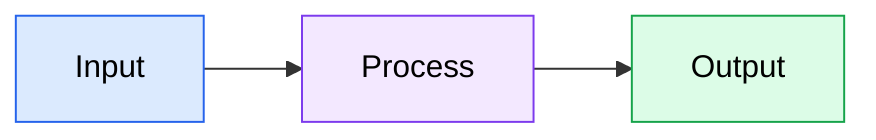

### Rule 3: Safe color palettes

Use these pre-tested combinations that guarantee readability:

| Style Name | Fill | Stroke | Text | Use For |
|-----------|------|--------|------|---------|
| `primary` | `#dbeafe` | `#2563eb` | `#000` | Main components, entry points |
| `secondary` | `#f3e8ff` | `#7c3aed` | `#000` | Supporting components |
| `success` | `#dcfce7` | `#16a34a` | `#000` | Success states, outputs |
| `warning` | `#fef3c7` | `#d97706` | `#000` | Warnings, caution areas |
| `danger` | `#fee2e2` | `#dc2626` | `#000` | Errors, critical items |
| `neutral` | `#f3f4f6` | `#6b7280` | `#000` | Background, inactive items |

### Bad vs Good

**Bad -- light text is invisible on light background:**
```
classDef bad fill:#dbeafe,stroke:#2563eb,color:#93c5fd
```

**Good -- dark text is always readable:**
```
classDef good fill:#dbeafe,stroke:#2563eb,color:#000
```

---

## Supported Diagram Types

| Diagram Type | Mermaid Keyword | Use Case | Reference |
|-------------|----------------|----------|-----------|
| Flowchart | `flowchart` | Process flows, decision trees, pipelines | Flowcharts section below |
| Sequence | `sequenceDiagram` | API interactions, message passing, protocols | See `references/sequence-diagrams.md` |
| Class | `classDiagram` | Object models, interfaces, relationships | See `references/class-diagrams.md` |
| State | `stateDiagram-v2` | State machines, lifecycle management | See `references/state-diagrams.md` |
| ER | `erDiagram` | Database schemas, entity relationships | See `references/er-diagrams.md` |
| C4 | `C4Context` / `C4Container` / etc. | System architecture, containers, components | C4 Diagrams section below |

---

## Quick Reference

Minimal copy-paste examples for simple diagrams. For complex use cases, see the corresponding reference section or file.

### Flowchart

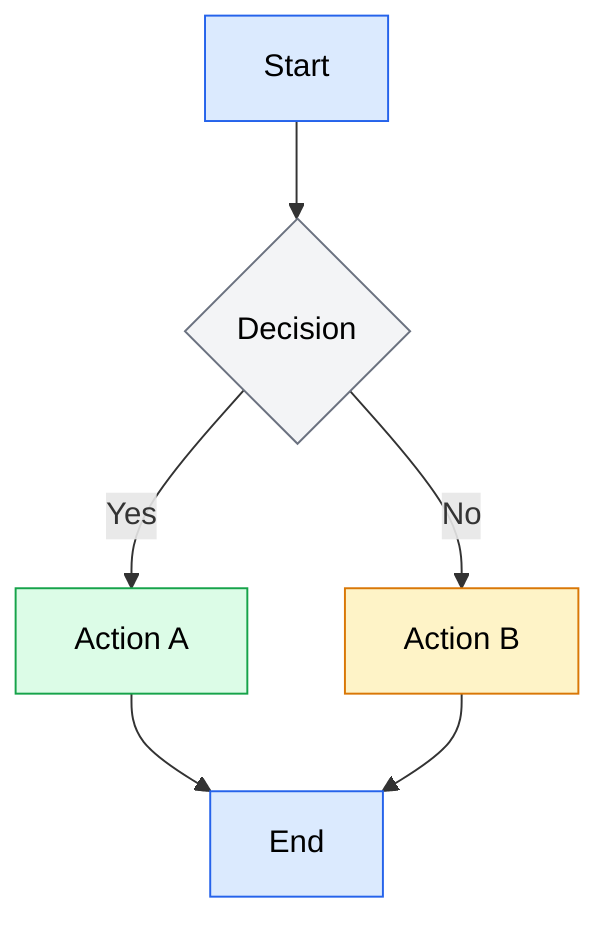

### Sequence Diagram

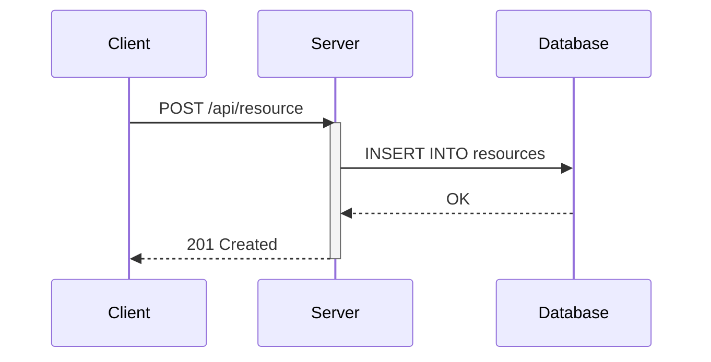

### Class Diagram

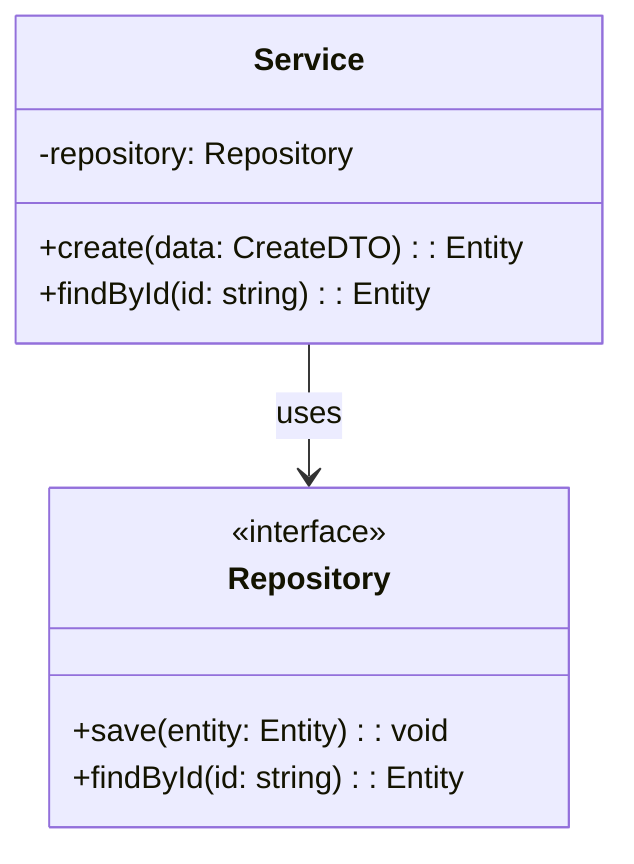

### State Diagram

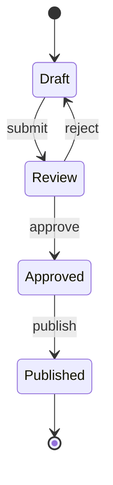

### ER Diagram

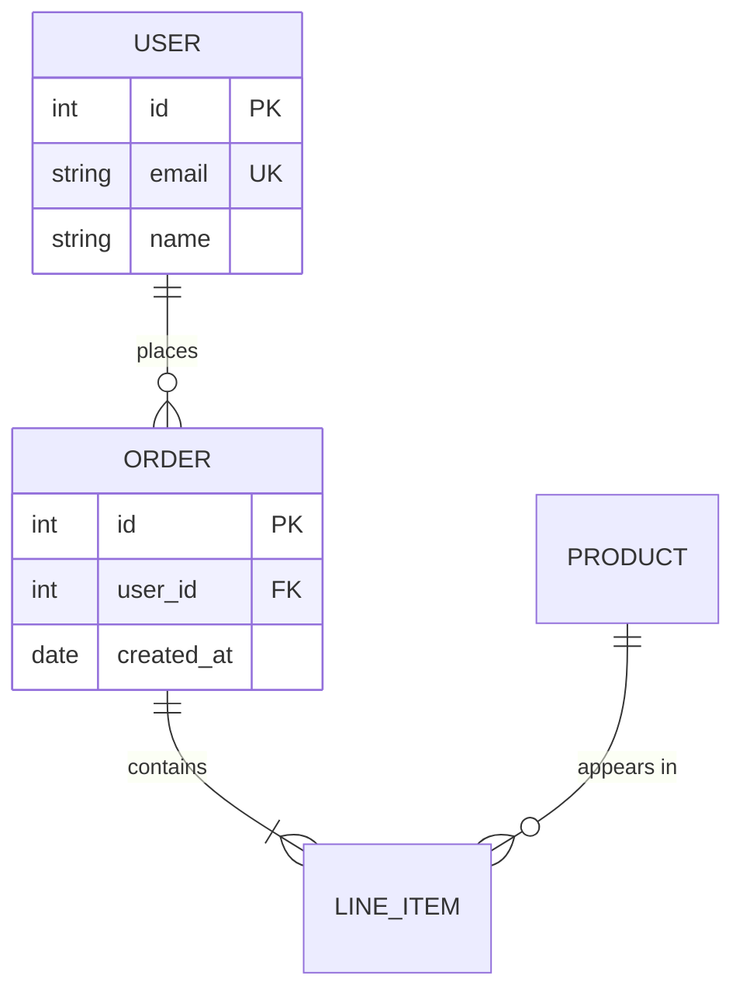

### C4 Context Diagram

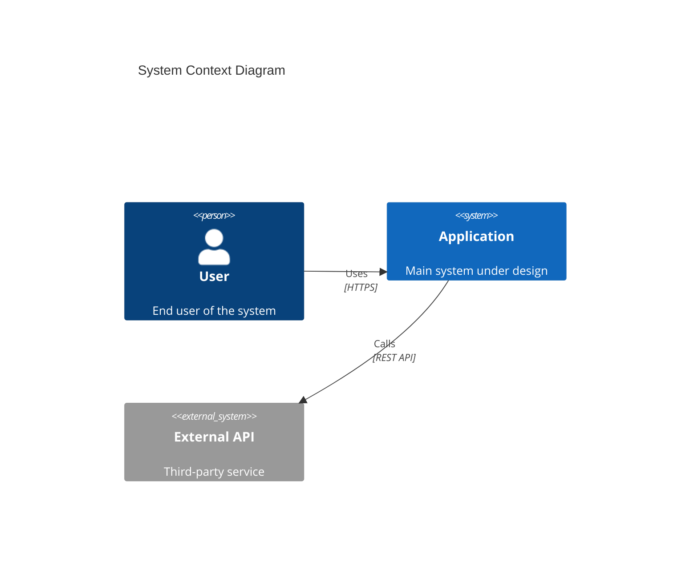

---

## Styling and Theming

### `classDef` -- Reusable Style Classes

Define once, apply to many nodes:

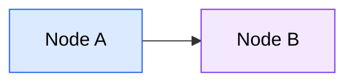

### `:::` Shorthand -- Apply Class Inline

```
A[Label]:::className
```

### `style` -- One-Off Inline Styling

For single-node overrides (prefer `classDef` for consistency):

```
style nodeId fill:#dbeafe,stroke:#2563eb,color:#000
```

### Standard Style Classes

Define these at the bottom of any diagram that uses multiple styles:

```
classDef primary fill:#dbeafe,stroke:#2563eb,color:#000
classDef secondary fill:#f3e8ff,stroke:#7c3aed,color:#000
classDef success fill:#dcfce7,stroke:#16a34a,color:#000
classDef warning fill:#fef3c7,stroke:#d97706,color:#000
classDef danger fill:#fee2e2,stroke:#dc2626,color:#000
classDef neutral fill:#f3f4f6,stroke:#6b7280,color:#000
```

### Subgraph Styling

Subgraphs can be styled via `style` directives:

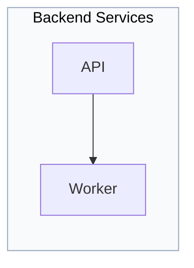

### Edge Styling with `linkStyle`

Style specific edges by their index (0-based, in order of definition):

```
linkStyle 0 stroke:#2563eb,stroke-width:2px
linkStyle 1 stroke:#dc2626,stroke-width:2px,stroke-dasharray:5
```

---

## Best Practices

### Keep diagrams focused
Limit to 15-20 nodes maximum. If a diagram grows beyond that, split it into multiple diagrams or use subgraphs to manage complexity.

### Choose direction deliberately
- **TD (top-down)** -- Hierarchies, data flow, process steps
- **LR (left-right)** -- Timelines, pipelines, request flows
- **BT (bottom-up)** -- Dependency trees (leaves at top)
- **RL (right-left)** -- Rarely used, avoid unless it matches a specific mental model

### Use meaningful labels
```
A[User Service] --> B[Auth Service]    %% Good: descriptive
A --> B                                 %% Bad: meaningless
```

### Label edges
```
A -->|validates| B    %% Good: explains the relationship
A --> B               %% Acceptable only if the relationship is obvious
```

### Group with subgraphs
Use subgraphs to visually separate layers, domains, or subsystems:

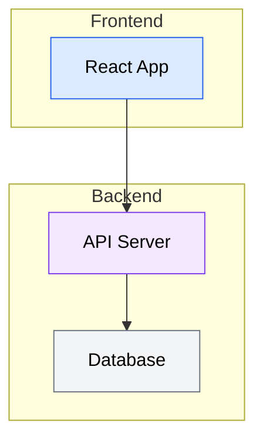

### Use consistent arrow types
Within a single diagram, stick to one arrow style unless you need to distinguish different relationship types:
- `-->` solid arrow (primary flow)
- `-.->` dotted arrow (optional or async)
- `==>` thick arrow (critical path)

### Prefer `flowchart` over `graph`
`flowchart` is the modern syntax with more features (subgraph styling, `:::` shorthand, more shapes). `graph` is legacy -- use `flowchart` for all new diagrams.

### Platform compatibility
- GitHub/GitLab: Full support for flowcharts, sequence, class, state, ER, Gantt, pie
- C4 diagrams: Require Mermaid 10.6+ -- verify platform support before using
- MkDocs: Requires `pymdownx.superfences` with custom Mermaid fence config

---

## Flowcharts Reference

Flowcharts visualize process flows, decision trees, pipelines, and system architectures. They are the most versatile Mermaid diagram type.

**Keyword:** `flowchart` (prefer over legacy `graph`)

### Direction Keywords

| Keyword | Direction | Best For |
|---------|-----------|----------|
| `TD` / `TB` | Top to bottom | Hierarchies, process steps |
| `LR` | Left to right | Pipelines, request flows, timelines |
| `BT` | Bottom to top | Dependency trees |
| `RL` | Right to left | Rarely used |

### Node Shapes

| Syntax | Shape | Use For |
|--------|-------|---------|
| `A[Text]` | Rectangle | Default, general purpose |
| `A(Text)` | Rounded rectangle | Processes, steps |
| `A([Text])` | Stadium | Start/end points |
| `A[[Text]]` | Subroutine | External processes |
| `A[(Text)]` | Cylinder | Databases, storage |
| `A((Text))` | Circle | Connectors, small nodes |
| `A{Text}` | Diamond | Decisions, conditions |
| `A{{Text}}` | Hexagon | Preparation steps |
| `A>Text]` | Asymmetric | Flags, signals |
| `A[/Text/]` | Parallelogram | Input/output |
| `A[\Text\]` | Alt parallelogram | Alt input/output |
| `A[/Text\]` | Trapezoid | Transforms |
| `A[\Text/]` | Alt trapezoid | Alt transforms |
| `A(((Text)))` | Double circle | Critical nodes |

### Edge Types

#### Solid Edges

| Syntax | Description |
|--------|-------------|
| `A --> B` | Arrow |
| `A --- B` | Line (no arrow) |
| `A -->\|label\| B` | Arrow with label |
| `A --label--> B` | Arrow with label (alt) |

#### Dotted Edges

| Syntax | Description |
|--------|-------------|
| `A -.-> B` | Dotted arrow |
| `A -.- B` | Dotted line |
| `A -.->\|label\| B` | Dotted arrow with label |

#### Thick Edges

| Syntax | Description |
|--------|-------------|
| `A ==> B` | Thick arrow |
| `A === B` | Thick line |
| `A ==>\|label\| B` | Thick arrow with label |

#### Multi-Directional

| Syntax | Description |
|--------|-------------|
| `A <--> B` | Bidirectional arrow |
| `A o--o B` | Circle endpoints |
| `A x--x B` | Cross endpoints |

#### Edge Length

Add extra dashes/dots/equals to make edges longer:
- `A ---> B` (longer than `A --> B`)
- `A -----> B` (even longer)

### Subgraphs

Group related nodes into labeled regions:

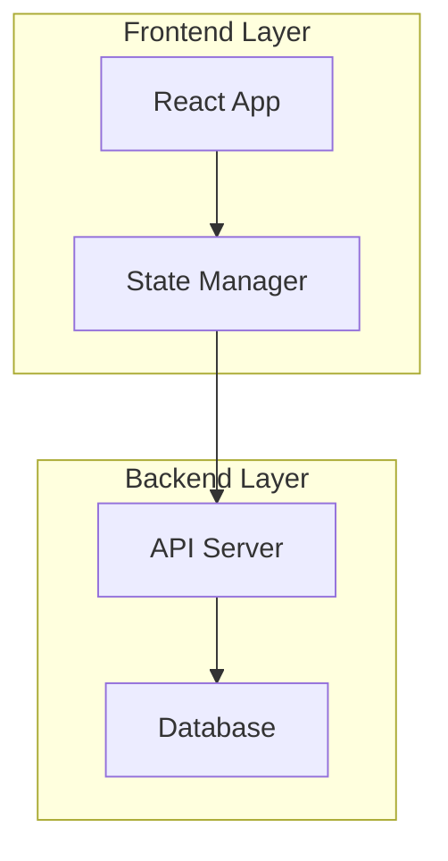

#### Nested Subgraphs

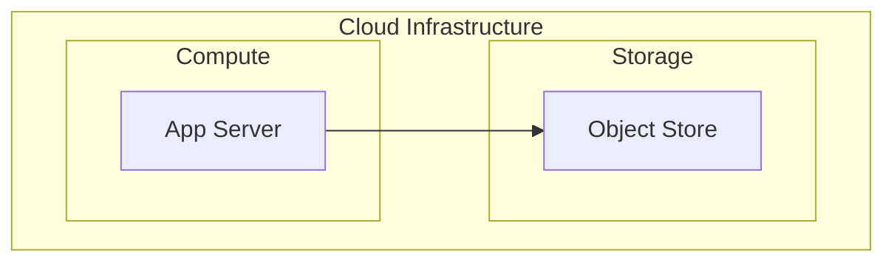

#### Subgraph Direction

Override direction inside a subgraph:

```
subgraph section["Section"]
    direction LR
    A --> B --> C
end
```

### Flowchart Styling

#### classDef and :::


#### Inline style

```
style A fill:#dbeafe,stroke:#2563eb,color:#000
```

#### Subgraph styling

```
style subgraphId fill:#f8fafc,stroke:#94a3b8,color:#000
```

#### linkStyle

Style edges by their 0-based index:

```
linkStyle 0 stroke:#2563eb,stroke-width:2px
linkStyle 1 stroke:#dc2626,stroke-dasharray:5
```

#### Apply class to multiple nodes

```
class A,B,C primary
```

### Flowchart Examples

#### CI/CD Pipeline

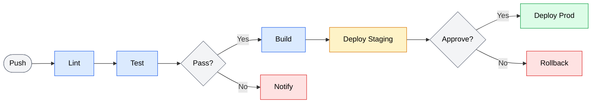

#### Layered Architecture

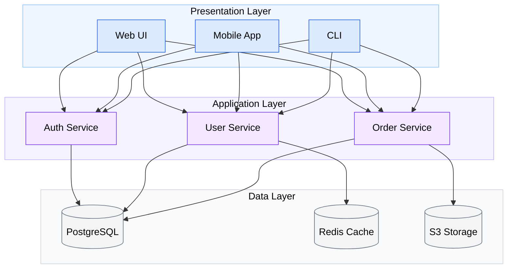

---

## C4 Diagrams Reference

C4 diagrams model software architecture at multiple zoom levels -- from system context down to individual components. C4 uses a unique function-call syntax that differs from other Mermaid diagram types.

**Keywords:** `C4Context`, `C4Container`, `C4Component`, `C4Dynamic`, `C4Deployment`

**Compatibility note:** C4 requires Mermaid 10.6+. Verify your rendering platform supports it.

### Diagram Levels

| Level | Keyword | Scope | Shows |
|-------|---------|-------|-------|
| Context | `C4Context` | Entire system | People, systems, external dependencies |
| Container | `C4Container` | Single system | Applications, databases, services within one system |
| Component | `C4Component` | Single container | Internal components of one application |
| Dynamic | `C4Dynamic` | Interaction flow | Numbered sequence of interactions |
| Deployment | `C4Deployment` | Infrastructure | Where containers run (servers, cloud, VMs) |

### Element Functions

#### People

```
Person(alias, "Label", "Description")
Person_Ext(alias, "Label", "Description")
```

- `Person` -- Internal user
- `Person_Ext` -- External user

#### Systems

```
System(alias, "Label", "Description")
System_Ext(alias, "Label", "Description")
System_Boundary(alias, "Label") { ... }
```

- `System` -- System under design
- `System_Ext` -- External system
- `System_Boundary` -- Groups elements belonging to one system

#### Containers

```
Container(alias, "Label", "Technology", "Description")
ContainerDb(alias, "Label", "Technology", "Description")
ContainerQueue(alias, "Label", "Technology", "Description")
Container_Ext(alias, "Label", "Technology", "Description")
Container_Boundary(alias, "Label") { ... }
```

- `Container` -- Application/service
- `ContainerDb` -- Database
- `ContainerQueue` -- Message queue
- `Container_Ext` -- External container
- `Container_Boundary` -- Groups containers

#### Components

```
Component(alias, "Label", "Technology", "Description")
ComponentDb(alias, "Label", "Technology", "Description")
ComponentQueue(alias, "Label", "Technology", "Description")
Component_Ext(alias, "Label", "Technology", "Description")
```

#### Deployment Nodes

```
Deployment_Node(alias, "Label", "Technology") { ... }
Node(alias, "Label", "Technology") { ... }
```

### C4 Relationships

```
Rel(from, to, "Label")
Rel(from, to, "Label", "Technology/Protocol")

Rel_D(from, to, "Label")    %% Downward
Rel_U(from, to, "Label")    %% Upward
Rel_L(from, to, "Label")    %% Left
Rel_R(from, to, "Label")    %% Right

Rel_Back(from, to, "Label")          %% Reverse direction
BiRel(from, to, "Label")             %% Bidirectional
```

### C4 Styling

#### UpdateElementStyle

```
UpdateElementStyle(alias, $bgColor="color", $fontColor="color", $borderColor="color")
```

#### UpdateRelStyle

```
UpdateRelStyle(from, to, $textColor="color", $lineColor="color", $offsetX="n", $offsetY="n")
```

#### Layout

```
UpdateLayoutConfig($c4ShapeInRow="3", $c4BoundaryInRow="1")
```

### Title and Description

Always include a title for context:

```
title System Context Diagram for My Application
```

### C4 Examples

#### System Context Diagram

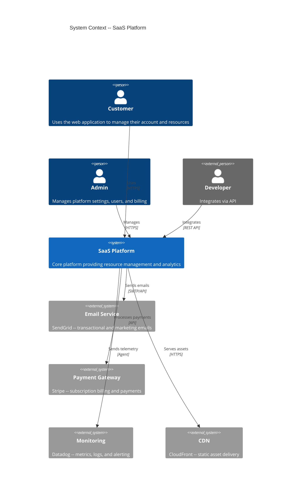

#### Container Diagram

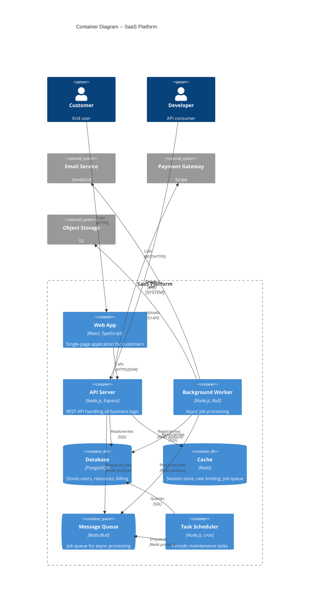

#### Component Diagram

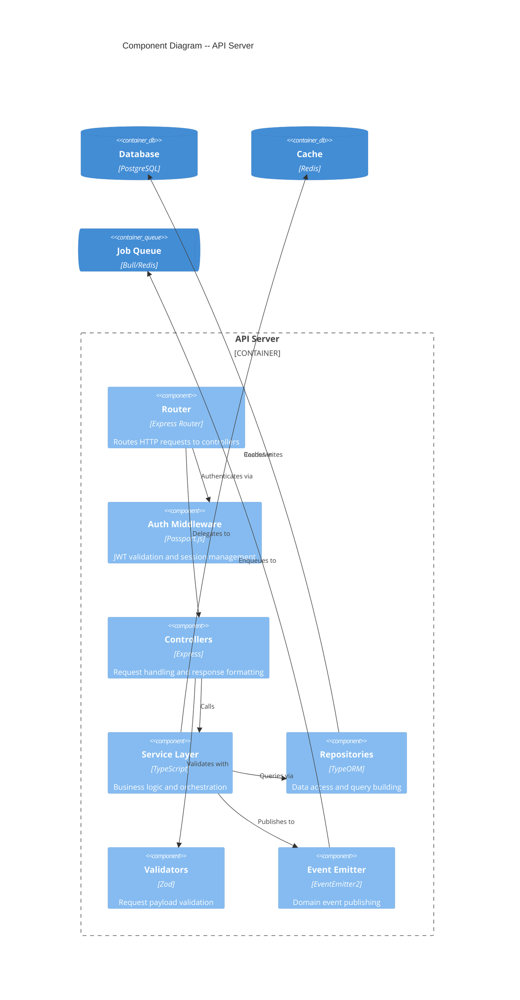

#### Dynamic Diagram

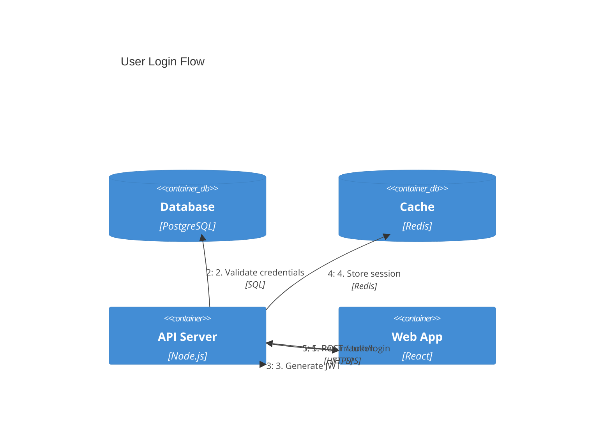

---

## When to Load Reference Files

**Simple diagrams** -- The quick reference above is sufficient. Use it for:
- Basic flowcharts with fewer than 10 nodes
- Simple sequence diagrams with 2-3 participants
- Standard ER diagrams with straightforward relationships

**Complex or unfamiliar diagrams** -- Load the reference file when:
- Using advanced features (composite states, parallel blocks, fork/join)
- Building class diagrams with generics, namespaces, or cardinality
- Needing the full set of node shapes, arrow types, or relationship notations
- Working with a diagram type for the first time

**C4 diagrams** -- The C4 reference above covers the full syntax. Review it before creating C4 diagrams, as C4 uses a unique function-call syntax.

For complex sequence, class, state, or ER diagrams, see the corresponding reference file in `references/`.

---

## Integration Notes
**What this component does:** Provides comprehensive Mermaid diagram syntax, styling rules, and examples for creating readable, consistent technical visualizations across all documentation.
**Capabilities needed:** None (passive reference material -- no tool access required). When reference files are needed for complex diagrams, file reading capability is required to load them from `references/`.
**Adaptation guidance:** This is a static knowledge resource. The styling rules and diagram syntax are platform-agnostic Mermaid. Reference files in `references/` contain advanced syntax for sequence, class, state, and ER diagrams.
